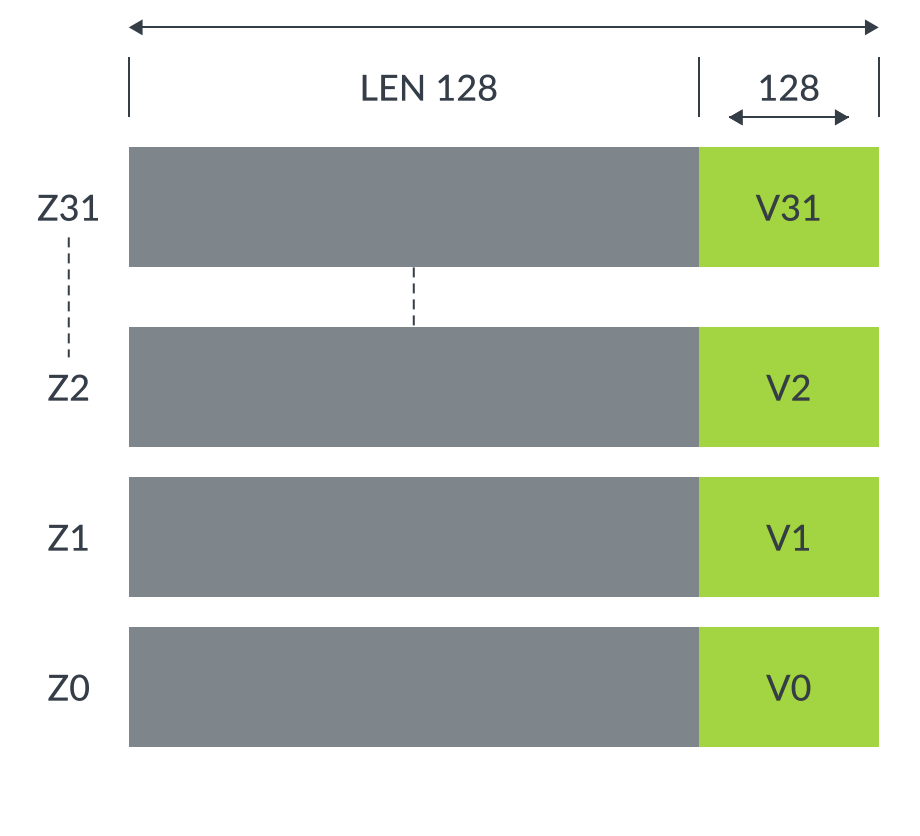
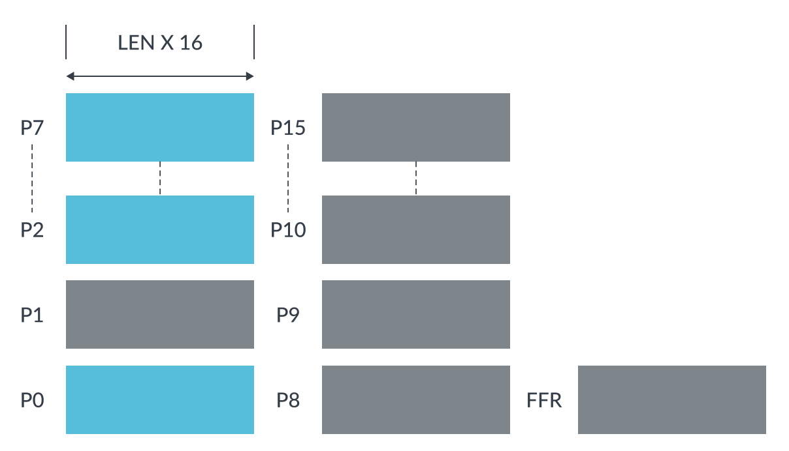
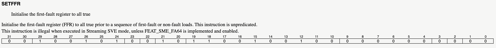
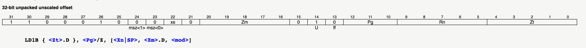
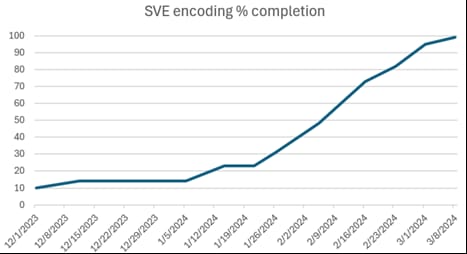
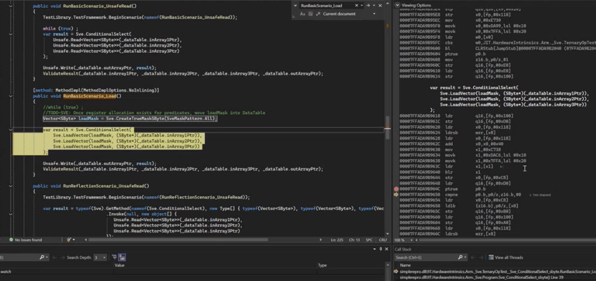

# Engineering SVE in .NET


With the rise of advanced computing, Scalable Vector Extension (SVE) is revolutionizing how modern hardware handles parallel workloads. Designed by Arm, SVE allows for flexible vector processing, enabling significant performance improvements across various applications. In .NET 9, we are excited to announce the [integration of SVE support](https://github.com/dotnet/runtime/issues/93095), bringing the power of scalable vector processing to .NET developers for the first time. This addition empowers developers to write more efficient, high-performance code that can take full advantage of modern hardware architectures.

This <i>"Hitchhiker's Guide to the SVE in .NET"</i> is a technical blog crafted for a diverse audience - .NET developers excited to dive into the new intrinsics features, developers aiming to integrate SVE into their .NET code, enthusiasts curious about SVE’s role in the .NET world, and compiler developers looking to bring SVE to life in their languages and runtimes. Buckle up and get ready — let’s embark on this exciting journey together!

- [1. Introduction](#1-introduction)
  * [1.1 What is SVE?](#11-what-is-sve)
  * [1.2 Scalable Vector Registers](#12-scalable-vector-registers)
  * [1.3 Scalable Predicate Registers](#13-scalable-predicate-registers)
- [2. SVE APIs](#2-sve-apis)
  * [2.1 (Almost) Scalable Vector\<T>](#21-almost-scalable-vector)
  * [2.2 Vector\<T> for predicate types](#22-vector-for-predicate-types)
  * [2.3 API categories](#23-api-categories)
    + [2.3.1 Conditional Select instruction](#231-conditional-select-instruction)
    + [2.3.2. Unpredicated instructions](#232-unpredicated-instructions)
    + [2.3.3 Embedded Predicated instructions](#233-embedded-predicated-instructions)
    + [2.3.4 Instructions having both Predicated and Unpredicated variants](#234-instructions-having-both-predicated-and-unpredicated-variants)
    + [2.3.5 Operate on both Vector and Predicate operands](#235-operate-on-both-vector-and-predicate-operands)
    + [2.3.6 Operate on Predicate operands](#236-operate-on-predicate-operands)
    + [2.3.7 Explicit Predicated instructions](#237-explicit-predicated-instructions)
  * [2.4 Vector \<---> Predicate conversion](#24-vector--predicate-conversion)
  * [2.5 Auto-generated code](#25-auto-generated-code)
- [3. Code generation](#3-code-generation)
  * [3.1 SVE encoding](#31-sve-encoding)
  * [3.2 Auto-generated encoding code](#32-auto-generated-encoding-code)
- [4. Beyond code generation](#4-beyond-code-generation)
  * [4.1 Handle more than 64 registers](#41-handle-more-than-64-registers)
  * [4.2 Calling conventions](#42-calling-conventions)
  * [4.3 Move prefix instruction](#43-move-prefix-instruction)
  * [4.4 FFR register](#44-ffr-register)
  * [4.5 Context switches](#45-context-switches)
- [5. Diagnostic and Testing](#5-diagnostic-and-testing)
- [6. A word about NativeAOT](#6-a-word-about-nativeaot)
- [7. Future](#7-future)
- [8. SVE Engineers](#8-sve-engineers)
- [9. Conclusion](#9-conclusion)
- [10. References](#10-references)
- [Appendix](#appendix)
  * [A. Loop example](#a-loop-example)
  * [B. ABS instruction selection case study](#b-abs-instruction-selection-case-study)


## 1. Introduction

There are numerous Arm manuals and a wealth of programming examples that provide an in-depth explanation of SVE features. In this section, I'll give a brief recap of the key concepts.

### 1.1 What is SVE?

Unlike traditional SIMD architectures with fixed-width vectors (e.g., 128-bit or 256-bit), SVE introduces the concept of scalable vector lengths (VL), where the hardware determines the vector width dynamically, supporting vectors ranging from 128 bits to 2048 bits in increments of 128. Thus it is designed to scale both with future hardware advancements and across different types of workloads, making it suitable for tasks like scientific simulations, data analytics, machine learning, and cryptography. This scalability ensures that the same code can run optimally across a variety of devices with different vector capabilities, without needing to recompile or optimize for specific vector lengths.

### 1.2 Scalable Vector Registers

SVE offers 32 scalable vector registers named `Z0` thru `Z31`. They overlap with the the SIMD & Floating Point registers `V0` thru `V31`. The `Vx` registers are of fixed size of 128-bits wide, but `Zx` registers are scalable and are same as the VL of the hardware.


<sub>* Image credits: "Introduction to SVE" version 1.0</sub>

### 1.3 Scalable Predicate Registers

SVE also features predicate registers and one first-faulting register, which enable fine-grained control over which vector elements are operated on, allowing for more efficient processing of irregular data sets and often avoiding to write tail loops. They are often used in SVE instructions to determine which elements of the operands participate in the current operation.


<sub>* Image credits: "Introduction to SVE" version 1.0</sub>

In below example, imagine we are doing addition of `operand1` and `operand2` based on the `predicate` value. In `predicate`, we only have bit position `0`, `3` and `4` are set to `1`. That says that only those elements of `operand1` and `operand2` should be added. We say that `0`, `3` and `4` are active lanes, while remaining others are inactive lanes. In the result, the addition result for only the active lanes are stored. For the inactive lanes, the data stored in result, shown as `X` depends if the predicate operation is "merged", "zeroed" or "don't touch". We will look into these in more details in the later sections.


```
   0        1       2      3        4       5       6       7        bit positions
.................................................................
|   5   |   2   |   3   |   6   |   8   |   2   |   3   |   2   |    operand 1
.................................................................
                                +
.................................................................
|   9   |   7   |   1   |   5   |   4   |   9   |   6   |   7   |    operand 2
.................................................................

.................................................................
|   1   |   0   |   0   |   1   |   1   |   0   |   0   |   0   |    predicate
.................................................................
                                =
.................................................................
|  14   |   X   |   X   |  11   |  12   |   X   |   X   |   X   |    result
.................................................................
```


## 2. SVE APIs

In this section, I will talk through the .NET API surface we exposed for various SVE intrinsics, data type we picked to represent scalable vector and predicate values and our testing methodology. I will also touch base upon various design approaches we undertook to make the connection between .NET API layer to the SVE instruction seemless. For those interested, I would recommend reading the [design discussion](https://github.com/dotnet/runtime/issues/88140) for SVE APIs.

### 2.1 (Almost) Scalable Vector\<T>

When we first decided to support SVE in .NET, one of the primary thing that we were brainstorming about was how to represent scalable register concept. Most of the data types we see usually hold a fixed amount of data that is known ahead of time. However, the "scalable" concept of SVE enforced the compiler developers to pick a data type that is designed to have unknown size until the runtime. [`Vector<T>`](https://learn.microsoft.com/en-us/dotnet/api/system.numerics.vector-1?view=net-9.0) was the data type that was designed with such a scenario in mind. It represents a vector (list) of `T` numeric type. The number of elements in vector depends on the hardware that is running the software. For a hardware having 128-bits, if a vector contains elements of type `int`, then `Vector<int>` contains `4` integer elements (`32 x 4 = 128`) or `Vector<short>` contains `8` short elements (`16 x 8 = 128`). Thus picking up `Vector<T>` to represent scalable values of SVE was our natural choice. This maps to the Arm's proposed C data types for [Sve vector types](https://arm-software.github.io/acle/main/acle.html#sve-vector-types). However, .NET 9 is the first release that added SVE and we wanted to validate our design with the future implementation of streaming mode SVE, for now, we [hardcoded the VL to 128-bits](https://github.com/dotnet/runtime/pull/104174). So if there is a .NET app using SVE instructions and is ran on a hardware that has more than 128-bits, then we will simply disable the SVE, for now. We have a [tracking issue](ttps://github.com/dotnet/runtime/issues/101477) to support the truely variable VL support in .NET in future release.

### 2.2 Vector\<T> for predicate types

"Predicate" concept is an inherit part of SVE framework. If you recall from previous section, predicates are similar to bitmask and are used to select lanes from vector types. Each bit in predicate registers decides if corresponding lane of SVE vector is active or inactive. C language proposed [svbool_t](https://arm-software.github.io/acle/main/acle.html#sve-predicate-types) for predicate values. To give .NET users an ability to have finer control over various SVE intrinsics, exposing predicates in similar fashion was crucial. There were [several options](https://github.com/dotnet/runtime/issues/88140#issuecomment-1758061408) that were brainstormed, mostly proposing to introduce a new data type like `VectorMask<T>` similar to `svbool_t`. There were few downside to that options. .NET users would have to get acquainted with the new data type `VectorMask<T>` and think carefully how to plumb it in their existing code base. Thus, the adoption of SVE technology in an existing code would not be natural and to some extent, would have discourage users from using it. Updating the code with new data-type comes with the cost of rebuilding the users application and redeploying it. Our goal was to light of SVE technology seemlessly for .NET users. The other important disadvantage of having a new data type was that it would have exploded the number of SVE intrinsic APIs that we were planning to implement. As a result, `Vector<T>` seemed to be our best choice to represent the predicate value concept. `Vector<T>` already has scalable length and the design was to just treat each lane has boolean value. The lanes that has non-zero value will be treated as active lane, while the ones that has zero value will be treated as inactive lane.

### 2.3 API categories

To understand the reason on why introducing `VectorMask<T>` instead of reusing `Vector<T>` would have created more APIs, we need to see various categories of SVE instructions and available options to expose them as .NET APIs.

#### 2.3.1 Conditional Select instruction

Let us look at the functioning of one of the important instruction [`sel`](https://developer.arm.com/documentation/ddi0602/2024-06/SVE-Instructions/SEL--vectors---Conditionally-select-elements-from-two-vectors-). 

```asm
SEL <Zd>.<T>, <Pv>, <Zn>.<T>, <Zm>.<T>
```

It acts as a ternary conditional operator in which depending on the values of predicate register `Pv`, for active lanes, it will pick the elements from `Zn` and for inactive lanes, from `Zm` and merge them in destination `Zd`. Essentially, it is doing the operation `Zd = Pv ? Zn : Zm`.

We exposed this instruction in following manner:

```c#
// where T: sbyte, byte, short, ushort, int, uint, long, ulong, float, double
Vector<T> ConditionalSelect(Vector<T> predicate, Vector<T> left, Vector<T> right)
```

The first argument is predicate register value, represented using `Vector<T>` (instead of `VectorMask<T>`), and then the actual scalable values in `left` and `right`. It performs operation `predicate ? left : right` and returns the result.

This API is one of the backbone of other .NET SVE APIs that we implemented and is the main reason of having less explosion of number of APIs. To see why, let us deep dive to check various types of instructions SVE offers.

#### 2.3.2. Unpredicated instructions

Unpredicated instructinos are the simplest instructions and are similar to the general/NEON instructions that many of you are familiar with. These instructions do not take any predicate register. The instruction operate on scalable vector registers.

[ZIP2 instruction](https://developer.arm.com/documentation/ddi0602/2024-06/SVE-Instructions/ZIP1--ZIP2--vectors---Interleave-elements-from-two-half-vectors-()) is an unpredicated instruction because there are no predicate register operands for that instruction.

```asm
ZIP2 <Zd>.Q, <Zn>.Q, <Zm>.Q
```

If we see the Arm C language extension (ACLE) APIs for [zip2](https://developer.arm.com/architectures/instruction-sets/intrinsics/#f:@navigationhierarchiessimdisa=[sve]&q=svzip2[_u8]), it takes the two operands, that are scalable vectors and return the result of same type.

```c++
svuint8_t svzip2_u8(svuint8_t op1, svuint8_t op2)
```

They get mapped one-to-one to our proposed .NET API.

```c#
Vector<byte> ZipHigh(Vector<byte> left, Vector<byte> right);
```

#### 2.3.3 Embedded Predicated instructions

The second category of SVE instructinos are the ones that only operates in presence of predicate operands. [ABS](https://developer.arm.com/documentation/ddi0602/2024-06/SVE-Instructions/ABS--Absolute-value--predicated--) is one of the example of such type. In Arm manual, such instructions have notation of "(predicated)" text in the instruction description.

```asm
ABS <Zd>.<T>, <Pg>/M, <Zn>.<T>
```

The instruction finds "Absolute value" of all the active elements (as per predicate register `Pg`) in `Zn` and store the result in `Zd`. The `/M` in the predicate register states that the inactive lanes should be left untouched and hence, for those lanes, `Zd` will not be modified. Thus, it performed the "merge" operation by merging the result of `Abs` into the destination `Zd`.


Let us see an example of ACLE APIs for `scalable vectors of signed integer` input. ACLE propose following [3 APIs](https://developer.arm.com/architectures/instruction-sets/intrinsics/#f:@navigationhierarchiessimdisa=[%5Bsve%5D]&q=svabs[_s32) for various scenarios on how to handle the inactive lanes.

```c++
svint32_t svabs_s32_m(svint32_t inactive, svbool_t pg, svint32_t op) // merge inactive elements with target
svint32_t svabs[_s32]_x(svbool_t pg, svint32_t op) // do not touch inactive elements of target
svint32_t svabs[_s32]_z(svbool_t pg, svint32_t op) // zero inactive elements with target
```

All the above 3 APIs calculate the Absolute value of elements that are in active lanes. The thing that differentiate them is what data is stored in the destination for the inactive lanes.

For inactive lanes, the `svabs_s32_m` API will pick the corresponding lanes from `inactive` parameter and store them in the destination. Thus it is "merging" the operation's result along with `inactive` parameter and storing all those elements in destination and hence the API name contains `_m`.

The `svabs_s32_x` API do not contain `inactive` parameter and hence leave the inactive lanes in destination untouched.

Lastly, `svabs_s32_z` API stores zero for the inactive lanes in the destination and hence the name ends with `_z`.

There is just 1 .NET API that we designed for this scenario which takes a parameter `value`. The API will find the Absolute value of `value` and return the result.

```c#
// T: sbyte, short, int, long, float, double
Vector<T> Abs(Vector<T> value)
```

Now, an obvious question is how can a .NET developer take advantage of all the possible variants of `ABS` instruction that I descibed above, specially combined with the predicate values using this single API? To answer that, we need to refresh our memory about [`ConditionalSelect` API](TODO: link to the section). As we know, any given expression `expr`, can be rewritten using ternary conditional operator `?:`. The `default` keyword represents the default value of `v`'s data type. For `int`, it would be `0`, for an object it would be `null` or for `Vector<T>` it is `Vector<T>.Zero`.

```c#
a = true ? expr() : default; // same as `a = expr()`
```

Likewise, operation `b = Abs(op)` can be rewritten as:

```c#
Vector<int> b = Vector<int>.One ? Abs(op) : Vector<int>.Zero;

// or in API format, something like:

Vector<int> b = ConditionalSelect(Vector<int>.One, Abs(op), Vector<int>.Zero);
```

In this example, the first parameter in `ConditionalSelect` is `Vector<int>.One` which has value `1` for all lanes. In predicate value's terminology, that means all lanes are active. The "true" value of ternary operator is given by the second parameter value i.e. `Abs(op)` operation, while the "false" value is given by the third parameter `Vector<int>.Zero`. Since all lanes of `predicate` is set to `1`, we want to return the "true" value of the `ConditionalSelect` operation. The "true" value is however a SVE operation `ABS` that only operates on "active" lanes. This is exactly we will connect the `predicate` value to the predicate value that `ABS` instruction operates on. Since all lanes of `predicate` are active, we translate the semantics of `Abs(op)` to - Perform `ABS` operation on all the lanes (because all are active) of `op` and return the result. In other words, `Abs(op)` .NET API call is translated to:

```asm
ptrue p7.s           ; manifest all lanes as active
abs z10, p7/m, z9.s  ; perform operation
```

With that in mind, let us go back to the C APIs for `ABS` instruction and see if we can rewrite them in `Abs(op)` format using `ConditionalSelect()` API.

```c#
val_m = ConditionalSelect(pg, Abs(op), inactive)  // val_m = svabs_s32_m(inactive, pg, op)
val_x = ConditionalSelect(pg, Abs(op), val_x);    // val_x = svabs_s32_x(pg, op)
val_z = ConditionalSelect(pg, Abs(op), Zero);     // val_z = svabs_s32_z(pg, op)
```

For exposing .NET APIs for SVE, we decided to follow this concept of recognizing the pattern during JIT. When we see `Abs()` call, we wrap it up inside `ConditionalSelect` node, to essentially produce `ConditionalSelect(True, Abs(op). Zero)` and during code generation, we handle it to generate correct instruction. Alternatively, if the developer already wrapped `Abs()` in `ConditionalSelect()`, we will not wrap it further in another `ConditionalSelect`. This prevented us from exposing separate API for each instruction variant.

For `ABS` instruction, we have [6 APIs](https://learn.microsoft.com/en-us/dotnet/api/system.runtime.intrinsics.arm.sve.abs?view=net-9.0) compared to [18 APIs](https://developer.arm.com/architectures/instruction-sets/intrinsics/#f:@navigationhierarchiessimdisa=[sve]&q=svabs[) (I am eliminating the 3 APIs from the count because they are 16-bit float, a type that .NET does not have). I want to pause for a moment and emphasize here that there is no right or wrong answer to the number of APIs that should be exposed for each of the instruction. The reason C APIs are more is because it wants to be explicit on which instruction an API will invoke and thus giving finer control to the developers. Another reason being to motivate developers for using the concept of predicate values via `svbool_t` data type. The intent of .NET is to have smaller number of .NET APIs for easy code maintainence. By not having a separate `VectorMask<T>`, we removed some of the burden for .NET developer in having to remember a new data type and sprinkling its use in their existing code base. We also believed that much of the API usage can be identified by the pattern recognition by JIT during code generation. Looking back, we implemented 102 of APIs that fell under the same category as `Abs` API. We labelled them as `HW_Flag_EmbeddedMaskedOperation` in our [intrinsic lookup table](https://github.com/dotnet/runtime/blob/main/src/coreclr/jit/hwintrinsiclistarm64sve.h). Had we exposed them as separate API, each API has 3 variants of `_m` (merge), `_x` (don't care) and `_z` (zero), there would have been at least `102 x 3 = 306` APIs. Taking template parameter into account, that brings up the count to approxiametely `306 x 8 = 2448`. With our current design model, we enabled `102 x 8 = 816` APIs only. This design decision also helped us for other categories of SVE instructions as we will see below. See [Appendix below](TODO) for more examples of `Abs` and `ConditionalSelect`.

#### 2.3.4 Instructions having both Predicated and Unpredicated variants

The next set of instructions are the ones that have both predicated and unpredicated variant. [Add (predicated)](https://docsmirror.github.io/A64/2023-06/add_z_p_zz.html) and [Add (unpredicated)](https://docsmirror.github.io/A64/2023-06/add_z_zz.html) is a good example of this:

```asm
ADD <Zdn>.<T>, <Pg>/M, <Zdn>.<T>, <Zm>.<T> ; predicated
ADD <Zd>.<T>, <Zn>.<T>, <Zm>.<T>           ; unpredicated
```

Similar to `ABS`, the predicated version of `ADD` too operates on active lanes of operands, and it merge/leave untouch/zero the destination for inactive lanes. The unpredicated version is similar to the `ZIP2` instructinon we have seen previously, whre the an operation is done on all lanes.

ACLE defines [3 APIs](https://developer.arm.com/architectures/instruction-sets/intrinsics/#f:@navigationhierarchiessimdisa=[sve]&f:@navigationhierarchiesreturnbasetype=[int,uint]&q=svadd[_s8) to cover both predicated and unpredicated version of the instruction. For .NET, we followed the same model that I described for `Abs` API. We have [10 APIs for Add](https://learn.microsoft.com/en-us/dotnet/api/system.runtime.intrinsics.arm.sve.add?view=net-9.0), one for each template parameter.

```c#
// where T: byte, sbyte, short, ushort, int,
//          uint, long, ulong, float, double
Vector<T> Add(Vector<T> left, Vector<T> right)
```

Now let us see how we determine whether to generate predicated version or unpredicated version of the instruction. The logic is very simple. During JIT if we see an API is being used inside a `ConditionalSelect()` as its second parameter, we know that we need to generate the predicated version of the instruction. In below code, for active lanes, the result will be taken from `Add(op1, op2)`.

```c#
// svadd_s8_m - for inactive lanes, get result from op1
var_m = ConditionalSelect(pg, Add(op1, op2), op1);

// svadd_s8_x - for inactive lanes, get result from b i.e. keep untouched
var_x = ConditionalSelect(pg, Add(op1, op2), b);

// svadd_s8_z - for inactive lanes, set result to zero
var_z = ConditionalSelect(pg, Add(op1, op2), Vector<T>.Zero)
```

For everything else, we generate the unpredicated variant of `ADD`, e.g. `a = Add(b, c)`. During JIT, unlike `Abs()`, we will not try to wrap `Add()` API inside `ConditionalSelect`. That's because we know that `ADD` has both predicated and unpredicated variant.

There are scenarios where `Add()` is indirectly wrapped in `ConditionalSelect`, like in below example:

```c#
Vector<int> DoAdd(Vector<int> x, Vector<int> y) => Add(x, y);

void Test() {
   ...
   var add_result = DoAdd(x, y);
   ...
   var y = ConditionalSelect(predicate, add_result, otherVariable);
   ...
}
```

For such cases, we will generate the unpredicated version of `ADD` and then `sel` instruction to select the appropriate result:

```asm
ADD z6, z7, z8
...
SEL p2, z6, z11 
```

#### 2.3.5 Operate on both Vector and Predicate operands

There are certain instructions like `TRN1` which has two variants - the one that takes [predicates](https://developer.arm.com/documentation/ddi0602/2024-06/SVE-Instructions/TRN1--TRN2--predicates---Interleave-even-or-odd-elements-from-two-predicates-) and the other that takes [vectors](https://developer.arm.com/documentation/ddi0602/2024-06/SVE-Instructions/TRN1--TRN2--vectors---Interleave-even-or-odd-elements-from-two-vectors-). 

```asm
TRN1 <Pd>.<T>, <Pn>.<T>, <Pm>.<T>   ; predicates
TRN1 <Zd>.<T>, <Zn>.<T>, <Zm>.<T>   ; vectors
```

The [svtrn1* APIs](https://developer.arm.com/architectures/instruction-sets/intrinsics/#f:@navigationhierarchiessimdisa=[sve]&q=svtrn1) defined in ACLE have separate version for each of these variants. 

```c++
svbool_t svtrn1_b32(svbool_t op1, svbool_t op2);   // predicates
svint32_t svtrn_s32(svint32_t op1, svint32_t op2); // vectors
```

In .NET, we have [10 APIs](https://learn.microsoft.com/en-us/dotnet/api/system.runtime.intrinsics.arm.sve.transposeeven?view=net-9.0) for this instruction, again one for each template parameter.

```c#
// where T: byte, sbyte, short, ushort, int
//          uint, long, ulong, float, double
Vector<T> TransposeEven(Vector<T> left, Vector<T> right)
```

As we have seen previously, in .NET, we do not have a separate type like `VectorMask<T>` for differentiating predicate types. How will we know if the inputs to `TransposeEven` represent vector value or a predicate value? Well, we know which API returns predicate result. E.g. [`CreateTrueMaskInt64`](https://learn.microsoft.com/en-us/dotnet/api/system.runtime.intrinsics.arm.sve.createtruemaskint64?view=net-9.0) (that generates [`ptrue`](https://developer.arm.com/documentation/ddi0602/2021-06/SVE-Instructions/PTRUE--Initialise-predicate-from-named-constraint-?lang=en) instruction) or [`CompareEqual`](https://learn.microsoft.com/en-us/dotnet/api/system.runtime.intrinsics.arm.sve.compareequal?view=net-9.0) (that generates [`cmp`](https://developer.arm.com/documentation/ddi0602/2024-06/SVE-Instructions/CMP-cc---vectors---Compare-vectors-) instruction). We label them as `HW_Flag_ReturnsPerElementMask` in [intrinsic lookup table](https://github.com/dotnet/runtime/blob/main/src/coreclr/jit/hwintrinsiclistarm64sve.h). During JIT, it is trival to determine if the arguments to `TransposeEven()` is coming from methods that return predicate values or the ones that return vector values. Depending on that, we can decide which instruction variant we should generate.

```c#
x = TransposeEven(left, right);                          // vectors variant
y = TransposeEven(CompareEqual(), CompareGreaterThan()); // predicate variant
```

In .NET 9, we did not get a chance to work on pattern detection for predicate variant and we have a tracking issue [dotnet/runtime #103078](https://github.com/dotnet/runtime/issues/103078) to analyze and generate predicate instruction variant. We need to also think of certain edge cases that might come with this design. In below code, `DoCompare()` returns predicate values in `Vector<T>` format, but in `TransposeEven()` we will not know that and assume that they are normal vector values.

```c#
[noinline]
Vector<int> DoCompare(Vector<int> x, Vector<int> y) => CompareEqual(x, y);

void Test() {
   ...
   var op1 = DoCompare(a, b);
   var op2 = DoCompare(c, d);
   ...
   var y = TransposeEven(op1, op2);
   ...
}
```

#### 2.3.6 Operate on Predicate operands

Similar to above, there are certain instructions that just operate on predicate operands like [ORN (predicates)](https://developer.arm.com/documentation/ddi0602/2024-06/SVE-Instructions/ORN--predicates---Bitwise-inclusive-OR-inverted-predicate-). We have yet enabled such APIs and we have tracking issue [dotnet/runtime #101933](https://github.com/dotnet/runtime/issues/101933) to enable them.

#### 2.3.7 Explicit Predicated instructions

Lastly, there are instructions like [`ld2sh`](https://docsmirror.github.io/A64/2023-06/ld2h_z_p_bi.html) that works based on predicate value and hence, there is a need to explicitely have the `predicate` parameter to such APIs. As done in ACLE, for [`svld2*`](https://developer.arm.com/architectures/instruction-sets/intrinsics/#f:@navigationhierarchiessimdisa=[sve]&q=svld2) APIs, we have added this parameter in the .NET API to have [10 APIs](https://learn.microsoft.com/en-us/dotnet/api/system.runtime.intrinsics.arm.sve.load2xvectorandunzip?view=net-9.0), one for each template parameter.

```c#
// where T: byte, sbyte, short, ushort, int
//          uint, long, ulong, float, double
(Vector<T>, Vector<T>) Load2xVectorAndUnzip(Vector<T> predicate, T* address) 
```

During JIT, by the virtue of flag `HW_Flag_ExplicitMaskedOperation` on such APIs in [intrinsic lookup table](https://github.com/dotnet/runtime/blob/main/src/coreclr/jit/hwintrinsiclistarm64sve.h), when we encounter this API, we already know that the first parameter is a predicate value.

### 2.4 Vector <---> Predicate conversion

When `HW_Flag_ExplicitMaskedOperation` is seen on an API, we know that the first parameter to the API is a predicate value. However, in the .NET API, the parameter is defined as `Vector<T>` type. To make sure JIT understands the concept of predicate internally, performs optimizations specific for predicates and do not intermix the "vector" and "predicate" types, we had to teach JIT about the new "predicate" type. We named it `TYP_MASK`. The term "mask" comes from the similar concept in AVX512 that we added support for in past release. At .NET layer, since everything is `Vector<T>`, during JIT, whenever we know that the parameter or the result represents a predicate value, we introduce a conversion node of `VectorToMask()` in the intermediate representation. The result of this operation has type `TYP_MASK`. For example, the `Compact`  API's first parameter represents a predicate value and hence we insert the conversion of `VectorToMask()`.

```c#
Vector<long> Test(Vector<long> predicate, Vector<long> value)
{
    // Compact(VectorToMask(predicate), value)
   var result = Compact(predicate, value);
   return result;
}
```

During code generation, if we see that such a conversion exists, we need to bring the value from vector register to predicate register. In below code, we populated a predicated register `p0` with all lanes as active. We then use `cmpne` instruction for all lanes (because `p0` has all lanes active) of the vector register `z0` and check which lanes are non-zero, and set the corresponding lane of predicate register to `1` i.e. active. Lastly, we use the value populated in `p0` in `compact`.

```asm
G_M2809_IG01:
            stp     fp, lr, [sp, #-0x10]!
            mov     fp, sp

G_M2809_IG02:
            ptrue   p0.s
            cmpne   p0.s, p0/z, z0.s, #0  ; VectorToMask
            compact z0.s, p0, z1.s

G_M2809_IG03:
            ldp     fp, lr, [sp], #0x10
            ret     lr
```
Imagine, having `predicate` of type `Vector<int>` with value `{5, 6}`. 


| 37 | 36 | 35 | 34 | 33 | 32 |...| 5 | 4 | 3 | 2 | 1 | 0 |
|----|----|----|----|----|----|---|----|----|----|----|----|----|
| 0 | 0 | 0 | 1 | 1 | <u>0</u> |... | 0 | 0 | 1 | 0 | <u>1</u> |


From the above conversion using `cmpne`, we would get the predicate value as `{1, 1}` meaning both lanes is active. However, the predicate values for `int` only looks at bit-position `0`, `32` and so forth. With that, the predicate value yields to `{1, 0}` i.e. lane 0 is active, while lane 1 is inactive.  Thus, there is a subtle difference in the way the vector value is interpreted in .NET, compared to that specified in the Arm manual. We believe that this should be functionally correct while the vector and predicate values are converted with consistent rules in the .NET ecosystem.

On the other side, if the .NET API returns a predicate value (marked as `HW_Flag_ReturnsPerElementMask`), we introduce a conversion node of `MaskToVector()` in our intermediate  representation.

```c#
Vector<long> Test(Vector<long> left, Vector<long> right)
{
   // MaskToVector(CompareGreaterThan(left, right));
   var result = CompareGreaterThan(left, right); 
   return result;
}
```

For `MaskToVector()`, we take the original predicate value `p0` and use `mov` instruction. It moves `#1` to `z0` for all active lanes of `p0`, while move `#0` in inactive lanes, because of presence of `/z`. In that way, we move the value of predicate register `p0` into `z0`.

```asm
G_M2809_IG01:
            stp     fp, lr, [sp, #-0x10]!
            mov     fp, sp

G_M2809_IG02:
            ptrue   p0.s
            cmpgt   p0.s, p0/z, z0.s, z1.s
            mov     z0.s, p0/z, #1      ; MaskToVector

G_M2809_IG03:
            ldp     fp, lr, [sp], #0x10
            ret     lr
```

In the last example, I would like to highlight a small optimization that we perform with regards to the conversion. If we have something like `MaskToVector(VectorToMask(v))`, the conversion cancels each other out and we are left with just the value `v`. Likewise, we optimize the conversions `VectorToMask(MaskToVector(v))` to `v`.

In below example, we perform `CompareGreaterThan()` that returns predicate value, which is further used in `Compact()` API.

```c#
Vector<int> Test(Vector<int> v1, Vector<int> v2, Vector<int> v3)
{
   // Compact(VectorToMask(MaskToVector(CompareGreaterThan(v1, v2)), v3))
   var pg = CompareGreaterThan(v1, v2);
   return Compact(pg,  v3);
}
```

If we look at the disassembly code, we do not see any `MaskToVector` or `VectorToMask` conversion. The result of `comgt` is computed in `p0.s` and is directly used in `compact` instruction.

```asm
G_M65205_IG01:
            stp     fp, lr, [sp, #-0x10]!
            mov     fp, sp

G_M65205_IG02:
            ptrue   p0.s
            cmpgt   p0.s, p0/z, z0.s, z1.s
            compact z0.s, p0, z2.s

G_M65205_IG03:
            ldp     fp, lr, [sp], #0x10
            ret     lr
```

### 2.5 Auto-generated code

To come up with list of SVE APIs to expose, we wanted to start going through each API in ACLE and come up with corresponding .NET API, having similar, but modified API signature (skipping the `svbool_t` parameter part from it). The list of these APIs were huge and there was a chance of making manual error. Hence, we decided to to auto-generate the API proposals by scanning the API list given in ACLE.

[Alan Haywards](https://github.com/a74nh) wrote a utility to scan the ACLE APIs and auto-generate multiple artifacts that can be seen in [this repository](https://github.com/a74nh/runtime/tree/api_github/sve_api). We will go over each category of code that was generated by the utility.

1. [API proposal](https://github.com/a74nh/runtime/tree/api_github/sve_api/post_review): The first outcome from the auto-generate utility was to come up with list of APIs that we wanted to propose to the API approval committee. In below screenshot, you can see the list of .NET APIs and the corresponding SVE instructions that those APIs generate, along with the template parameters they operate on.

   ```c#
   /// VectorT Summary
   public abstract partial class Sve : AdvSimd
   {
      /// T: float, double, sbyte, short, int, long
      public static unsafe Vector<T> Abs(Vector<T> value);

      /// T: float, double, sbyte, short, int, long, byte, ushort, uint, ulong
      public static unsafe Vector<T> AbsoluteDifference(Vector<T> left, Vector<T> right);

      /// T: float, double, sbyte, short, int, long, byte, ushort, uint, ulong
      public static unsafe Vector<T> Add(Vector<T> left, Vector<T> right);

      /// T: float, double, long, ulong
      public static unsafe Vector<T> AddAcross(Vector<T> value);

      ...
   }

   ```

   Here is a list of .NET API proposal for various categories.
   - Bit manipulation [dotnet/runtime #94008](https://github.com/dotnet/runtime/issues/94008)
   - Bitwise [dotnet/runtime #93887](https://github.com/dotnet/runtime/issues/93887)
   - Counting [dotnet/runtime #94003](https://github.com/dotnet/runtime/issues/94003)
   - Firstfault [dotnet/runtime #94004](https://github.com/dotnet/runtime/issues/94004)
   - FloatPoint [dotnet/runtime #94005](https://github.com/dotnet/runtime/issues/94005)
   - Gather loads [dotnet/runtime #94007](https://github.com/dotnet/runtime/issues/94007)
   - Loads [dotnet/runtime #94006](https://github.com/dotnet/runtime/issues/94006)
   - Mask [dotnet/runtime #93964](https://github.com/dotnet/runtime/issues/93964)
   - Math [dotnet/runtime #94009](https://github.com/dotnet/runtime/issues/94009)
   - Scatter stores [dotnet/runtime #94014](https://github.com/dotnet/runtime/issues/94014)
   - Stores [dotnet/runtime #94011](https://github.com/dotnet/runtime/issues/94011)


2. [Method signatures with comment metadata](https://github.com/a74nh/runtime/blob/api_github/sve_api/out_cs_api/Sve.cs): When we implement an API, specially which is hardware intrinsic, we need to include the ACLE information as well as the instruction it generates as part of the method header comment. Have this manually would have taken several months of work. 

   ```c#
      ...

      /// <summary>
      /// svfloat32_t svabs[_f32]_m(svfloat32_t inactive, svbool_t pg, svfloat32_t op)
      /// svfloat32_t svabs[_f32]_x(svbool_t pg, svfloat32_t op)
      /// svfloat32_t svabs[_f32]_z(svbool_t pg, svfloat32_t op)
      ///   FABS Ztied.S, Pg/M, Zop.S
      ///   FABS Ztied.S, Pg/M, Ztied.S
      /// </summary>
      public static unsafe Vector<float> Abs(Vector<float> value) => Abs(value);


      // Absolute compare greater than

      /// <summary>
      /// svbool_t svacgt[_f64](svbool_t pg, svfloat64_t op1, svfloat64_t op2)
      ///   FACGT Presult.D, Pg/Z, Zop1.D, Zop2.D
      /// </summary>
      public static unsafe Vector<double> AbsoluteCompareGreaterThan(Vector<double> left, Vector<double> right) => AbsoluteCompareGreaterThan(left, right);

        ...
   ```

   The new APIs also had to be added in two ([1](https://github.com/a74nh/runtime/blob/api_github/sve_api/out_cs_api/Sve.PlatformNotSupported.cs) and [2](https://github.com/a74nh/runtime/blob/api_github/sve_api/out_cs_api/Sve.System.Runtime.Intrinsics.cs)) other files and the tool was able to generate that information as well for us. When implementing the API, the engineer had to just copy paste the lines for APIs they were interested in and paste it in relevant places.

3. [Intrinsic lookup table](https://github.com/a74nh/runtime/blob/api_github/sve_api/out_hwintrinsiclistarm64sve.h): In RyuJIT, the place that maps the API names to the instruction is our intrinsic lookup table. Whenever we want to light up a new hardware intrinsic API, we make an entry of it in this table. Then for each API entry, there are instructions that are permissible depending on the type the API is operating on (the template parameter). It also has various flags like `HW_Flag_EmbeddedMaskedOperation`, `HW_Flag_ReturnsPerElementMask`, etc. for handling them throughout various JIT phases. Again, adding them manually is time consuming task and the auto-generated code from the utility helped in producing the entire table. The engineers had to make small tweaking around some flags, but otherwise it was just a matter of copy/pasting the code in our code base.

4. [Unit test code for APIs](https://github.com/a74nh/runtime/blob/api_github/sve_api/out_GenerateHWIntrinsicTests_Arm.cs): Lastly, one of the important area the utility really helped in boosting the productivity was to generate test templates for all the APIs that we wanted to added.


In .NET 9, we exposed 281 SVE APIs and if we consider the template parameter override for each of them, that would be 1343! That number would have been 30~40% more, had we exposed a separate type like `VectorMask<T>` to represent the predicate value. To read more details and our progress, you can refer to the [dotnet/runtime #99957](https://github.com/dotnet/runtime/issues/99957) that lists all the APIs added as well as the links to all the PRs them.

## 3. Code generation

Now that we have seen the APIs design above, let us deep dive in the backend. To include an ISA in a compiler, there is a pre-requisite to add support for the new instructions the ISA offers, so that compiler can generate them. There are lot of details that goes in for implementing instructions. Starting with the lowest level, the opcodes of instrutions need to be added in the codebase, along with the corresponding pneumonic names. Many instructions comes with different versions having different number of operands, size of data they handle or various register requirements. All these finer details need to be fed in an easy to understand lookup table. Next, the code generation infrastructure need to be updated to make sure that the new instructions can be emitted in relevant places. Higher up, if there are any new registers introduced as per of the instruction, they need to be added in the register allocation. Every ISA defines its own Application Binary Interface (ABI) that specifies what happens to the state of registers at the sub-routine boundary and whose responsibility it is to save and restore the registers. In below sections, we will look through the work we have done in each of these phases to support SVE.

### 3.1 SVE encoding

In compiler literature, "instruction encodes" refers to the opcodes of each instruction that are found in the Architecture manual. Compilers usually embedded these opcodes in some kind of lookup table such that key is a pneumonic name (or instruction name that is easy to understand by the developer) and value is the opcode of that instruction. The code generator knows which instruction to emit and it invokes the encoder to output the corresponding opcodes in the final code buffer.



In above screenshot, taken from Arm manual, the opcode of `setffr` instruction can be seen as `0x252C9000`. 

Now, lets look at step by step on how the opcodes that are found in the instruction manual get it through the compiler codebase.

1. The opcodes of new instructions has to be added in our codebase, such that the encoder and code generator has access to it.

2. For a code generator, to emit the any instruction, there is a giant `switch-case` against the instruction to be emitted. Depending on the instruction, the individual `case` statement calls the encoder to perform the encoding. The new instruction need to be added in such `switch-case`.

3. If an instruction has multiple formats, we need to update the code paths, to include the formats of the newly added instruction. 

4. There are sanity checks that are done while emitting each instruction to make sure that the instruction we are emitting has right set of registers, the data/vector size embedded in the opcode of the instruction is relevant, the immediates present in the instruction is within the allowable range, etc. All these codepaths need to get updated for any new instruction we add. 

5. For a disassembler, to display the pneumonic names of the instruction for a developer, we need to update the codepaths to include the new instruction to display them appropriately.

6. If we want to calculate the performance characteristics like latency and throughput of the newly added instruction, we need to update those paths.

7. Lastly, if there is a provision to unit test the instruction, we need to add unit tests for the new instructions.

What we can infer is for every new instruction a compiler adds support for, there are handful of places that needs to be updated to make sure the new instruction is completely enabled and functional. For SVE, we had to add 1123 new instructions. Yes, that is "One Thousand, One Hundred and Twenty Three" instructions. For an engineer to add support for a single instruction, from inspecting the opcodes in the Arm Manual, to understand the opcodes, to typing in the opcodes, to updating all the code paths, and all the places I described above, up to the point they can validate the instruction with unit test, it will at least take 3~4 hours to complete the task. For 1123 instructions, that is 561 work days, or little over 2 years of work for a single engineer.

With those timelines and estimate, there was no one we could have finished adding all the instructions, let alone exposing the intrinsics in .NET APIs layer. We realized that most of the code I mentioned above thatw was required to light up an instruction was very similar. All it needed was to translate an instruction details presented in the Arm architecture manual into the C++ code that can fit in RyuJIT's codebase. We started exploring options of auto generating some portion of the C++ code. To do that, we needed some utility that will scan pdf documents (Arm manual that is in pdf format) and extract out important information from it. However, we did not have such tool at our exposure or expertise to write a custom utility tool that knows how to parse the pdf pages. 

### 3.2 Auto-generated encoding code

Arm Ltd. had [xml version](https://developer.arm.com/Architectures/A-Profile%20Architecture#Software-Download) of all their instruction set, which was much easier to write a parser for. We spent 3~4 weeks to write a tool in C# (of course) that parsed the xml files containing instruction data and generating various versions of C++ code that was needed at several places in our codebase. If you see [SveEncodingFiles](https://github.com/kunalspathak/SveEncodingFiles), the tool produced more than 17K lines of C++ code spread across 15 files. Imagine what a hard task it would be for an engineer having to type all this code by hand! The tool proved to be a great value add for our team and was worth pursuing.

When it came to implementation, all that an engineer had to do was copy the auto-generated code for each instruction from various files and paste it at the right place in our codebase. We distributed the instructions among 3 engineers. As you must have guessed, we also auto-generated the [distribution of instructions](https://github.com/kunalspathak/SveEncodingFiles/blob/main/assignments.md) among engineers. The engineers were able to implement all the instructions without having to worry about ay dependencies on each other or complicated merge conflicts during development. We finished adding all the 1123 encodings in little over 3 months. Hand writing the code for encoding would have took almost 9 months for 3 engineers. That was a total saving of 6 months for 3 engineers, or 18 man-months!

While there were lot of challenges in understanding the xml files semantics, how they are interconnected to other instruction files and writing parsing tools to make sure that we do not interpret the data incorrectly, it is worth its own blog post. Here, I will just walk you through few auto-generated files to highlight some of the key design of the tool.

1. [instrsarm64sve.h](https://github.com/kunalspathak/SveEncodingFiles/blob/main/instrsarm64_sve.h): All the instructions that RyuJIT offers are stored in a table. Each instruction can have several different formats by which they operate, depending on the size of vector, size of data, size of individual elements, those containing immediate operand and so forth. For e.g., `ld1sb` instruction's entry in `Fig 1.` has 6 different formats (as seen in [1](https://docsmirror.github.io/A64/2023-06/ld1sb_z_p_bi.html), [2](https://docsmirror.github.io/A64/2023-06/ld1sb_z_p_br.html), [3](https://docsmirror.github.io/A64/2023-06/ld1sb_z_p_bz.html) and [4](https://docsmirror.github.io/A64/2023-06/ld1sb_z_p_ai.html)). Every instruction format has the normalized opcodes in binary and hexadecimal formats. In the first instruction format of `Fig. 1`, the binary representation comes from [the Arm manual](https://docsmirror.github.io/A64/2023-06/ld1b_z_p_bz.html) seen in `Fig 2.`. The normalized version in our codebase basically has `0` at all the bit positions that encodes the information during code generation. One of the example is registers used in an instruction. If you see the binary representation, there are characters like `g`, `n` and `t` in them. Those positions are filled up when register corresponding to `g`, `n` and `t` are known during code generation. Without the tool, it would have been very time consuming task to translate the information in Arm manual (from `Fig 2.`) into the C++ code (in `Fig 1.`). 

   Other critical information that the tool helped generate for us was the format names. In `Fig 1.`, all instruction formats have names that starts with `SVE_*`. All instruction formats (of different instructions) that share same "normalized" binary/hexadecimal encoding gets the same format name. The rational behind this design is that all the formats having same "normalized" encoding, would get encoded during code generation in similar way. By grouping all such instruction formats with a format name that share similar encoding logic, we easily can share the C++ code needed to handle those formats (as you will see further). Now, imagine if each engineer start implementing the instructions assigned to them, it will be very challenging and difficult to co-ordinate to see if the format they are working on already exists and if not, the nomenclature they should use for the format name. By letting the tool do the heavy lifting for us, we embedded the logic of grouping various instruction formats and naming them with consistent naming conventions in the tool itself. As a result, the engineer was not burdened with this thinking of grouping similar formats.

      ```c++
   //    enum               name                     info                           SVE_HW_4A        SVE_HW_4A_A      SVE_HW_4B        SVE_HX_3A_B      SVE_IJ_3A_D      SVE_IK_4A_F      
   INST6(ld1sb,             "ld1sb",                 LD,             IF_SVE_6C,     0xC4000000,      0x84000000,      0xC4408000,      0x84208000,      0xA580A000,      0xA5804000)
      //
      // LD1SB   {<Zt>.D }, <Pg>/Z, [<Xn|SP>, <Zm>.D, <mod>]         SVE_HW_4A      110001000h0mmmmm 000gggnnnnnttttt     C400 0000   
      // LD1SB   {<Zt>.S }, <Pg>/Z, [<Xn|SP>, <Zm>.S, <mod>]         SVE_HW_4A_A    100001000h0mmmmm 000gggnnnnnttttt     8400 0000   
      // LD1SB   {<Zt>.D }, <Pg>/Z, [<Xn|SP>, <Zm>.D]                SVE_HW_4B      11000100010mmmmm 100gggnnnnnttttt     C440 8000   
      // LD1SB   {<Zt>.S }, <Pg>/Z, [<Zn>.S{, #<imm>}]               SVE_HX_3A_B    10000100001iiiii 100gggnnnnnttttt     8420 8000   
      // LD1SB   {<Zt>.D }, <Pg>/Z, [<Xn|SP>{, #<imm>, MUL VL}]      SVE_IJ_3A_D    101001011000iiii 101gggnnnnnttttt     A580 A000   
      // LD1SB   {<Zt>.D }, <Pg>/Z, [<Xn|SP>, <Xm>]                  SVE_IK_4A_F    10100101100mmmmm 010gggnnnnnttttt     A580 4000   
   ```
   <p style="text-align: center;">Fig 1. Instruction encoding formats for "ld1sb"</p>

   

   <p style="text-align: center;">Fig 2. Arm manual's encoding entry for "ld1sb"</p>

2. [emitfmtsarm64sve.h](https://github.com/kunalspathak/SveEncodingFiles/blob/main/emitfmtsarm64_sve.h): Talking about the instruction format names, we also have a lookup table for individual format names along with the format it represents and brief description. From the Arm manual, we were able to easily extract this information and generate the lookup table with the new SVE format names. The nomenclature that we came up with was `SVE_XX_AB`, where `XX` is just alphabetical in order starting with `AA`, `AB` and so forth. `A` represents the number of register the format operates on, and `B` is another alphabetical order if there are slight variations from `SVE_XX_A` format. 

   ```c++
   IF_DEF(SVE_AC_3A,   IS_NONE, NONE) // SVE_AC_3A  ........xx...... ...gggmmmmmddddd  -- SVE integer divide vectors (predicated)
   IF_DEF(SVE_AF_3A,   IS_NONE, NONE) // SVE_AF_3A  ........xx...... ...gggnnnnnddddd  -- SVE bitwise logical reduction (predicated)
   IF_DEF(SVE_AG_3A,   IS_NONE, NONE) // SVE_AG_3A  ........xx...... ...gggnnnnnddddd  -- SVE bitwise logical reduction (quadwords)
   IF_DEF(SVE_AH_3A,   IS_NONE, NONE) // SVE_AH_3A  ........xx.....M ...gggnnnnnddddd  -- SVE constructive prefix (predicated)
   IF_DEF(SVE_AI_3A,   IS_NONE, NONE) // SVE_AI_3A  ........xx...... ...gggnnnnnddddd  -- SVE integer add reduction (predicated)
   IF_DEF(SVE_AJ_3A,   IS_NONE, NONE) // SVE_AJ_3A  ........xx...... ...gggnnnnnddddd  -- SVE integer add reduction (quadwords)
   ```

3. Instruction to format mapping ([1](https://github.com/kunalspathak/SveEncodingFiles/blob/main/emitIns_R_I_sve.cpp), [2](https://github.com/kunalspathak/SveEncodingFiles/blob/main/emitIns_R_R_I_sve.cpp), [3](https://github.com/kunalspathak/SveEncodingFiles/blob/main/emitIns_R_R_R_I_sve.cpp), [4](https://github.com/kunalspathak/SveEncodingFiles/blob/main/emitIns_R_R_R_R_I_sve.cpp), [5](https://github.com/kunalspathak/SveEncodingFiles/blob/main/emitIns_R_R_R_R_sve.cpp), [6](https://github.com/kunalspathak/SveEncodingFiles/blob/main/emitIns_R_R_R_sve.cpp), [7](https://github.com/kunalspathak/SveEncodingFiles/blob/main/emitIns_R_R_sve.cpp), [8](https://github.com/kunalspathak/SveEncodingFiles/blob/main/emitIns_R_sve.cpp)): Since the auto generator tool already had the mapping of instruction format names to the instruction, we also leveraged it to generate reverse mapping needed to select the instruction format, depending on the instruction we want to emit.

   ```c++
   case INS_sve_ld1sb:
   case INS_sve_ldff1sb:
   case INS_sve_ld1b:
   case INS_sve_ldff1b:
      assert(insOptsScalable(id->idInsOpt()));
      assert(isVectorRegister(reg10)); // nnnnn
      assert(isPredicateRegister(reg20)); // ggg
      assert(isVectorRegister(reg30)); // ttttt
      assert(isValidImm()); // iiiii
      fmt = IF_SVE_HX_3A_B;
      break;

   case INS_sve_ld1sh:
   case INS_sve_ldff1sh:
   case INS_sve_ld1h:
   case INS_sve_ldff1h:
   case INS_sve_ld1w:
   case INS_sve_ldff1w:
      assert(insOptsScalable(id->idInsOpt()));
      assert(isVectorRegister(reg10)); // nnnnn
      assert(isPredicateRegister(reg20)); // ggg
      assert(isVectorRegister(reg30)); // ttttt
      assert(isValidImm()); // iiiii
      fmt = IF_SVE_HX_3A_E;
      break;
   ```

3. [emitOutputInstr.cpp](https://github.com/kunalspathak/SveEncodingFiles/blob/main/emitOutputInstr_sve.cpp), [dispHelper.cpp](https://github.com/kunalspathak/SveEncodingFiles/blob/main/emitDispInsHelp_sve.cpp), [sanityCheck.cpp](https://github.com/kunalspathak/SveEncodingFiles/blob/main/emitInsSanityCheck_sve.cpp): The next important piece of code the tool helped us generate was a huge switch/case, where depending on individual instruction format names, there is a common logic of handling them at various places in our codebase.

   In below code snippet, there is an encoding logic for `IF_SVE_BJ_2A` and following cases. It starts with the encodings we have in `instrsarm64sve.h`. Then, we encode the register represented by `nnnnn`, followed by the register represented by `ddddd` and then the element size `xx` of the instruction we are emitting. Because of the virtue of having all the manual's data handy, the tool was able to generate nice comments and other finer details that are easy to miss, if done manually.

   ```c++
      ...
      code |= insEncodeShiftImm(); // hh
      dst += emitOutput_Instr(dst, code);
      break;
   case IF_SVE_BI_2A:   // ................ ......nnnnnddddd -- SVE constructive prefix (unpredicated)
   case IF_SVE_HH_2A:   // ................ ......nnnnnddddd -- SVE2 FP8 upconverts
      code = emitInsCodeSve(ins, fmt);
      code |= insEncodeReg_V_9_to_5(id->idReg10()); // nnnnn
      code |= insEncodeReg_V_4_to_0(id->idReg20()); // ddddd
      dst += emitOutput_Instr(dst, code);
      break;
   case IF_SVE_BJ_2A:   // ........xx...... ......nnnnnddddd -- SVE floating-point exponential accelerator
   case IF_SVE_CB_2A:   // ........xx...... ......nnnnnddddd -- SVE broadcast general register
   case IF_SVE_CG_2A:   // ........xx...... ......nnnnnddddd -- SVE reverse vector elements
   case IF_SVE_CH_2A:   // ........xx...... ......nnnnnddddd -- SVE unpack vector elements
   case IF_SVE_HF_2A:   // ........xx...... ......nnnnnddddd -- SVE floating-point reciprocal estimate (unpredicated)
      code = emitInsCodeSve(ins, fmt);
      code |= insEncodeReg_V_9_to_5(id->idReg10()); // nnnnn
      code |= insEncodeReg_V_4_to_0(id->idReg20()); // ddddd
      code |= insEncodeElemsize(id->idInsOpt()); // xx
      dst += emitOutput_Instr(dst, code);
   ```

   In a similar fashion, the tool generated all the relevant code necessary to display the disassembly of each instruction as shown below. 
   To verify the encodings and the disassembly that we were generating is correct, we wanted an external tool that will take the encodes as input and produce the disassembly code. We would then compare the disassembly we produce with that of the external tool. One of our engineer forked [capstone](https://github.com/TIHan/capstone/tree/capstone-jit2) to make it work with RyuJIT. Each time an engineer would implement set of instructions, we would ask them to compare the disassembly RyuJIT produced with capstone's disassembly as seen in one of [this PR](https://github.com/dotnet/runtime/pull/95679).

   ```c++
   case IF_SVE_CW_4A:       // ........xx.mmmmm ..VVVVnnnnnddddd -- SVE select vector elements (predicated)
      emitDispSveReg(id->idReg10(), id->idInsOpt(), true); // mmmmm
      emitDispSveReg(id->idReg20(), id->idInsOpt(), true); // nnnnn
      emitDispPredicateReg(id->idReg30(), PREDICATE_ZERO, id->idInsOpt(), true); // VVVV
      emitDispSveReg(id->idReg40(), id->idInsOpt(), true); // ddddd
      break;
   case IF_SVE_CX_4A:       // ........xx.mmmmm ...gggnnnnn.DDDD -- SVE integer compare vectors
   case IF_SVE_CX_4A_A:     // ........xx.mmmmm ...gggnnnnn.DDDD -- SVE integer compare vectors
   case IF_SVE_GE_4A:       // ........xx.mmmmm ...gggnnnnn.DDDD -- SVE2 character match
   case IF_SVE_HT_4A:       // ........xx.mmmmm ...gggnnnnn.DDDD -- SVE floating-point compare vectors
      emitDispSveReg(id->idReg10(), id->idInsOpt(), true); // mmmmm
      emitDispSveReg(id->idReg20(), id->idInsOpt(), true); // nnnnn
      emitDispPredicateReg(id->idReg30(), PREDICATE_ZERO, id->idInsOpt(), true); // ggg
      emitDispPredicateReg(id->idReg40(), PREDICATE_ZERO, id->idInsOpt(), true); // DDDD
      break;
   ```

   Lastly, to ensure that the instruction contains correct information like register, data size, etc. embedded, we do a round of sanity check and new checks were added by the tool for the SVE instructions as seen below.

   ```c++
   case IF_SVE_BC_1A:       // ................ .....iiiiiiddddd -- SVE stack frame size
      assert(insOptsScalable(id->idInsOpt()));
      assert(isValidGeneralRegister(id->idReg10())); // ddddd
      assert(isValidImm()); // iiiiii
      break;
   case IF_SVE_BF_2A:       // ........xx.xxiii ......nnnnnddddd -- SVE bitwise shift by immediate (unpredicated)
   case IF_SVE_FT_2A:       // ........xx.xxiii ......nnnnnddddd -- SVE2 bitwise shift and insert
   case IF_SVE_FU_2A:       // ........xx.xxiii ......nnnnnddddd -- SVE2 bitwise shift right and accumulate
      elemsize = id->idOpSize();
      assert(insOptsScalable(id->idInsOpt()));
      assert(isVectorRegister(id->idReg10())); // nnnnn
      assert(isVectorRegister(id->idReg20())); // ddddd
      assert(isValidImm()); // iii
      assert(isValidVectorElemsize(id->idInsOpt())); // xx
      assert(isValidVectorElemsize(id->idInsOpt())); // xx
      break;
   ```

4. [PerfScore.cpp](https://github.com/kunalspathak/SveEncodingFiles/blob/main/emitPerfScore_sve.cpp): For our debugging purpose, we emit the latency and throughput information of the entire method to understand how fast or slow the method would be. The latency and throughput information of individual instructions is taken from the Architecture Manuals and is embedded in our codebase. For new instructions, it would have been again tedious to find it in the manual and put it in our codebase. The tool helped to come up with
[perfscore.md](https://github.com/kunalspathak/SveEncodingFiles/blob/main/perfscore.md) that contained all the information needed for this purpose. As seen in code snippet below, depending on instruction format and specific instruction, we embedded the perfscore information in our codebase.


   ```c++
   case IF_SVE_CN_3A:        // ........xx...... ...gggmmmmmddddd -- SVE conditionally extract element to SIMD&FP scalar
      switch(ins)
      {
         case INS_sve_clasta:
               result.insThroughput = PERFSCORE_THROUGHPUT_1C;
               result.insLatency    = PERFSCORE_LATENCY_3C;
         case INS_sve_clastb:
               result.insThroughput = PERFSCORE_THROUGHPUT_1C;
               result.insLatency    = PERFSCORE_LATENCY_3C;
         default:
               // all other instructions
               perfScoreUnhandledInstruction(id, &result);
               break;
      }
   ```

6. [UnitTests.cpp](https://github.com/kunalspathak/SveEncodingFiles/blob/main/emitArm64EmitterUnitTests_sve.cpp): Finally, any feature is not complete without adequant test coverage. We were able to auto-generate unit tests to invoke all the above code.

   ```c++
   // IF_SVE_AB_3A
   theEmitter->emitIns_R_R_R(INS_sve_add, EA_SCALABLE, REG_V0, REG_P0, REG_V0, INS_OPTS_SCALABLE_B);  // ADD     <Zdn>.<T>, <Pg>/M, <Zdn>.<T>, <Zm>.<T> 
   theEmitter->emitIns_R_R_R(INS_sve_sub, EA_SCALABLE, REG_V0, REG_P0, REG_V0, INS_OPTS_SCALABLE_B);  // SUB     <Zdn>.<T>, <Pg>/M, <Zdn>.<T>, <Zm>.<T> 
   theEmitter->emitIns_R_R_R(INS_sve_subr, EA_SCALABLE, REG_V0, REG_P0, REG_V0, INS_OPTS_SCALABLE_B);  // SUBR    <Zdn>.<T>, <Pg>/M, <Zdn>.<T>, <Zm>.<T> 

   // IF_SVE_AB_3B
   theEmitter->emitIns_R_R_R(INS_sve_addpt, EA_SCALABLE, REG_V0, REG_P0, REG_V0, INS_OPTS_SCALABLE_B);  // ADDPT   <Zdn>.D, <Pg>/M, <Zdn>.D, <Zm>.D 
   theEmitter->emitIns_R_R_R(INS_sve_subpt, EA_SCALABLE, REG_V0, REG_P0, REG_V0, INS_OPTS_SCALABLE_B);  // SUBPT   <Zdn>.D, <Pg>/M, <Zdn>.D, <Zm>.D 

   ```

To read more details and our progress, you can refer to the [dotnet/runtime #94549](https://github.com/dotnet/runtime/issues/94549) that lists all the encodings we added as well as the links to all the PRs that implemented 1123 instructions.



## 4. Beyond code generation

### 4.1 Handle more than 64 registers

The next important topic to talk about is having the support in register allocator. Prior to SVE, AArch64 had 64 registers - 32 general purpose registers (GPR) and 32 SIMD/Floating-Point registers. Throughout the RyuJIT backend code, we handle register set in lot of places. We represent them in a bitmask of type `unsigned __int64` and named it as `regMaskTP`. By treating register set as bitmask made it simpler to perform queries and operations like "Is a register present in the set?" or "Remove a register from the set" and so on. We also need to keep track of registers that are free/busy at a given point for which bitmask is useful. There are also numerous methods in our backend that either takes the `regMaskTP` as parameter (to know which registers are involved in an operation) or returns `regMaskTP` (to return the information about number of registers involved). Lastly, we had these register sets as part of our Intermediate Representation (IR) tree nodes. For such purpose too, `regMaskTP` has proven useful so far. 

However, as I have briefly mentioned above, SVE instruction set introduces 16 new predicate registers. That makes the total count of AArch64 registers to 80, which made it impossible to use our `regMaskTP` data structure. The obvious solution for such problem was to convert the `regMaskTP` into a struct and have additional field for representing the new register set. Our [quick prototype revealed](https://github.com/dotnet/runtime/pull/96196#issuecomment-1864657071) that by doing it increases the throughput cost of JIT compilation by around 10%. The reason being the native code produced for the RyuJIT code was sub-optimal because of replacing primitive `unsigned __int64` with a `struct`. All the methods that took or returned `regMaskTP` got impacted because the native code produced for such methods emitted additional code to copy around one extra field, often leading to disabling certain optimizations by the native C++ compiler.

Knowing that `struct` has significant overhead, prototype# 2 was to try to update the `regMaskTP` to `unsigned __int128` instead. However, we quickly realized that this option will not work. If we changed `regMaskTP` to `unsigned __int128`, all the data structure containing `regMaskTP` field assumed that the field's memory is aligned at 16-byte boundary. The native compiler would fail if that is not the case as we [found it here](https://github.com/dotnet/runtime/pull/94589#issuecomment-1816836145). This option was discarded.

Whatever prototype we try, we knew that it would impact many places in RyuJIT and we wanted to make sure that we not only minimize that impact for AArch64, but have zero impact for other platforms. To try out something that would pay off in a long run for all platforms, we had prototype# 3. We audited almost 1000s of places where `regMaskTP` was passed around. We segregated the places that are guaranteed to take just GPRs, just SIMD/Floating-Point registers, either of them, or any of them. By doing this analysis led us explore the code places where the new "predicate registers" need to be part of the register set and have the new "struct" version of `regMaskTP` only for such cases to reduce the throughput impact that we noticed in prototype# 1. We tried lot of novel techniques to reduce the throughput impact as much as possible, that an interested reader can read [here](https://github.com/dotnet/runtime/pull/98258). This prototype just had the throughput impact of 5~6% compared to that of 10% we tried earlier. However, we did not find this option viable because it touched at too many places and there were high chances that it could introduce bugs.

Knowing that the last prototype gave tolerable throughput impact, we decided to go forward with declaring `regMaskTP` as `struct` with 2 fields of `unsigned __int64` each. The first field will continue to represent GPR + SIMD/Floating-Point registers jointly, while the second field would represent the new "predicate registers". By having that separation, most of the code paths work on first field and very few places (like in register allocator itself), we had to deal with both the fields. We also decided to break down [prototype# 3](https://github.com/dotnet/runtime/pull/98258) into smaller incremental PRs, that are easy to review and thus, understand the impact of each smaller changes.

- [Handle more than 64 registers - Part 1](https://github.com/dotnet/runtime/pull/101950)
- [Handle more than 64 registers - Part 2](https://github.com/dotnet/runtime/pull/102297)
- [Handle more than 64 registers - Part 3](https://github.com/dotnet/runtime/pull/102592)
- [Handle more than 64 registers - Part 4](https://github.com/dotnet/runtime/pull/102921)
- [Handle more than 64 registers - Part 5](https://github.com/dotnet/runtime/pull/103188)
- [Handle more than 64 registers - Part 6](https://github.com/dotnet/runtime/pull/103387)


While register allocator support was getting added, we wanted to make sure that our engineers implementing the instruction encoding are not blocked because of lack of predicate registers. As such, we set the predicate registers to be an alias of vector registers. For e.g. `P0` was set to be alias of `V0`, `P1` to be alias of `V1` and so forth. That enabled our engineers to use enums like `REG_P0`, `REG_P1`, etc. in instruction encoding.

Overall, it took us several months to get these changes in, but it proved to be very useful infrastructure work to have. In future release, .NET is planning to add support for [Intel APX](https://www.intel.com/content/www/us/en/developer/articles/technical/advanced-performance-extensions-apx.html) which too adds additional GPR registers and will surpass the number of registers beyond 64. For lighting up new registers for Intel APX, very minimal change will be needed on top of the support we added in register allocator to support more than 64 registers.

### 4.2 Calling conventions

With the completion of predicate register support in our register allocator, we started to represent these registers as its own dedicated entities, similar to GPR and SIMD/Floating-Point registers. The next logical thing to do was to implement the calling conventions defined for SVE. To revise the concept, lets say a method `A` (the caller) calls method `B` (the callee). Out of the other rules, an important rule that the calling convention describes is which registers should be preserved by callee and caller such that after the method call is complete, the caller can proceed its execution. Imagine the calling convention states that registers `r5` and `r6` should be preserved by the caller, while `r7` and `r8` should be preserved by the callee. We refer `r5` and `r6` as callee-trash/caller-saved, because callee can freely overwrite it without backing up its value. Hence it is caller's responsibility to preserve the register values, if they contain the live variable value. Likewise, `r7` and `r8` are referred as callee-saved registers because it is callee's responsibility to save/restore them (in prolog/epilog), if it want to use it.


```asm
func A()
{
   r5 = ...
   r6 = ...
   r8 = ...

   save r5
   B();
   restore r5

   ... = r5
   ... = r8
}

func B()
{
   push r8 ; prolog

   r8 = ...
   r5 = ...
   ...
   ...= r8


   pop r8 ; epilog
}
```

In code snippet above, although `r5`/`r6` are callee-trash registers, only `r5` is saved in `A` and restored after the call to `B` because there is no use of `r6` after `B` and hence there is no need to save/restore it. Likewise, in `B`, although `r8`/`r9` are callee-saved registers, only `r8` is saved in prolog and restored in epilog because `r9` was not touched through out the method. Once the call to `B` is complete, the value of `r5`, that was overwritten in `B`, is restored back to the value that was prior to `B` (hence `r5` is referenced as caller-saved). Likewise, `r8`'s value was restored, but the difference being the restoration of `r8` was done by callee (hence `r8` is referenced as callee-saved).


Here are the extracts about SVE calling convention as stated in the Arm architecture manual:

[Scalable Vector Registers](https://github.com/ARM-software/abi-aa/blob/main/aapcs64/aapcs64.rst#613scalable-vector-registers):

```
z0-z7 are used to pass scalable vector arguments to a subroutine, and to return scalable vector results from a function. If a subroutine takes at least one argument in scalable vector registers or scalable predicate registers, or returns results in such regisers, the subroutine must ensure that the entire contents of z8-z23 are preserved across the call. In other cases it need only preserve the low 64 bits of z8-z15.
```

[Scalable Predicate Registers](https://github.com/ARM-software/abi-aa/blob/main/aapcs64/aapcs64.rst#scalable-predicate-registers):

```
p0-p3 are used to pass scalable predicate arguments to a subroutine and to return scalable predicate results from a function. If a subroutine takes at least one argument in scalable vector registers or scalable predicate registers, or returns results in such registers, the subroutine must ensure that p4-p15 are preserved across the call. In other cases it need not preserve any scalable predicate register contents. In other cases it need not preserve any scalable predicate register contents.
```

After a [long discussion](https://github.com/ARM-software/abi-aa/issues/266) with Arm manual writers, we got clarifications about this requirement, which can be summarized in below table:

|Callee type | Callee saves | Caller saves
|---|---|---|
| regular | bottom 64-bits v8-v15 | All registers not in bottom 64-bits `v8-v15`
| *sve | `z8-z23`, `p4-p15` | All registers not in {`z8-z23, p4-p15`}

*sve method is defined as having at least one parameter as scalable vector/predicate value or that returns such value.

In other words, the calling convention mentions to save/restore different set of vector and predicate registers, depending on the method being called is a sve or a regular method. There were few challenges with having this convention implemented in .NET. The easier and solvable problem was that during jitting a method, we would now have to track if the current method is a sve method or if there is a call to a sve method. However, the challenging problem was the produced JIT code calls into native helpers, which are usually regular methods since we have not used scalable vector/predicate values in its parameters/return. Lets look again at the table above to understand the calling convention for `sve -> regular` call scenario.
- The caller (`sve` method) saves/restore {`z8-z23`, `p4-p15`} in its prolog/epilog because callee (`regular` method just saves bottom `v8-v15` and hence others can get overwritten).
- The callee (`regular` method) saves/restore {bottom 64-bits `v8-v15`} in prolog/epilog. Everything else should be saved/restored by the caller.

To visualize the disassembly produced by GCC/LLVM with all the saves/restore done correctly, lets look at two simple C++ programs. Both `M1` and `M2` are sve methods, however the difference is `M1` operates on scalable values (`pg`, `x` and `y`) while `M2` does not. `M2` just takes scalable values as parameters.

```c++
extern void N();
extern svbool_t Foo();

svbool_t M1(svint8_t x, svint8_t y)
{
    svbool_t pg = Foo();
    N();
    return svcmpgt_s8(pg, x, y);
}

int z;
void M2(svint8_t x, svint8_t y)
{
    z = 500;
    printf("hello");
}
```

If we look at the optimized disassembly (using `-O3`) produced for both these methods [at godbolt](https://godbolt.org/z/8sdbo5a9x) by GCC/Clang,  we notice that there are lot of saves/restores generated. That confirms that calling a regular method from a sve method can prove expensive. So the JIT code for a sve method that calls our helpers can thus be expensive and would regress the performance.

Hence, to keep things simpler, we decided to continue follow NEON calling conventions. Row 1 "regular callee type" in above table. With that design, it was much easier to just treat all the predicate registers `p0-p15` as [callee-trash](https://github.com/dotnet/runtime/pull/104065/files#diff-9fccee792bd328bbce1878bb5f0c4b999a251cb34a6f2a4b34ccd98be16d30a7R83). Essentially, whenever we do a method call and there is a live variable value inside the predicate register, we would just save that register values on the stack before the call and then restore it after the call.

To save and restore predicate registers on the stack, regular or NEON instructions cannot be used. Predicate registers can only be saved/restore from the stack using predicate version of [str](https://docsmirror.github.io/A64/2023-06/str_p_bi.html) / [ldr](https://docsmirror.github.io/A64/2023-06/ldr_p_bi.html) instructions respectively. This was easily done by detecting if the register involved is predicate, and if so, use the predicate version of the instructions. In .NET 9, we hardcoded the vector length to 128-bits (more on that later), and hence, we did not have to worry about the position in the stack frame layout where the values of predicate registers will be saved. Likewise, the scalable vector registers are hardcoded to be of size 128-bits, and so, we did not have to update the `str`/`ldr` instructions that are used to save and restore scalable vector register values from/to stack. Existing NEON instructions just worked for this purpose. As seen in [dotnet/runtime #104065](https://github.com/dotnet/runtime/pull/104065), only change we had to make is making predicate register part of callee-trash set and then handling the saving and restoring of those registers.


### 4.3 Move prefix instruction


As we all know, AArch64 is based on RISC architecture and has a fixed-length encoding. Each instruction in AArch64 is 4-bytes long. The instruction has to embed lot of information in that space and there is no choice of expanding the size of an instruction. Some of the data that an instruction has is - instruction opcode,  register numbers of source operands and destination, data/element size, etc. So if an instruction contains lot of operands that are hard to fit in the 4-bytes instruction, AArch64 has a concept of read-modify-write (RMW) instructions, where one of the source register is also the target register. With that, there is 1 less register (or 5-bits) to encode in an instruction. The NEON instruction for [Multiply-Substract (MLS)](https://developer.arm.com/documentation/ddi0602/2021-06/SIMD-FP-Instructions/MLS--vector---Multiply-Subtract-from-accumulator--vector--) is `MLS <Vd>.<T>, <Vn>.<T>, <Vm>.<T>`, which performs the operation `Vd = Vd - (Vn * Vm)`. With the introduction of 16 predicate registers in SVE, instruction needed extra space to encode their register number and hence SVE instructions are categorized in  destructive and constructive encoing. In destructive encoding, one of the source register is also the target register. Prior to SVE, RMW instructions were simulated by moving the value from source to target register, before performing the RMW instruction. That way, the target register would hold the value that was needed during the execution of RMW instruction. SVE has introduced move prefix instruction `MOVPRFX` that can be combined with the destructive instruction to create a single construction instruction. `MOVPRFX` cannot be emitted as an individual instruction and optionally can be an immediate prefix of destructive instructions.

As part of the code generation, depending on the registers that are assigned to source operands and the destination, we decide if there is a need to emit `MOVPRFX` instruction. We also took a step forward in [dotnet/runtime #106184](https://github.com/dotnet/runtime/pull/106184) to make sure that we prefix the `MOVPRFX` only for allowable destructive instructions. To learn more on situation where `MOVPRFX` is needed, please check out the [Appendix](TODO) for some examples.

### 4.4 FFR register

SVE also offers First Faulting Registers (FFR) that are worth describing in its own section. For those, who are unfamiliar, it is a special register, having same size as that of predicate register, and is used to determine the success or failure of load instruction from memory address. As long as data getting loaded is successful and happening from a valid memory, the elements in the lanes of FFR are set to `1`. As soon as there is a failure, instad of faulting, it will set the further lanes to `0`. The [`RDFFR`](https://developer.arm.com/documentation/ddi0602/2021-06/SVE-Instructions/RDFFR--unpredicated---Read-the-first-fault-register-) instruction is used to read the value of FFR register into a predicate register for doing the further processing. We wanted to expose APIs for our .NET developers to read and manipulate the FFR register. Imagine calling `LoadVectorFirstFaulting(predicate, address)` API that loads the data from `address` only in active lanes as per the `predicate`. To know which lanes faulted, the developer would call `SetFfr()` to reset the contents of all lanes of FFR to `1`, followed by the call to `result = LoadVectorFirstFaulting()` and lastly, `GetFfr()`, to read the contents of FFR to check which lanes faulted to see which lanes of `result` contains valid result.

However, we soon realized that the FFR register is zeroed out during a [syscall](https://www.kernel.org/doc/html/v6.11/arch/arm64/sve.html#system-call-behaviour) (that can get called during a .NET method call too) and hence, by definition is a caller-saved register.

If you see the followig code, the method call to `Method1()` resets the FFR register.

```c#
SetFfr(AllTrue);                                   // All lanes of FFR set to `1`
var z = LoadVectorFirstFaulting(mask, address);    // Sets certain lanes to `0`
var x = GetFfr();                                  // Returns the FFR value to see which lanes of `z` has valid data
Method1();                                         // Method zeros out FFR
var y = GetFfr();                                  // Should "ideally" return same FFR value
Assert(x == y);                                    // But was not...
```

Since FFR is not a user-mode register, it can only be read/written using special instruction. FFR is read by `GetFfr*()` and `LoadVector*FirstFaulting*()` APIs, while it is written by `SetFfr()` and `LoadVector*FirstFaulting*()` APIs. We could not just add FFR as part of the general purpose/SIMD register set to simulate the fact that they should be saved by the caller before making a method call.

To address this, the approach we took in [dotnet/runtime #105348](https://github.com/dotnet/runtime/pull/105348) is to create a fake variable `lvaFfrRegister` to represent FFR register's liveness information. When we see an API call that writes to FFR, we emitted a "store" node to `lvaFfrRegister` at that location . When we see the APIs that read from FFR, we inserted `lvaFfrRegister` as an additional parameter to that API to simulate the "load" scenario. This would only happen if we have seen a prior "store" to `lvaFfrRegister`. The liveness pass then take care of eliminating dead load/store of `lvaFfrRegister`. During code generation, for APIs like `LoadVector*FirstFaulting*()`, if we see an extra argument (meaning a store of FFR happened earlier and now the API will read the value of FFR  register), we generate a `WRFFR` instruction to load the value of a predicate register that has most up to date value of FFR and write it back to FFR. Likewise, if there is a method call between the execution of an API that updated `FFR` register value and the one that will read it back, we store the FFR register value in a predicate register using `RDFFR`. If interested, please check out [some of the examples](https://gist.github.com/kunalspathak/b03d740762993482c692dcf7c51d5fa1) of C# code that uses first-faulting APIs and the corresponding disassembly code that we generate.

### 4.5 Context switches

When a process is running, a kernel can trigger a context switch for any reason resulting in suspending the running process/thread. The register state of the currently running process should be saved properly, so that when it gets rescheduled, all the state is restored and the process can start executing without problems. The runtime needs to report the register state that should be saved/restored when the context switch happen. When we see [signal handling](https://www.kernel.org/doc/html/v5.15/arm64/sve.html#signal-handling) and [signal return](https://www.kernel.org/doc/html/v5.15/arm64/sve.html#signal-return) specs, unix guarantees that any bits beyond the first 128-bits of SVE registers `Z0-Z31`, all bits of predicate registers `P0-P15` and `FFR` register are "unspecified" when returned from syscall. We merged [dotnet/runtime #103801](https://github.com/dotnet/runtime/pull/103801) and [dotnet/runtime #105059](https://github.com/dotnet/runtime/pull/105059) to ensure that the SVE state is saved/restored correctly when the thread is suspended.

## 5. Diagnostic and Testing

Implementation of a big feature like SVE is incomplete without test coverage. I want to briefly  describe how we tested this feature during development. In chronological order, we first implemented the SVE encodings for all the instructions we wanted to add. As I mentioned it in [section #](TODO), we auto-generated around [5097 instruction encoding unit tests](https://github.com/dotnet/runtime/blob/dee90100a179efdb9b5aeef9872a80eca5befc22/src/coreclr/jit/codegenarm64test.cpp#L25), which we gradually added in our codebase for instructions that we were implementing. It helped us verify if the encoding logic of newly added instruction is correct. By setting few environment variables, we could force execute all these unit tests and generate 5097 instruction in prolog of any method of our choice. We then validated the disassembly text that RyuJIT produced, against the one that capstone tool produced when we feed it with encoding data that RyuJIT produced. If there were no differences between the two, we would have verified the following things:
- The encoding logic of SVE instruction is bug free. 
- The encodings of each instruction is correct such that a capstone tool can decode it without problem.
- The syntax of disassembly that RyuJIT produced matches with that of capstone.

Next, during the API implementation, we used another auto-generator tool I mentioned in [section xx](TODO) above to generate API test cases. A test file focused on the functional working of each overload of a given API. Whenever an engineer completed the implementation of specific API, they would also add these API unit tests. Since we did not have a SVE machine in CI (as of September 2024), the norm was that they were required to run the newly added API tests manually on a SVE machine and report back the test result in PR. It looked like [this report](https://gist.github.com/kunalspathak/9ebff5d9daac5cadadf7d1265a66139d). Since our CI jobs also have legs that run with various stress modes, we wanted to make sure that we ran them as well manually, before merging the change. This was just a precautionary measure taken by us to avoid later surprises when SVE CI machines come online. By the end of completion of SVE work, we had added 1453 test files comprising of 26,926 test cases. 

The SVE .NET API code can be debugged in VS, if the need arrives. The disassembly window shows the SVE instructions and developer can do instruction stepping inside this windows.



However, there might be some caveats about the state restoration logic, handling of fault, or some other edge scenario, which we did not get time to find, investigate and fix.


## 6. A word about NativeAOT

NativeAOT or ahead-of-time compilation of .NET applications needed a serious consideration on how it should handle the compilation of code for platforms with SVE feature. Similar to C++ compiler, the NAOT does not know the target machine for which the code is being compiled. In such circumstances, either we need to hardcode the Vector Length to some value and tell NAOT to just assume the assembly produced will be running on hardware with vector length same as the one specified during compilation. Other option would be to produce the final code of a .NET app to be pure VL agnostic. The app, during bootstrapping should be able to query the VL from hardware it is running on and use that for various purposes like finding out the size of `struct` data type containing `Vector<T>` field, establishing the stack frame layout and pushing and popping scalable registers using SVE instructions and so forth. With the later approach, developers would never have to recompile their app, if they have to migrate their app from hardware that has 128-bits to hardware that has 256-bits, for example. Currently, to simplify things in v1 of SVE development, we have taken the former approach and hardcoded the VL to be 128-bits. Hence the NativeAOT application compiled using .NET 9 might will not be able to run on hardware that has VL other than 128-bits. In future release, we are planning to make SVE, a "truely scalable" concept.

## 7. Future

- streaming SVE and SME
- True VL agnostic

## 8. SVE Engineers

I would like to take a moment to highlight all the engineers who brought SVE to life in .NET.

- Arm
  - [Alan Haywards](https://github.com/a74nh)
  - [Mikhail Ablakatov](https://github.com/mikabl-arm)
  - [Sebastin Nickolls](https://github.com/snickolls-arm)
  - [Swapnil Gaikwad](https://github.com/SwapnilGaikwad)

- Microsoft
  - [Aman Asif Khalid](https://github.com/amanasifkhalid)
  - [Kunal Pathak](https://github.com/kunalspathak)
  - [Phoebe Owusu](https://github.com/ebepho)
  - [Tanner Gooding](https://github.com/tannergooding)
  - [Will Smith](https://github.com/TiHan)

## 9. Conclusion

As you have seen the amount of work needed, it took us entire .NET 9 release to implement 1300+ new SVE APIs and to add 1100+ new SVE instruction for 6 engineers, both from Arm and Microsoft. We merged [more than 200 PRs](https://github.com/dotnet/runtime/pulls?q=is%3Apr+label%3Aarm-sve+) to light up this feature. This was one of the very few .NET feature that was developed on cutting edge technology. When we started the work in Fall' 2023, the Windows OS (our primary development environment) did not have support for SVE. The first internal build of Windows OS with SVE support was in early Spring' 2024. Microsoft Visual C++ team was also working at the same time for adding SVE/SVE2 support in their compiler/assembler/disassembler and is [available now](https://devblogs.microsoft.com/cppblog/msvc-backend-updates-in-visual-studio-2022-version-17-10/). The [unwind codes](https://learn.microsoft.com/en-us/cpp/build/arm64-exception-handling?view=msvc-170#arm64-stack-frame-layout) for the new VL agnostic SVE/predicate registers were not finalized too when we were in process of developing SVE in .NET. The debugger tools like `windbg` and Visual Studio (as of September 2024) do not have support of inspective the predicate registers. Those teams are in process of adding that support. And most important of all, we did not have early access to the Azure Cobalt machines during the development cycle. We are planning soon to add it to our CI leg. As you can imagine, there were lot of instances where we had to keep finding a workaround for the problem we did not fully understand and was out of our control. We did not let these problems block or demotivate us.

Despite of all the hard work, the SVE APIs are marked as [`[Experimental]`](https://learn.microsoft.com/en-us/dotnet/api/system.diagnostics.codeanalysis.experimentalattribute?view=net-8.0) because there is still a long way before which we will be able to make SVE and future versions feature complete. There will be variety of challenges that we will have to go through and tackle them as they come. We need to support SVE as "truely scalable" feature such that the .NET application, once written with SVE intrinsics can scale, depending on the vector length the hardware supports. We want the SVE adoption experience for our developer to be smooth, and to accompolish that, we want to make sure that they need minimal to no refactoring to port their existing code in SVE programming model. We think that once our JIT enables SVE intrinsics for standard operations of `Vector<T>`, when running on SVE capable hardware, the existing user code will show improvements without doing anything. Lastly, we want to make sure that our current design model would work for future SVE technologies like streaming mode SVE and SME. While we work on all of these, please give our newly introduced SVE APIs and let us know your feedback.

Happy scalable coding!


## 10. References

TODO:
- https://developer.arm.com/Architectures/A-Profile%20Architecture#Software-Download
- [Arm C Language Extension](https://arm-software.github.io/acle/main/acle.html)
- https://www.kernel.org/doc/html/v6.11/arch/arm64/sve.html
- https://community.arm.com/arm-community-blogs/b/high-performance-computing-blog/posts/technology-update-the-scalable-vector-extension-sve-for-the-armv8-a-architecture

good references that explain SVE features in details along with the coding examples.

TODO:
- Some examples of SVE APIs usage and disassembly produced from sve slides
- Replace `docsmirror` with Arm docs link.
- Rearrange the sections
- loop example and optimization PR for handling locals

## Appendix

### A. Loop example

Below, we see 3 ways in which we wrote a simple examples that calculates the sum of all `N` numbers present in a given memory address. Below each C# version, I pasted the disassembly code produced for the code in the loop portion. In the end we will do a comparison of the performance of each of these versions.

`sum_scalar` is the scalar version of the loop that produces the smallest possible code, but is the slowest to complete. The next is `sum_advsimd` version, which uses NEON instruction for 16B vector length. After the main loop, it also has a tail loop to add the left over `N % 16` elements. The code generated for this version is much more than the scalar version, but is relatively faster. `sum_sve` uses the new SVE APIs and generates code that is little longer than the scalar version, but is much shorter than the `sum_advsimd` version. The main reason for that is because it did not have tail loop. The `N % 16` elements were handled using the predicate values. When run on 128-bits machine, its performance is similar to `sum_advsimd` version, but when ran on a 256-bits machine, the performance improves by almost 1.9X.

```c#
// Scalar:
public static unsafe int sum_scalar(int* src, int length)
{
   int ret = 0;
   for (int i=0; i<length; i++)
   {
      ret += src[i];
   }
   return ret;
}

/*
G_M36051_IG03:
      ldr     w4, [x0, w3, SXTW #2]
      add     w2, w4, w2
      add     w3, w3, #1
      cmp     w3, w1
      blt     G_M36051_IG03
*/

// ADVSIMD:
public static unsafe int sum_advsimd(int* srcBytes, int length)
{
   Vector128<int> total = Vector128.Create((int)0);
   int* src = srcBytes;
   int vector_length = 16/sizeof(int);

   for (int i = 0; i+vector_length <= length; i+=vector_length)
   {
      Vector128<int> vec = AdvSimd.LoadVector128(srcBytes);
      total = AdvSimd.Add(vec, total);
      srcBytes += vector_length;
   }

   return AdvSimd.Arm64.AddAcross(total).ToScalar() + sum_scalar(srcBytes, length%vector_length);
}

/*
G_M49885_IG03:
      ldr     q16, [x0]
      add     v8.4s, v16.4s, v8.4s
      add     x0, x0, #16
      add     w2, w2, #4
      add     w3, w2, #4
      cmp     w3, w1
      ble     G_M49885_IG03

G_M49885_IG04:
      and     w2, w1, #3
      negs    w1, w1
      and     w1, w1, #3
      csneg   w1, w2, w1, mi
      movz    x2, #0xD3C8      // code for CodeGenTests.SveSum:sum_scalar(ulong,int):int
      movk    x2, #0x3A78 LSL #16
      movk    x2, #0x7FFE LSL #32
      ldr     x2, [x2]
      mov     v9.d[0], v8.d[1]
      blr     x2
      mov     v8.d[1], v9.d[0]
      addv    s16, v8.4s
      smov    x1, v16.s[0]
      add     w0, w0, w1
*/

// SVE:
public static unsafe int sum_sve(int* srcBytes, int length)
{
   Vector<int> total = new Vector<int>(0);
   int* src = srcBytes;
   int elems = (int)Sve.Count32BitElements();

   for (int i = 0; i < length + elems; i += elems)
   {
      Vector<int> vec = Sve.LoadVector((Vector<int>)Sve.CreateWhileLessThanMask32Bit(i, length), src);
      total = Sve.ConditionalSelect((Vector<int>)Sve.CreateWhileLessThanMask32Bit(i, length), Sve.Add(total, vec), total);
      src += elems;
   }

   return (int)Sve.AddAcross(total).ToScalar();
}

/*
G_M52765_IG04:
      whilelt p7.s, w3, w1
      ld1w    { z17.s }, p7/z, [x0]
      add     z16.s, p7/m, z16.s, z17.s
      add     x0, x0, x5
      add     w3, w3, w2
      cmp     w4, w3
      bgt     G_M52765_IG04

G_M52765_IG05:
      ptrue   p7.s
      saddv   d16, p7, z16.s
      umov    x0, v16.d[0]
*/

```

| Method	| Duration (in ms)	| Code size (in bytes)
|---|---|---|
| sum_scalar |	12253	| 64
| sum_advsimd	| 4867 |	128
| sum_sve (128-bits) |	4890 |	84
| sum_sve (256-bits) | 2576|	84


### B. ABS instruction selection case study

This section hightlights some of the consideration we had to take into account while generating the machine code, depending on the registers assigned to source and target of an operation. I will be taking `Abs(op)` API as an example for simplicity in combination with `ConditionalSelect(predicate, trueValue, falseValue)` API. To reiterate, for active lanes, `ConditionalSelect()` returns elements from corresponding lanes of `trueValue`, while for inactive lanes, it returns from `falseValue`.

1. Let us start with a simple example where we are computing `Abs(op1)`. It is wrapped as a `trueValue` inside `ConditionalSelect()` API. Since the predicate is `allTrue`, meaning all lanes are active, we want to pick elements from all the lanes of `trueValue` i.e. from the result of `Abs(op1)`. As such, the predicate version of `ABS` instruction yields that result.

   ```c#
   dst = ConditionalSelect(allTrue, Abs(op1), op2);

   // ptrue pg
   // abs dst, pg/M op1
   ```

2. Next, if the `falseValue` and destination are same, then for the given predicate `pg`, we want to store the result of operation `Abs(op1)` for active lanes, while lanes from `op2` for inactive lanes. However, `op2` is same as destination, we again use the predicated version of `ABS` to achive that result. If you see the disassembly, only the active lanes of `op2` will get overwritten by the result of `ABS(op1)`. Other lanes will remain unchanged.

   ```c#
   op2 = ConditionalSelect(pg, Abs(op1), op2);

   // abs op2, pg/M, op1
   ```

3. Above case# 2 is also applicable if we use same operand `op1` for all the operations. If you see the disassembly, only the active lanes of `op1` are overwritten by the operation of `ABS(op1)`, while inactive lanes are untouched. 

   ```c#
   op1 = ConditionalSelect(pg, Abs(op1), op1);

   // abs op1, pg/M, op1
   ```

4. The following example is different from previous examples. Here, the source and destination registers are same. For active lanes of `pg`, we want to store the result of `ABS(op1)` in `op1` itself, but for inactive lanes, we want to store the corresponding elements from `op2`. How can we achieve that? If you see the disassembly, first, we perform the `ABS` operation based off `pg/M`, to just update the active lanes of `op1`. Next, we use `sel` or conditional select instruction to store the elements of `op2` corresponding to inactive lanes of `pg` in `op1`. If you see, the true value of `sel` is `op1`, so the active lane elements does not get overwritten.

   ```c#
   op1 = ConditionalSelect(pg, Abs(op1), op2);

   // abs op1, pg/M, op1
   // sel op1, pg/M, op1, op2
   ```

5. This and next example demonstrates the usage of `MOVPRFX` instruction. In this example, as usual, the active lanes of destination should contain the corresponding elements of result for `Abs(op1)`. But the inactive lane should have the corresponding elements from `op1`. To conduct that operation, we first move `op1` to `dst` using `MOVPRFX`. Thus all lanes in `dst` are now `op1`. Next, using `ABS` based on `pg`, we store the result of active lanes of operation `ABS(op1)` in the destination, achieving the desired result in `dst`.

   ```c#
   dst = ConditionalSelect(pg, Abs(op1), op1);

   // movprfx dst, op1
   // abs dst, pg/M, op1
   ```
6. In last example, we want to zero out the inactive lanes of operand `op1`, while storing the result of `Abs(op1)` for active lanes? First we move the `op1` to itself using `MOVPRFX /Z`. This will zero out the inactive lanes of `op1` and will keep the same data for active elements. Next, when we perform the `ABS` operation on the same predicate `pg`, it stores the result of operation in `op1`, given us the desired result.

   ```c#
   op1 = ConditionalSelect(pg, Abs(op1), zero);

   // movprfx op1, pg/Z, op1
   // abs op1, pg/M, op1
   ```
