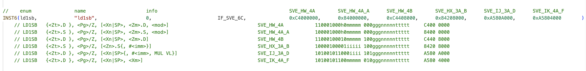
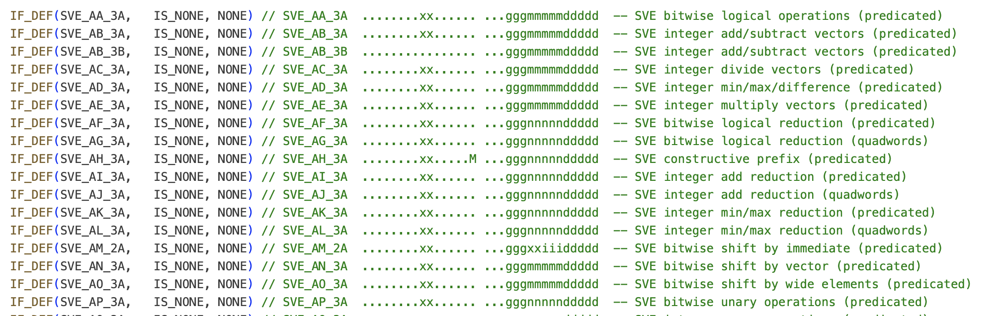
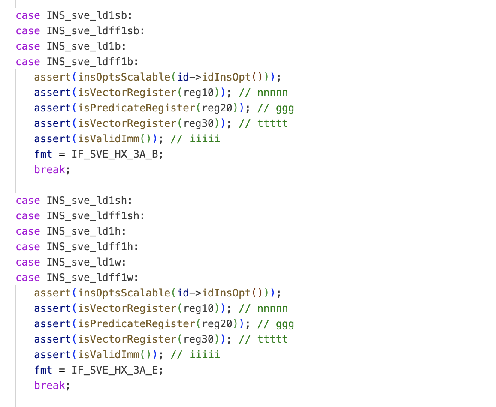
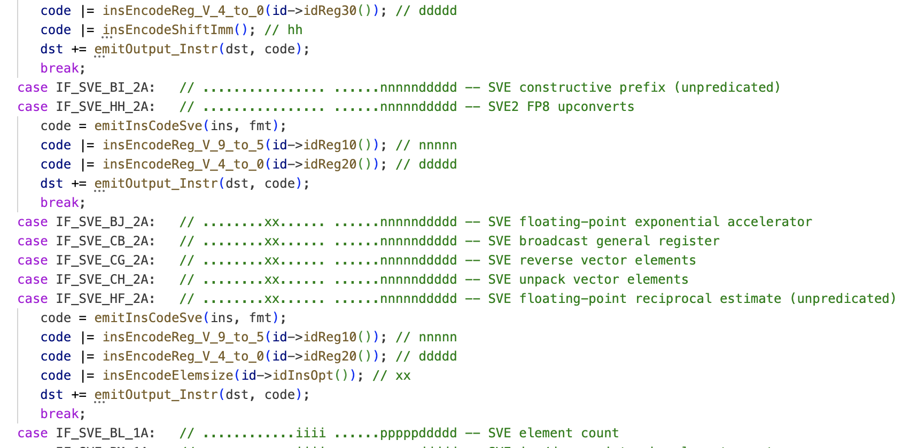
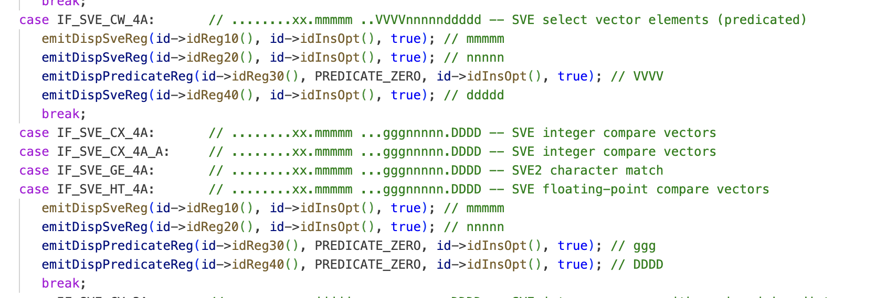
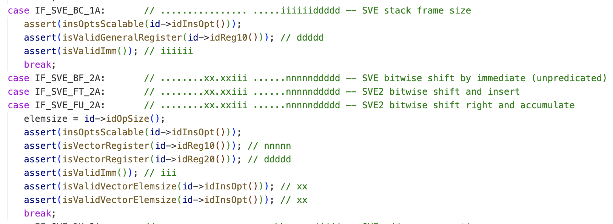
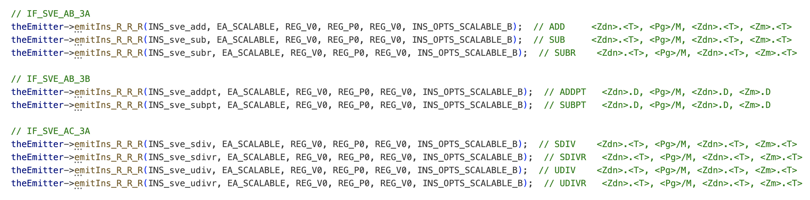

# Engineering SVE in .NET

## Introduction

128-bits is 16B and 256-bits are 32B

lot of technical information along with SVE design, etc.

blog post is arranged in chronological order of implementation

Disclaimer: This blog is huge and heavily technical because it is written targetting different category of audience - .NET fans who want to understand how we enabled SVE, .NET user who want to write SVE code, compiler developers who want to light up SVE in their language and runtime. Some might find the entire blogpost useful and for others, just certain subsections.

## What is SVE?

SVE an acronym for Scalable Vector Extension is the Arm processor feature that lets you program on vector length that is hardware defined and developers do not have to worry about it. Once the code is written, it doesn't need be recompiled for the future version of hardware that can expand the vector length. There are numerous articles and blog posts that describes SVE. 

Explain difference between non-streaming and streaming mode SVE.

## Predicates

diagrams of predicate register and some operations

todo: define clearly active and inactive lanes


## Code generation

To include an ISA in a compiler, there is a pre-requisite to add support for the new instructions the ISA offers, so that compiler can generate them. There are lot of details that goes in for implementing instructions. Starting with the lowest level, the opcodes of instrutions need to be added in the codebase, along with the corresponding pneumonic names. Many instructions comes with different versions having different number of operands, size of data they handle or various register requirements. All these finer details need to be fed in an easy to understand lookup table. Next, the code generation infrastructure need to be updated to make sure that the new instructions can be emitted in relevant places. Higher up, if there are any new registers introduced as per of the instruction, they need to be added in the register allocation. Every ISA defines its own Application Binary Interface (ABI) that specifies what happens to the state of registers at the sub-routine boundary and whose responsibility it is to save and restore the registers. In below sections, we will look through the work we have done in each of these phases to support SVE.

### SVE encoding

In compiler literature, "instruction encodes" refers to the opcodes of each instruction that are found in the Architecture manual. Compilers usually embedded these opcodes in some kind of lookup table such that key is a pneumonic name (or instruction name that is easy to understand by the developer) and value is the opcode of that instruction. The code generator knows which instruction to emit and it invokes the encoder to output the corresponding opcodes in the final code buffer.


In above screenshot, taken from Arm manual, the opcode of `setffr` instruction can be seen as `0x252C9000`. 

Now, lets look at step by step on how the opcodes that are found in the instruction manual get it through the compiler codebase.

1. The opcodes of new instructions has to be added in our codebase, such that the encoder and code generator has access to it.

TODO-START: Do not include
 This can be seen in [instrsarm64sve.h](TODO) file as shown below.

<< TODO: snapshot of instrarm64sve.h for SETFFR>>

Next, there are several code paths that need to be updated in order to enable the instruction that got added in above lookup table.

TODO-END: Do not include

2. For a code generator, to emit the any instruction, there is a giant `switch-case` against the instruction to be emitted. Depending on the instruction, the individual `case` statement calls the encoder to perform the encoding. The new instruction need to be added in such `switch-case`.

3. If an instruction has multiple formats, we need to update the code paths, to include the formats of the newly added instruction. 

4. There are sanity checks that are done while emitting each instruction to make sure that the instruction we are emitting has right set of registers, the data/vector size embedded in the opcode of the instruction is relevant, the immediates present in the instruction is within the allowable range, etc. All these codepaths need to get updated for any new instruction we add. 

5. For a disassembler, to display the pneumonic names of the instruction for a developer, we need to update the codepaths to include the new instruction to display them appropriately.

6. If we want to calculate the performance characteristics like latency and throughput of the newly added instruction, we need to update those paths.

7. Lastly, if there is a provision to unit test the instruction, we need to add unit tests for the new instructions.

What we can infer is for every new instruction a compiler adds support for, there are handful of places that needs to be updated to make sure the new instruction is completely enabled and functional. For SVE, we had to add 1123 new instructions. Yes, that is "One Thousand, One Hundred and Twenty Three" instructions. For an engineer to add support for a single instruction, from inspecting the opcodes in the Arm Manual, to understand the opcodes, to typing in the opcodes, to updating all the code paths, and all the places I described above, up to the point they can validate the instruction with unit test, it will at least take 3~4 hours to complete the task. For 1123 instructions, that is 561 work days, or little over 2 years of work for a single engineer.

With those timelines and estimate, there was no one we could have finished adding all the instructions, let alone exposing the intrinsics in .NET APIs layer. We realized that most of the code I mentioned above thatw was required to light up an instruction was very similar. All it needed was to translate an instruction details presented in the Arm architecture manual into the C++ code that can fit in RyuJIT's codebase. We started exploring options of auto generating some portion of the C++ code. To do that, we needed some utility that will scan pdf documents (Arm manual that is in pdf format) and extract out important information from it. However, we did not have such tool at our exposure or expertise to write a custom utility tool that knows how to parse the pdf pages. 

#### SVE encoding auto-generated C++ code

Arm Ltd. had [xml version](https://developer.arm.com/Architectures/A-Profile%20Architecture#Software-Download) of all their instruction set, which was much easier to write a parser for. We spent 3~4 weeks to write a tool in C# (of course) that parsed the xml files containing instruction data and generating various versions of C++ code that was needed at several places in our codebase. If you see [SveEncodingFiles](https://github.com/kunalspathak/SveEncodingFiles), the tool produced more than 17K lines of C++ code spread across 15 files. Imagine what a hard task it would be for an engineer having to type all this code by hand! The tool proved to be a great value add for our team and was worth pursuing.

When it came to implementation, all that an engineer had to do was copy the auto-generated code for each instruction from various files and paste it at the right place in our codebase. We distributed the instructions among 3 engineers. As you must have guessed, we also auto-generated the [distribution of instructions](https://github.com/kunalspathak/SveEncodingFiles/blob/main/assignments.md) among engineers. The engineers were able to implement all the instructions without having to worry about ay dependencies on each other or complicated merge conflicts during development. We finished adding all the 1123 encodings in little over 3 months. Hand writing the code for encoding would have took almost 9 months for 3 engineers. That was a total saving of 6 months for 3 engineers, or 18 man-months!

While there were lot of challenges in understanding the xml files semantics, how they are interconnected to other instruction files and writing parsing tools to make sure that we do not interpret the data incorrectly, it is worth its own blog post. Here, I will just walk you through few auto-generated files to highlight some of the key design of the tool.

1. [instrsarm64sve.h](https://github.com/kunalspathak/SveEncodingFiles/blob/main/instrsarm64_sve.h): All the instructions that RyuJIT offers are stored in a table. Each instruction can have several different formats by which they operate, depending on the size of vector, size of data, size of individual elements, those containing immediate operand and so forth. For e.g., `ld1sb` instruction's entry in `Fig 1.` has 6 different formats (as seen in [1](https://docsmirror.github.io/A64/2023-06/ld1sb_z_p_bi.html), [2](https://docsmirror.github.io/A64/2023-06/ld1sb_z_p_br.html), [3](https://docsmirror.github.io/A64/2023-06/ld1sb_z_p_bz.html) and [4](https://docsmirror.github.io/A64/2023-06/ld1sb_z_p_ai.html)). Every instruction format has the normalized opcodes in binary and hexadecimal formats. In the first instruction format of `Fig. 1`, the binary representation comes from [the Arm manual](https://docsmirror.github.io/A64/2023-06/ld1b_z_p_bz.html) seen in `Fig 2.`. The normalized version in our codebase basically has `0` at all the bit positions that encodes the information during code generation. One of the example is registers used in an instruction. If you see the binary representation, there are characters like `g`, `n` and `t` in them. Those positions are filled up when register corresponding to `g`, `n` and `t` are known during code generation. Without the tool, it would have been very time consuming task to translate the information in Arm manual (from `Fig 2.`) into the C++ code (in `Fig 1.`). 

   Other critical information that the tool helped generate for us was the format names. In `Fig 1.`, all instruction formats have names that starts with `SVE_*`. All instruction formats (of different instructions) that share same "normalized" binary/hexadecimal encoding gets the same format name. The rational behind this design is that all the formats having same "normalized" encoding, would get encoded during code generation in similar way. By grouping all such instruction formats with a format name that share similar encoding logic, we easily can share the C++ code needed to handle those formats (as you will see further). Now, imagine if each engineer start implementing the instructions assigned to them, it will be very challenging and difficult to co-ordinate to see if the format they are working on already exists and if not, the nomenclature they should use for the format name. By letting the tool do the heavy lifting for us, we embedded the logic of grouping various instruction formats and naming them with consistent naming conventions in the tool itself. As a result, the engineer was not burdened with this thinking of grouping similar formats.


   

   <p style="text-align: center;">Fig 1. Instruction encoding formats for "ld1sb"</p>

   

   <p style="text-align: center;">Fig 2. Arm manual's encoding entry for "ld1sb"</p>

2. [emitfmtsarm64sve.h](https://github.com/kunalspathak/SveEncodingFiles/blob/main/emitfmtsarm64_sve.h): Talking about the instruction format names, we also have a lookup table for individual format names along with the format it represents and brief description. From the Arm manual, we were able to easily extract this information and generate the lookup table with the new SVE format names. The nomenclature that we came up with was `SVE_XX_AB`, where `XX` is just alphabetical in order starting with `AA`, `AB` and so forth. `A` represents the number of register the format operates on, and `B` is another alphabetical order if there are slight variations from `SVE_XX_A` format. 

   


   <p style="text-align: center;">Fig 3. List of instruction format names</p>


3. Instruction to format mapping ([1](https://github.com/kunalspathak/SveEncodingFiles/blob/main/emitIns_R_I_sve.cpp), [2](https://github.com/kunalspathak/SveEncodingFiles/blob/main/emitIns_R_R_I_sve.cpp), [3](https://github.com/kunalspathak/SveEncodingFiles/blob/main/emitIns_R_R_R_I_sve.cpp), [4](https://github.com/kunalspathak/SveEncodingFiles/blob/main/emitIns_R_R_R_R_I_sve.cpp), [5](https://github.com/kunalspathak/SveEncodingFiles/blob/main/emitIns_R_R_R_R_sve.cpp), [6](https://github.com/kunalspathak/SveEncodingFiles/blob/main/emitIns_R_R_R_sve.cpp), [7](https://github.com/kunalspathak/SveEncodingFiles/blob/main/emitIns_R_R_sve.cpp), [8](https://github.com/kunalspathak/SveEncodingFiles/blob/main/emitIns_R_sve.cpp)): Since the auto generator tool already had the mapping of instruction format names to the instruction, we also leveraged it to generate reverse mapping needed to select the instruction format, depending on the instruction we want to emit.

   
    <p style="text-align: center;">Fig TODO. Instruction -> format mapping</p>

3. [emitOutputInstr.cpp](https://github.com/kunalspathak/SveEncodingFiles/blob/main/emitOutputInstr_sve.cpp), [dispHelper.cpp](https://github.com/kunalspathak/SveEncodingFiles/blob/main/emitDispInsHelp_sve.cpp), [sanityCheck.cpp](https://github.com/kunalspathak/SveEncodingFiles/blob/main/emitInsSanityCheck_sve.cpp): The next important piece of code the tool helped us generate was a huge switch/case, where depending on individual instruction format names, there is a common logic of handling them at various places in our codebase.

   In `Fig 4.` below, there is an encoding logic for `IF_SVE_BJ_2A` and following cases. It starts with the encodings we have in `instrsarm64sve.h`. Then, we encode the register represented by `nnnnn`, followed by the register represented by `ddddd` and then the element size `xx` of the instruction we are emitting. Because of the virtue of having all the manual's data handy, the tool was able to generate nice comments and other finer details that are easy to miss, if done manually.

   
   <p style="text-align: center;">Fig 4. Code to encoding instruction format</p>

   In a similar fashion, the tool generated all the relevant code necessary to display the disassembly of each instruction as seen in `Fig 5.` below. 
   To verify the encodings and the disassembly that we were generating is correct, we wanted an external tool that will take the encodes as input and produce the disassembly code. We would then compare the disassembly we produce with that of the external tool. One of our engineer forked [capstone](https://github.com/TIHan/capstone/tree/capstone-jit2) to make it work with RyuJIT. Each time an engineer would implement set of instructions, we would ask them to compare the disassembly RyuJIT produced with capstone's disassembly as seen in one of [this PR](https://github.com/dotnet/runtime/pull/95679).

   
    <p style="text-align: center;">Fig 5. Code to display disassembly</p>

   Lastly, to ensure that the instruction contains correct information like register, data size, etc. embedded, we do a round of sanity check and new checks were added by the tool for the SVE instructions as seen below.

   
    <p style="text-align: center;">Fig 6. Code to perform sanity checks</p>


4. [PerfScore.cpp](https://github.com/kunalspathak/SveEncodingFiles/blob/main/emitPerfScore_sve.cpp): For our debugging purpose, we emit the latency and throughput information of the entire method to understand how fast or slow the method would be. The latency and throughput information of individual instructions is taken from the Architecture Manuals and is embedded in our codebase. For new instructions, it would have been again tedious to find it in the manual and put it in our codebase. The tool helped to come up with
[perfscore.md](https://github.com/kunalspathak/SveEncodingFiles/blob/main/perfscore.md) that contained all the information needed for this purpose. As seen in `Fig todo.`, depending on instruction format and specific instruction, we embedded the perfscore information in our codebase.


   
   <p style="text-align: center;">Fig todo. Perfscore calculations</p>

6. [UnitTests.cpp](https://github.com/kunalspathak/SveEncodingFiles/blob/main/emitArm64EmitterUnitTests_sve.cpp): Finally, any feature is not complete without adequant test coverage. We were able to auto-generate unit tests to invoke all the above code as seen in `Fig todo.`

   
   <p style="text-align: center;">Fig todo. Unit tests for instructions</p>

To read more details and our progress, you can refer to the [dotnet/runtime #94549](https://github.com/dotnet/runtime/issues/94549) that lists all the encodings we added as well as the links to all the PRs that implemented 1123 instructions.


<p style="text-align: center;">Fig todo. Sve encodings progress</p>

### Handle more than 64 registers

The next important topic to talk about is having the support in register allocator. Prior to SVE, AArch64 had 64 registers - 32 general purpose registers (GPR) and 32 SIMD/Floating-Point registers. Throughout the RyuJIT backend code, we handle register set in lot of places. We represent them in a bitmask of type `unsigned __int64` and named it as `regMaskTP`. By treating register set as bitmask made it simpler to perform queries and operations like "Is a register present in the set?" or "Remove a register from the set" and so on. We also need to keep track of registers that are free/busy at a given point for which bitmask is useful. There are also numerous methods in our backend that either takes the `regMaskTP` as parameter (to know which registers are involved in an operation) or returns `regMaskTP` (to return the information about number of registers involved). Lastly, we had these register sets as part of our Intermediate Representation (IR) tree nodes. For such purpose too, `regMaskTP` has proven useful so far. 

However, as I have briefly mentioned above, SVE instruction set introduces 16 new predicate registers. That makes the total count of AArch64 registers to 80, which made it impossible to use our `regMaskTP` data structure. The obvious solution for such problem was to convert the `regMaskTP` into a struct and have additional field for representing the new register set. Our [quick prototype revealed](https://github.com/dotnet/runtime/pull/96196#issuecomment-1864657071) that by doing it increases the throughput cost of JIT compilation by around 10%. The reason being the native code produced for the RyuJIT code was sub-optimal because of replacing primitive `unsigned __int64` with a `struct`. All the methods that took or returned `regMaskTP` got impacted because the native code produced for such methods emitted additional code to copy around one extra field, often leading to disabling certain optimizations by the native C++ compiler.

Knowing that `struct` has significant overhead, prototype# 2 was to try to update the `regMaskTP` to `unsigned __int128` instead. However, we quickly realized that this option will not work. If we changed `regMaskTP` to `unsigned __int128`, all the data structure containing `regMaskTP` field assumed that the field's memory is aligned at 16-byte boundary. The native compiler would fail if that is not the case as we [found it here](https://github.com/dotnet/runtime/pull/94589#issuecomment-1816836145). This option was discarded.

Whatever prototype we try, we knew that it would impact many places in RyuJIT and we wanted to make sure that we not only minimize that impact for AArch64, but have zero impact for other platforms. To try out something that would pay off in a long run for all platforms, we had prototype# 3. We audited almost 1000s of places where `regMaskTP` was passed around. We segregated the places that are guaranteed to take just GPRs, just SIMD/Floating-Point registers, either of them, or any of them. By doing this analysis led us explore the code places where the new "predicate registers" need to be part of the register set and have the new "struct" version of `regMaskTP` only for such cases to reduce the throughput impact that we noticed in prototype# 1. We tried lot of novel techniques to reduce the throughput impact as much as possible, that an interested reader can read [here](https://github.com/dotnet/runtime/pull/98258). This prototype just had the throughput impact of 5~6% compared to that of 10% we tried earlier. However, we did not find this option viable because it touched at too many places and there were high chances that it could introduce bugs.

Knowing that the last prototype gave tolerable throughput impact, we decided to go forward with declaring `regMaskTP` as `struct` with 2 fields of `unsigned __int64` each. The first field will continue to represent GPR + SIMD/Floating-Point registers jointly, while the second field would represent the new "predicate registers". By having that separation, most of the code paths work on first field and very few places (like in register allocator itself), we had to deal with both the fields. We also decided to break down [prototype# 3](https://github.com/dotnet/runtime/pull/98258) into smaller incremental PRs, that are easy to review and thus, understand the impact of each smaller changes.

- [Handle more than 64 registers - Part 1](https://github.com/dotnet/runtime/pull/101950)
- [Handle more than 64 registers - Part 2](https://github.com/dotnet/runtime/pull/102297)
- [Handle more than 64 registers - Part 3](https://github.com/dotnet/runtime/pull/102592)
- [Handle more than 64 registers - Part 4](https://github.com/dotnet/runtime/pull/102921)
- [Handle more than 64 registers - Part 5](https://github.com/dotnet/runtime/pull/103188)
- [Handle more than 64 registers - Part 6](https://github.com/dotnet/runtime/pull/103387)


While register allocator support was getting added, we wanted to make sure that our engineers implementing the instruction encoding are not blocked because of lack of predicate registers. As such, we set the predicate registers to be an alias of vector registers. For e.g. `P0` was set to be alias of `V0`, `P1` to be alias of `V1` and so forth. That enabled our engineers to use enums like `REG_P0`, `REG_P1`, etc. in instruction encoding.

Overall, it took us several months to get these changes in, but it proved to be very useful infrastructure work to have. In future release, .NET is planning to add support for [Intel APX](https://www.intel.com/content/www/us/en/developer/articles/technical/advanced-performance-extensions-apx.html) which too adds additional GPR registers and will surpass the number of registers beyond 64. For lighting up new registers for Intel APX, very minimal change will be needed on top of the support we added in register allocator to support more than 64 registers.

### Calling conventions

With the completion of predicate register support in our register allocator, we started to represent these registers as its own dedicated entities, similar to GPR and SIMD/Floating-Point registers. The next logical thing to do was to implement the calling conventions defined for SVE. To revise the concept, lets say a method `A` (the caller) calls method `B` (the callee). Out of the other rules, an important rule that the calling convention describes is which registers should be preserved by callee and caller such that after the method call is complete, the caller can proceed its execution. Imagine the calling convention states that registers `r5` and `r6` should be preserved by the caller, while `r7` and `r8` should be preserved by the callee. We refer `r5` and `r6` as callee-trash/caller-saved, because callee can freely overwrite its contents without backing up its contents. Hence it is caller's responsibility to preserve its contents, if they are holding a value of a live variable. Likewise, `r7` and `r8` are referred as callee-saved registers because it is callee's responsibility to save/restore them (in prolog/epilog), if it want to use it.


```asm
func A()
{
   r5 = ...
   r6 = ...
   r8 = ...

   save r5
   B();
   restore r5

   ... = r5
   ... = r8
}

func B()
{
   push r8 ; prolog

   r8 = ...
   r5 = ...
   ...
   ...= r8


   pop r8 ; epilog
}
```

In code snippet above, although `r5`/`r6` are callee-trash registers, only `r5` is saved in `A` and restored after the call to `B` because there is no use of `r6` after `B` and hence there is no need to save/restore it. Likewise, in `B`, although `r8`/`r9` are callee-saved registers, only `r8` is saved in prolog and restored in epilog because `r9` was not touched through out the method. Once the call to `B` is complete, the value of `r5`, that was overwritten in `B`, is restored back to the value that was prior to `B` (hence `r5` is referenced as caller-saved). Likewise, `r8`'s value was restored, but the difference being the restoration of `r8` was done by callee (hence `r8` is referenced as callee-saved).


Here are the extracts about SVE calling convention as stated in the Arm architecture manual:

[Scalable Vector Registers](https://github.com/ARM-software/abi-aa/blob/main/aapcs64/aapcs64.rst#613scalable-vector-registers):

```
z0-z7 are used to pass scalable vector arguments to a subroutine, and to return scalable vector results from a function. If a subroutine takes at least one argument in scalable vector registers or scalable predicate registers, or returns results in such regisers, the subroutine must ensure that the entire contents of z8-z23 are preserved across the call. In other cases it need only preserve the low 64 bits of z8-z15.
```

[Scalable Predicate Registers](https://github.com/ARM-software/abi-aa/blob/main/aapcs64/aapcs64.rst#scalable-predicate-registers):

```
p0-p3 are used to pass scalable predicate arguments to a subroutine and to return scalable predicate results from a function. If a subroutine takes at least one argument in scalable vector registers or scalable predicate registers, or returns results in such registers, the subroutine must ensure that p4-p15 are preserved across the call. In other cases it need not preserve any scalable predicate register contents. In other cases it need not preserve any scalable predicate register contents.
```

After a [long discussion](https://github.com/ARM-software/abi-aa/issues/266) with Arm manual writers, we got clarifications about this requirement, which can be summarized in below table:

|Callee type | Callee saves | Caller saves
|---|---|---|
| regular | bottom 64-bits v8-v15 | All registers not in bottom 64-bits `v8-v15`
| *sve | `z8-z23`, `p4-p15` | All registers not in {`z8-z23, p4-p15`}

*sve method is defined as having at least one parameter as scalable vector/predicate value or that returns such value.

In other words, the calling convention mentions to save/restore different set of vector and predicate registers, depending on the method being called is a sve or a regular method. There were few challenges with having this convention implemented in .NET. The easier and solvable problem was that during jitting a method, we would now have to track if the current method is a sve method or if there is a call to a sve method. However, the challenging problem was the produced JIT code calls into native helpers, which are usually regular methods since we have not used scalable vector/predicate values in its parameters/return. Lets look again at the table above to understand the calling convention for `sve -> regular` call scenario.
- The caller (`sve` method) saves/restore {`z8-z23`, `p4-p15`} in its prolog/epilog because callee (`regular` method just saves bottom `v8-v15` and hence others can get overwritten).
- The callee (`regular` method) saves/restore {bottom 64-bits `v8-v15`} in prolog/epilog. Everything else should be saved/restored by the caller.

To visualize the disassembly produced by GCC/LLVM with all the saves/restore done correctly, lets look at two simple C++ programs. Both `M1` and `M2` are sve methods, however the difference is `M1` operates on scalable values (`pg`, `x` and `y`) while `M2` does not. `M2` just takes scalable values as parameters.

```c++
extern void N();
extern svbool_t Foo();

svbool_t M1(svint8_t x, svint8_t y)
{
    svbool_t pg = Foo();
    N();
    return svcmpgt_s8(pg, x, y);
}

int z;
void M2(svint8_t x, svint8_t y)
{
    z = 500;
    printf("hello");
}
```

If we look at the optimized disassembly (using `-O3`) produced for both these methods [at godbolt](https://godbolt.org/z/8sdbo5a9x) by GCC/Clang,  we notice that there are lot of saves/restores generated. That confirms that calling a regular method from a sve method can prove expensive. So the JIT code for a sve method that calls our helpers can thus be expensive and would regress the performance.

Hence, to keep things simpler, we decided to continue follow NEON calling conventions. Row 1 "regular callee type" in above table. With that design, it was much easier to just treat all the predicate registers `p0-p15` as [callee-trash](https://github.com/dotnet/runtime/pull/104065/files#diff-9fccee792bd328bbce1878bb5f0c4b999a251cb34a6f2a4b34ccd98be16d30a7R83). Essentially, whenever we do a method call and there is a live variable value inside the predicate register, we would just save that register contents on the stack before the call and then restore it after the call.

To save and restore predicate registers on the stack, regular or NEON instructions cannot be used. Predicate registers can only be saved/restore from the stack using predicate version of [str](https://docsmirror.github.io/A64/2023-06/str_p_bi.html) / [ldr](https://docsmirror.github.io/A64/2023-06/ldr_p_bi.html) instructions respectively. This was easily done by detecting if the register involved is predicate, and if so, use the predicate version of the instructions. In .NET 9, we hardcoded the vector length (VL) to 128-bits (more on that later), and hence, we did not have to worry about the position in the stack frame layout where the values of predicate registers will be saved. Likewise, the scalable vector registers are hardcoded to be of size 128-bits, and so, we did not have to update the `str`/`ldr` instructions that are used to save and restore scalable vector register values from/to stack. Existing NEON instructions just worked for this purpose. As seen in [dotnet/runtime #104065](https://github.com/dotnet/runtime/pull/104065), only change we had to make is making predicate register part of callee-trash set and then handling the saving and restoring of those registers.

## .NET APIs


Now that we have seen the code generation details above, let us deep dive in the frontend side of things. In this section, I will talk through the .NET API surface we exposed for various SVE intrinsics, data type we picked to represent scalable vector and predicate values and our testing methodology. I will also touch base upon various design approaches we undertook to make the connection between .NET API layer to the SVE instruction seemless. For those interested, I would recommend reading the [design discussion](https://github.com/dotnet/runtime/issues/88140) for SVE APIs.

### (Almost) Scalable Vector\<T>

When we first decided to support SVE in .NET, one of the primary thing that we were brainstorming about was how to represent scalable register concept. All the data types that are available currently in .NET ecosystem can hold a fixed amount of data that is known ahead of time. However, the "scalable" concept of SVE enforced the compiler developers to pick a data type that is designed to have unknown size until the  runtime. [`Vector<T>`](https://learn.microsoft.com/en-us/dotnet/api/system.numerics.vector-1?view=net-9.0) (where `T` is a generic parameter) was such a data type that was designed with such a scenario in mind. It represents a vector representing XXX bits, depending on the hardware on which the software is executing. For a hardware having 128-bits, if a vector contains elements of type `int`, then `Vector<int>` contains `4` integer elements (`32 x 4 = 128`) or `Vector<short>` contains `8` short elements (`16 x 8 = 128`). Thus picking up `Vector<T>` to represent scalable values of SVE was our natural choice. This maps to the Arm's proposed C data types for [Sve vector types](https://arm-software.github.io/acle/main/acle.html#sve-vector-types). However, .NET 9 is the first release that added SVE and we wanted to validate our design with the future implementation of streaming mode SVE, for now, we [hardcoded the VL to 128-bits](https://github.com/dotnet/runtime/pull/104174). So if there is a .NET app using SVE instructions and is ran on a hardware that has more than 128-bits, then we will simply disable the SVE, for now. We have a [tracking issue](ttps://github.com/dotnet/runtime/issues/101477) to support the truely variable VL support in .NET in future release.

### Vector\<T> for predicate types

"Predicate" concept is an inherit part of SVE framework. If you recall from previous section, predicates are similar to bitmask and are used to select lanes from vector types. Each bit in predicate registers decides if corresponding lane of SVE vector is active or inactive. C language proposed [svbool_t](https://arm-software.github.io/acle/main/acle.html#sve-predicate-types) for predicate values. To give .NET users an ability to have finer control over various SVE intrinsics, exposing predicates in similar fashion was crucial. There were [several options](https://github.com/dotnet/runtime/issues/88140#issuecomment-1758061408) that were brainstormed, mostly proposing to introduce a new data type like `VectorMask<T>` similar to `svbool_t`. There were few downside to that options. .NET users would have to get acquainted with the new data type `VectorMask<T>` and think carefully how to plumb it in their existing code base. Thus, the adoption of SVE technology in an existing code would not be natural and to some extent, would have discourage users from using it. Updating the code with new data-type comes with the cost of rebuilding the users application and redeploying it. Our goal was to light of SVE technology seemlessly for .NET users. The other important disadvantage of having a new data type was that it would have exploded the number of SVE intrinsic APIs that we were planning to implement. As a result, `Vector<T>` seemed to be our best choice to represent the predicate value concept. `Vector<T>` already has scalable length and the design was to just treat each lane has boolean value. The lanes that has non-zero value will be treated as active lane, while the ones that has zero value will be treated as inactive lane.

To understand the reason behind having more APIs, had we picked `VectorMask<T>` instead of `Vector<T>`, we need to see various categories of SVE instructions and options to expose them as .NET APIs.

#### Conditional Select instruction

Before looking at SVE instruction categories, let us look at the functioning of one of the important instruction [`sel`](https://developer.arm.com/documentation/ddi0602/2024-06/SVE-Instructions/SEL--vectors---Conditionally-select-elements-from-two-vectors-). 

```asm
SEL <Zd>.<T>, <Pv>, <Zn>.<T>, <Zm>.<T>
```

It acts as a ternary conditional operator in which depending on the values of predicate register `Pv`, for active lanes, it will pick the elements from `Zn` and for inactive lanes, from `Zm` and merge them in destination `Zd`. Essentially, it is doing the operation `Zd = Pv ? Zn : Zm`.

We exposed this instruction in following manner:

```c#
// where T: sbyte, byte, short, ushort, int, uint, long, ulong, float, double
Vector<T> ConditionalSelect(Vector<T> mask, Vector<T> left, Vector<T> right)
```

The first argument is predicate register value, represented using `Vector<T>` (instead of `VectorMask<T>`), and then the actual scalable values in `left` and `right`. It performs operation `mask ? left : right` and returns the result.

This API is one of the backbone of other .NET SVE APIs that we implemented and is the main reason of having less explosion of number of APIs. To see why, let us deep dive to check various types of instructions SVE offers.

#### Unpredicated instructions

Unpredicated instructinos are the simplest instructions and are similar to the general/NEON instructions that many of you are familiar with. These instructions do not take any predicate register. The instruction operate on scalable vector registers.

[ZIP2 instruction](https://developer.arm.com/documentation/ddi0602/2024-06/SVE-Instructions/ZIP1--ZIP2--vectors---Interleave-elements-from-two-half-vectors-()) is an unpredicated instruction because there are no predicate register operands for that instruction.

```asm
ZIP2 <Zd>.Q, <Zn>.Q, <Zm>.Q
```

If we see the Arm C language extension (ACLE) APIs for [zip2](https://developer.arm.com/architectures/instruction-sets/intrinsics/#f:@navigationhierarchiessimdisa=[sve]&q=svzip2[_u8]), it takes the two operands, that are scalable vectors and return the result of same type.

```c++
svuint8_t svzip2_u8(svuint8_t op1, svuint8_t op2)
```

They get mapped one-to-one to our proposed .NET API.

```c#
Vector<byte> ZipHigh(Vector<byte> left, Vector<byte> right);
```

#### Embedded Predicated instructions

The second category of SVE instructinos are the ones that only operates in presence of predicate operands. [ABS](https://developer.arm.com/documentation/ddi0602/2024-06/SVE-Instructions/ABS--Absolute-value--predicated--) is one of the example of such type. In Arm manual, such instructions have notation of "(predicated)" text in the instruction description.

```asm
ABS <Zd>.<T>, <Pg>/M, <Zn>.<T>
```

The instruction finds "Absolute value" of all the active elements (as per predicate register `Pg`) in `Zn` and store the result in `Zd`. The `/M` in the predicate register states that the inactive lanes should be left untouched and hence, for those lanes, `Zd` will not be modified. Thus, it performed the "merge" operation by merging the result of `Abs` into the destination `Zd`.


Let us see an example of ACLE APIs for `scalable vectors of signed integer` input. ACLE propose following [3 APIs](https://developer.arm.com/architectures/instruction-sets/intrinsics/#f:@navigationhierarchiessimdisa=[%5Bsve%5D]&q=svabs[_s32) for various scenarios on how to handle the inactive lanes.

```c++
svint32_t svabs_s32_m(svint32_t inactive, svbool_t pg, svint32_t op) // merge inactive elements with target
svint32_t svabs[_s32]_x(svbool_t pg, svint32_t op) // do not touch inactive elements of target
svint32_t svabs[_s32]_z(svbool_t pg, svint32_t op) // zero inactive elements with target
```

All the above 3 APIs calculate the Absolute value of elements that are in active lanes. The thing that differentiate them is what data is stored in the destination for the inactive lanes.

For inactive lanes, the `svabs_s32_m` API will pick the corresponding lanes from `inactive` parameter and store them in the destination. Thus it is "merging" the operation's result along with `inactive` parameter and storing all those elements in destination and hence the API name contains `_m`.

The `svabs_s32_x` API do not contain `inactive` parameter and hence leave the inactive lanes in destination untouched.

Lastly, `svabs_s32_z` API stores zero for the inactive lanes in the destination and hence the name ends with `_z`.

There is just 1 .NET API that we designed for this scenario which takes a parameter `value`. The API will find the Absolute value of `value` and return the result.

```c#
// T: sbyte, short, int, long, float, double
Vector<T> Abs(Vector<T> value)
```

Now, an obvious question is how can a .NET developer take advantage of all the possible variants of `ABS` instruction that I descibed above, specially combined with the predicate values using this single API? To answer that, we need to refresh our memory about [`ConditionalSelect` API](TODO: link to the section). As we know, any given expression `expr`, can be rewritten using ternary conditional operator `?:`. The `default` keyword represents the default value of `v`'s data type. For `int`, it would be `0`, for an object it would be `null` or for `Vector<T>` it is `Vector<T>.Zero`.

```c#
a = true ? expr() : default; // same as `a = expr()`
```

Likewise, operation `b = Abs(op)` can be rewritten as:

```c#
Vector<int> b = Vector<int>.One ? Abs(op) : Vector<int>.Zero;

// or in API format, something like:

Vector<int> b = ConditionalSelect(Vector<int>.One, Abs(op), Vector<int>.Zero);
```

In this example, the first `mask` in `ConditionalSelect` is `Vector<int>.One` which has value `1` for all lanes. In predicate value's terminology, that means all lanes are active. The "true" value of ternary operator is given by the second parameter value i.e. `Abs(op)` operation, while the "false" value is given by the third parameter `Vector<int>.Zero`. Since all lanes of `mask` is set to `1`, we want to return the "true" value of the `ConditionalSelect` operation. The "true" value is however a SVE operation `ABS` that only operates on "active" lanes. This is exactly we will connect the `mask` value to the predicate value that `ABS` instruction operates on. Since all lanes of `mask` are active, we translate the semantics of `Abs(op)` to - Perform `ABS` operation on all the lanes (because all are active) of `op` and return the result. In other words, `Abs(op)` .NET API call is translated to:

```asm
ptrue p7.s           ; manifest all lanes as active
abs z10, p7/m, z9.s  ; perform operation
```

With that in mind, let us go back to the C APIs for `ABS` instruction and see if we can rewrite them in `Abs(op)` format using `ConditionalSelect()` API.

```c#
val_m = ConditionalSelect(pg, Abs(op), inactive)  // val_m = svabs_s32_m(inactive, pg, op)
val_x = ConditionalSelect(pg, Abs(op), val_x);    // val_x = svabs_s32_x(pg, op)
val_z = ConditionalSelect(pg, Abs(op), Zero);     // val_z = svabs_s32_z(pg, op)
```

For exposing .NET APIs for SVE, we decided to follow this concept of recognizing the pattern during JIT. When we see `Abs()` call, we wrap it up inside `ConditionalSelect` node, to essentially produce `ConditionalSelect(True, Abs(op). Zero)` and during code generation, we handle it to generate correct instruction. Alternatively, if the developer already wrapped `Abs()` in `ConditionalSelect()`, we will not wrap it further in another `ConditionalSelect`. This prevented us from exposing separate API for each instruction variant.

For `ABS` instruction, we have [6 APIs](https://learn.microsoft.com/en-us/dotnet/api/system.runtime.intrinsics.arm.sve.abs?view=net-9.0) compared to [18 APIs](https://developer.arm.com/architectures/instruction-sets/intrinsics/#f:@navigationhierarchiessimdisa=[sve]&q=svabs[) (I am eliminating the 3 APIs from the count because they are 16-bit float, a type that .NET does not have). I want to pause for a moment and emphasize here that there is no right or wrong answer to the number of APIs that should be exposed for each of the instruction. The reason C APIs are more is because it wants to be explicit on which instruction an API will invoke and thus giving finer control to the developers. Another reason being to motivate developers for using the concept of predicate values via `svbool_t` data type. The intent of .NET is to have smaller number of .NET APIs for easy code maintainence. By not having a separate `VectorMask<T>`, we removed some of the burden for .NET developer in having to remember a new data type and sprinkling its use in their existing code base. We also believed that much of the API usage can be identified by the pattern recognition by JIT during code generation. Looking back, we implemented 102 of APIs that fell under the same category as `Abs` API. We labelled them as `HW_Flag_EmbeddedMaskedOperation` in our [intrinsic lookup table](https://github.com/dotnet/runtime/blob/main/src/coreclr/jit/hwintrinsiclistarm64sve.h). Had we exposed them as separate API, each API has 3 variants of `_m`, `_x` and `_z`, there would have been at least `102 x 3 = 306` APIs. Taking template parameter into account, that brings up the count to approxiametely `306 x 8 = 2448`. With our current design model, we enabled `102 x 8 = 816` APIs only. This design decision also helped us for other categories of SVE instructions as we will see below.


#### Instructions having both Predicated and Unpredicated variants

The next set of instructions are the ones that have both predicated and unpredicated variant. [Add (predicated)](https://docsmirror.github.io/A64/2023-06/add_z_p_zz.html) and [Add (unpredicated)](https://docsmirror.github.io/A64/2023-06/add_z_zz.html) is a good example of this:

```asm
ADD <Zdn>.<T>, <Pg>/M, <Zdn>.<T>, <Zm>.<T> ; predicated
ADD <Zd>.<T>, <Zn>.<T>, <Zm>.<T>           ; unpredicated
```

Similar to `ABS`, the predicated version of `ADD` too operates on active lanes of operands, and it merge/leave untouch/zero the destination for inactive lanes. The unpredicated version is similar to the `ZIP2` instructinon we have seen previously, whre the an operation is done on all lanes.

ACLE defines [3 APIs](https://developer.arm.com/architectures/instruction-sets/intrinsics/#f:@navigationhierarchiessimdisa=[sve]&f:@navigationhierarchiesreturnbasetype=[int,uint]&q=svadd[_s8) to cover both predicated and unpredicated version of the instruction. For .NET, we followed the same model that I described for `Abs` API. We have [10 APIs for Add](https://learn.microsoft.com/en-us/dotnet/api/system.runtime.intrinsics.arm.sve.add?view=net-9.0), one for each template parameter.

```c#
// where T: byte, sbyte, short, ushort, int,
//          uint, long, ulong, float, double
Vector<T> Add(Vector<T> left, Vector<T> right)
```

Now let us see how we determine whether to generate predicated version or unpredicated version of the instruction. The logic is very simple. During JIT if we see an API is being used inside a `ConditionalSelect()` as its second parameter, we know that we need to generate the predicated version of the instruction. In below code, for active lanes, the result will be taken from `Add(op1, op2)`.

```c#
// svadd_s8_m - for inactive lanes, get result from op1
var_m = ConditionalSelect(pg, Add(op1, op2), op1);

// svadd_s8_x - for inactive lanes, get result from b i.e. keep untouched
var_x = ConditionalSelect(pg, Add(op1, op2), b);

// svadd_s8_z - for inactive lanes, set result to zero
var_z = ConditionalSelect(pg, Add(op1, op2), Vector<T>.Zero)
```

For everything else, we generate the unpredicated variant of `ADD`, e.g. `a = Add(b, c)`. During JIT, unlike `Abs()`, we will not try to wrap `Add()` API inside `ConditionalSelect`. That's because we know that `ADD` has both predicated and unpredicated variant.

There are scenarios where `Add()` is indirectly wrapped in `ConditionalSelect`, like in below example:

```c#
Vector<int> DoAdd(Vector<int> x, Vector<int> y) => Add(x, y);

void Test() {
   ...
   var add_result = DoAdd(x, y);
   ...
   var y = ConditionalSelect(mask, add_result, otherVariable);
   ...
}
```

For such cases, we will generate the unpredicated version of `ADD` and then `sel` instruction to select the appropriate result:

```asm
ADD z6, z7, z8
...
SEL p2, z6, z11 
```

#### Operate on both Vector and Predicate operands

There are certain instructions like `TRN1` which has two variants - the one that takes [predicates](https://developer.arm.com/documentation/ddi0602/2024-06/SVE-Instructions/TRN1--TRN2--predicates---Interleave-even-or-odd-elements-from-two-predicates-) and the other that takes [vectors](https://developer.arm.com/documentation/ddi0602/2024-06/SVE-Instructions/TRN1--TRN2--vectors---Interleave-even-or-odd-elements-from-two-vectors-). 

```asm
TRN1 <Pd>.<T>, <Pn>.<T>, <Pm>.<T>   ; predicates
TRN1 <Zd>.<T>, <Zn>.<T>, <Zm>.<T>   ; vectors
```

The [svtrn1* APIs](https://developer.arm.com/architectures/instruction-sets/intrinsics/#f:@navigationhierarchiessimdisa=[sve]&q=svtrn1) defined in ACLE have separate version for each of these variants. 

```c++
svbool_t svtrn1_b32(svbool_t op1, svbool_t op2);   // predicates
svint32_t svtrn_s32(svint32_t op1, svint32_t op2); // vectors
```

In .NET, we have [10 APIs](https://learn.microsoft.com/en-us/dotnet/api/system.runtime.intrinsics.arm.sve.transposeeven?view=net-9.0) for this instruction, again one for each template parameter.

```c#
// where T: byte, sbyte, short, ushort, int
//          uint, long, ulong, float, double
Vector<T> TransposeEven(Vector<T> left, Vector<T> right)
```

As we have seen previously, in .NET, we do not have a separate type like `VectorMask<T>` for differentiating predicate types. How will we know if the inputs to `TransposeEven` represent vector value or a predicate value? Well, we know which API returns predicate result. E.g. [`CreateTrueMaskInt64`](https://learn.microsoft.com/en-us/dotnet/api/system.runtime.intrinsics.arm.sve.createtruemaskint64?view=net-9.0) (that generates [`ptrue`](https://developer.arm.com/documentation/ddi0602/2021-06/SVE-Instructions/PTRUE--Initialise-predicate-from-named-constraint-?lang=en) instruction) or [`CompareEqual`](https://learn.microsoft.com/en-us/dotnet/api/system.runtime.intrinsics.arm.sve.compareequal?view=net-9.0) (that generates [`cmp`](https://developer.arm.com/documentation/ddi0602/2024-06/SVE-Instructions/CMP-cc---vectors---Compare-vectors-) instruction). We label them as `HW_Flag_ExplicitMaskedOperation` in [intrinsic lookup table](https://github.com/dotnet/runtime/blob/main/src/coreclr/jit/hwintrinsiclistarm64sve.h). During JIT, it is trival to determine if the arguments to `TransposeEven()` is coming from methods that return predicate values or the ones that return vector values. Depending on that, we can decide which instruction variant we should generate.

```c#
x = TransposeEven(left, right);                          // vectors variant
y = TransposeEven(CompareEqual(), CompareGreaterThan()); // predicate variant
```

In .NET 9, we did not get a chance to work on pattern detection for predicate variant and we have a tracking issue [dotnet/runtime #103078](https://github.com/dotnet/runtime/issues/103078) to analyze and generate predicate instruction variant. We need to also think of certain edge cases that might come with this design. In below code, `DoCompare()` returns predicate values in `Vector<T>` format, but in `TransposeEven()` we will not know that and assume that they are normal vector values.

```c#
[noinline]
Vector<int> DoCompare(Vector<int> x, Vector<int> y) => CompareEqual(x, y);

void Test() {
   ...
   var op1 = DoCompare(a, b);
   var op2 = DoCompare(c, d);
   ...
   var y = TransposeEven(op1, op2);
   ...
}
```

#### Operate on Predicate operands

Similar to above, there are certain instructions that just operate on predicate operands like [ORN (predicates)](https://developer.arm.com/documentation/ddi0602/2024-06/SVE-Instructions/ORN--predicates---Bitwise-inclusive-OR-inverted-predicate-). We have yet enabled such APIs and we have tracking issue [dotnet/runtime #101933](https://github.com/dotnet/runtime/issues/101933) to enable them.

#### Explicit Predicated instructions

Lastly, there are instructions like [`ld2sh`](https://docsmirror.github.io/A64/2023-06/ld2h_z_p_bi.html) that works based on predicate value and hence, there is a need to explicitely have the `mask` or predicate parameter to such APIs. As done in ACLE, for [`svld2*`](https://developer.arm.com/architectures/instruction-sets/intrinsics/#f:@navigationhierarchiessimdisa=[sve]&q=svld2) APIs, we have added this parameter in the .NET API to have [10 APIs](https://learn.microsoft.com/en-us/dotnet/api/system.runtime.intrinsics.arm.sve.load2xvectorandunzip?view=net-9.0), one for each template parameter.

```c#
// where T: byte, sbyte, short, ushort, int
//          uint, long, ulong, float, double
(Vector<T>, Vector<T>) Load2xVectorAndUnzip(Vector<T> mask, T* address) 
```

During JIT, by the virtue of flag `HW_Flag_ExplicitMaskedOperation` on such APIs in [intrinsic lookup table](https://github.com/dotnet/runtime/blob/main/src/coreclr/jit/hwintrinsiclistarm64sve.h), when we encounter this API, we already know that the first parameter is a predicate value.

 
### Vector <--> Predicate conversion

  - VectorToMask and MaskToVector conversion in the IR and optimization for it.
- Handy for `TRN1` above


There are

TODO: Stats - with and without `VectorMask<T>`
TODO: it's a different focus. C++ cared about exposing masks where possible to encourage their use. C# cares more about simplicity of the API - shorter and fewer args


The full list of issues is:

TODO:
- Links to Alan's issues 
- Some examples of SVE APIs usage and disassembly produced from sve slides
- Replace `docsmirror` with Arm docs link.
- auto-generate of code for API


### .NET APIs for SVE intrinsics 

 and [Sve predicate types](https://arm-software.github.io/acle/main/acle.html#sve-predicate-types)


- What design decisions we had to make because of that:
  - Mark the APIs with specific flag and explain with examples
  - ConditionalSelect wrapping
- Auto-generate of various files

TODO:
- GH issues for .NET API proposal
- Vector<T> to light up naturally
- Rearrange the sections


###  RMW Delay free registers

### movprfx instruction

## FFR register

## Diagnostics

## Context switches

## Debugging

## Testing 

1453 test files, 26926 test cases

unit test

stress test running locally

## Partners

Acknowledgement:
 - Alan Haywards
 - Aman Asif Khalid
 - Kunal Pathak
 - Sebastin
 - Arm engineer who was present for API implementation??
 - Swapnil
 - Will Smith

## Hardware availability

Currently SVE is available in very limited hardwares, but vendors are pushing towards introducing SVE. Microsoft Azure recently released Arm offering of Cobalt 100 that has non-streaming SVE feature. Amazon's AWS has Graviton 3 that comes with 2 x 16B VL, Graviron 4 comes with 16B vector length, Apple's M4 has 64B vector length and supports streaming SVE and SME features. And there is Fijitsu's super computer that offers SVE 64B VL.

- unwind code not available - https://learn.microsoft.com/en-us/cpp/build/arm64-exception-handling?view=msvc-170#arm64-stack-frame-layout
- OS had support in January
- windbg no support

## NativeAOT

`struct {}` size determination


### Future

- streaming SVE and SME
- True VL agnostic


### References

- https://developer.arm.com/Architectures/A-Profile%20Architecture#Software-Download
- [Arm C Language Extension](https://arm-software.github.io/acle/main/acle.html)

good references that explain SVE features in details along with the coding examples.