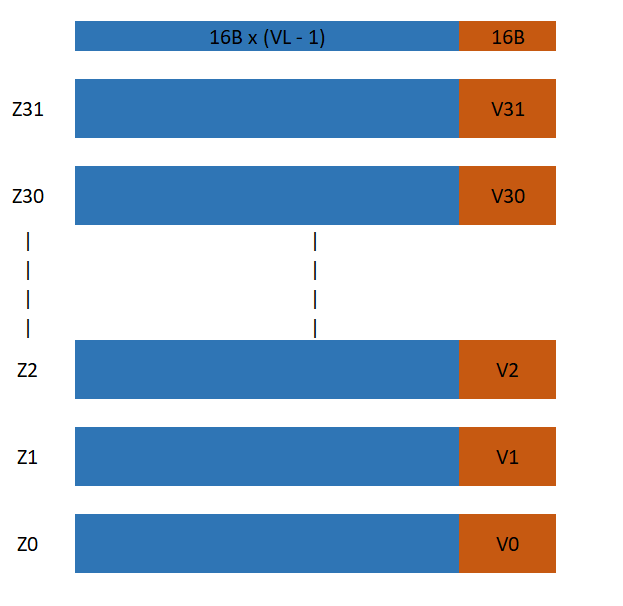
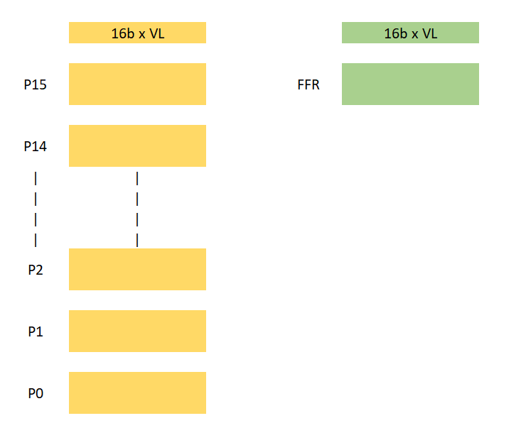
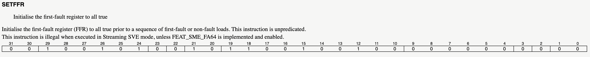
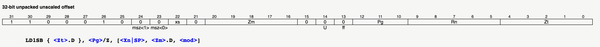
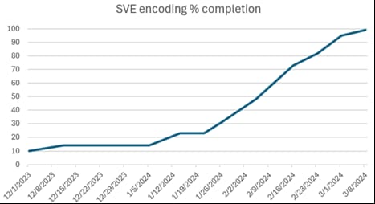
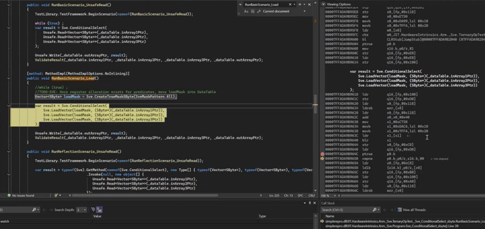

Scalable Vector Extension (SVE) on Arm processors is revolutionizing how modern hardware handles parallel workloads. SVE allows for flexible vector processing, enabling significant performance improvements across various applications. We are excited to announce the [integration of Arm SVE support](https://github.com/dotnet/runtime/issues/93095) as an [`[Experimental]`](https://learn.microsoft.com/dotnet/api/system.diagnostics.codeanalysis.experimentalattribute?view=net-8.0) feature. It will bring the power of scalable vector processing to .NET developers through [SVE .NET APIs](https://learn.microsoft.com/dotnet/api/system.runtime.intrinsics.arm.sve?view=net-9.0) for the first time. This addition empowers developers to write more efficient, high-performance code that can take full advantage of modern hardware architectures. This marks only the initial step on a long journey toward fully implementing and supporting SVE, as well as other features like Streaming SVE (SSVE) and Scalable Matrix Extension (SME). We encourage everyone to explore our current offerings and provide feedback, particularly regarding our decision not to surface an explicit predicate vector type. Your insights will be invaluable in refining our implementation.

This article, <b><i>"Hitchhiker's Guide to the SVE in .NET"</i></b> is a detailed look at the work we undertook to reach this point, highlighting the challenges we faced and the solutions we developed to integrate SVE seamlessly into the .NET ecosystem. It is crafted for wide range of readers - .NET developers eager to explore the new intrinsics features, those looking to use SVE in their .NET applications, enthusiasts curious about SVE’s impact within the .NET, and compiler developers interested in bringing SVE to life in their languages and runtimes. Buckle up and get ready — let’s embark on this exciting journey together!

- [1. Introduction](#1-introduction)
  * [1.1 What is SVE?](#11-what-is-sve-)
  * [1.2 Scalable Vector Registers](#12-scalable-vector-registers)
  * [1.3 Scalable Predicate Registers](#13-scalable-predicate-registers)
- [2. SVE APIs](#2-sve-apis)
  * [2.1 (Almost) Scalable Vector\<T>](#21--almost--scalable-vector--t-)
  * [2.2 Vector\<T> for predicate types](#22-vector--t--for-predicate-types)
  * [2.3 API categories](#23-api-categories)
    + [2.3.1 Conditional Select instruction](#231-conditional-select-instruction)
    + [2.3.2. Unpredicated instructions](#232-unpredicated-instructions)
    + [2.3.3 Embedded Predicated instructions](#233-embedded-predicated-instructions)
    + [2.3.4 Instructions having both Predicated and Unpredicated variants](#234-instructions-having-both-predicated-and-unpredicated-variants)
    + [2.3.5 Operate on both Vector and Predicate operands](#235-operate-on-both-vector-and-predicate-operands)
    + [2.3.6 Operate on Predicate operands](#236-operate-on-predicate-operands)
    + [2.3.7 Explicit Predicated instructions](#237-explicit-predicated-instructions)
  * [2.4 Vector <---> Predicate conversion](#24-vector-------predicate-conversion)
  * [2.5 Auto-generated code](#25-auto-generated-code)
- [3. Code generation](#3-code-generation)
  * [3.1 SVE encoding](#31-sve-encoding)
  * [3.2 Auto-generated encoding code](#32-auto-generated-encoding-code)
- [4. Beyond code generation](#4-beyond-code-generation)
  * [4.1 Handle more than 64 registers](#41-handle-more-than-64-registers)
  * [4.2 Calling conventions](#42-calling-conventions)
  * [4.3 Move prefix instruction](#43-move-prefix-instruction)
  * [4.4 FFR register](#44-ffr-register)
  * [4.5 Context switches](#45-context-switches)
- [5. Diagnostic and Testing](#5-diagnostic-and-testing)
- [6. A word about NativeAOT](#6-a-word-about-nativeaot)
- [7. Limitation](#7-limitation)
- [8. Future](#8-future)
- [9. Acknowledgement](#9-acknowledgement)
- [10. Conclusion](#10-conclusion)
- [11. References](#11-references)
- [12. Appendix](#12-appendix)
  * [12.1. Loop example](#121-loop-example)
  * [12.2. ABS instruction selection case study](#122-abs-instruction-selection-case-study)


## 1. Introduction

There are many Arm manuals and a plethora of programming examples that offer a detailed overview of SVE features. In this section, I will provide a concise summary of the key SVE concepts essential for understanding the content of this blog.

### 1.1 What is SVE?

Unlike traditional SIMD architectures that use fixed-width vectors (e.g., 128-bit or 256-bit), the Scalable Vector Extension (SVE) introduces scalable vector lengths (VL), allowing for a wide range from 128 bits to 2048 bits. This flexibility enables SVE to adapt to different hardware configurations, optimizing performance across various workloads such as scientific simulations, data analytics, machine learning, and cryptography. By supporting various data widths, SVE ensures that the same code can run efficiently on devices with differing vector capabilities without the need for recompilation or specific optimizations, making it a powerful solution for modern computing needs.

### 1.2 Scalable Vector Registers

SVE offers 32 scalable vector registers named `Z0` thru `Z31`. They overlap with the the SIMD & Floating Point registers `V0` thru `V31`. The `Vx` registers are of fixed size of 128-bits wide. `Zx` registers are scalable and are sized based on the VL of the hardware.




### 1.3 Scalable Predicate Registers

SVE also features predicate registers and one first-faulting register, which enable fine-grained control over which vector elements are operated on, allowing for more efficient processing of irregular data sets and often avoiding the need to write tail cleanup loops for vectorized loop code. They are 1/8 of `Zx` register's length and hence each bit in the predicate represents a lane of vector on which the predication is applied.



In below example, imagine we are doing an addition operation of two vectors of `16-bit short` numbers - `operand1` and `operand2`, and a given `predicate` value. In `predicate`, only lane numbers `3`, `4` and `7` are set to `1`. That says that only those corresponding elements of `operand1` and `operand2` should be added. In SVE terminology, `3`, `4` and `7` are active lanes, while remaining others are inactive lanes. In the result, the addition result for only the active lanes are stored. For the inactive lanes, the data stored in result, shown as `X` depends if the predicate operation is "merged", "zeroed" or "don't touch". We will explore these topics in more detail in the upcoming sections.


```bash

   7        6       5      4        3       2       1       0        predicate bit-positions
.................................................................
|   1   |   0   |   0   |   1   |   1   |   0   |   0   |   0   |    predicate
.................................................................

   111     95      79      63      47      31      15       0        vector bit-positions
.................................................................
|   5   |   2   |   3   |   6   |   8   |   2   |   3   |   2   |    operand 1
.................................................................
                                +
.................................................................
|   9   |   7   |   1   |   5   |   4   |   9   |   6   |   7   |    operand 2
.................................................................

                                =
.................................................................
|  14   |   X   |   X   |  11   |  12   |   X   |   X   |   X   |    result
.................................................................
```


## 2. SVE APIs

In this section, I will discuss the .NET programming model we created for various SVE intrinsics, the data types selected to represent scalable vectors and predicate values, as well as our testing methodology. The programming model includes a set of functions ("APIs") and data types. I will also highlight the different design approaches we implemented to ensure a seamless connection between the .NET API layer and the SVE instructions. For those interested in a deeper dive, I recommend reviewing the [design discussion](https://github.com/dotnet/runtime/issues/88140) for the SVE APIs.

### 2.1 (Almost) Scalable Vector\<T>

When we first decided to support SVE in .NET, one of the main topics we brainstormed was how to represent the concept of scalable registers. Most data types we are familiar with are of fixed size, and their sizes are known at compile time. However, the "scalable" aspect of SVE requires compiler developers to choose a data type that can have an unknown size until runtime. The existing [`Vector<T>`](https://learn.microsoft.com/dotnet/api/system.numerics.vector-1?view=net-9.0) type was designed with this scenario in mind. It represents a vector (list) of elements of type `T`, where the number of elements in the vector depends on the hardware running the software and the type `T` being stored.

For example, on hardware with 128 bits, if a vector contains elements of type `int`, then `Vector<int>` will hold four 32-bit integers (`32 x 4 = 128`), while `Vector<short>` will contain eight 16-bit short integers (`16 x 8 = 128`). Therefore, selecting `Vector<T>` to represent scalable values for SVE was a natural choice, aligning with Arm's proposed C data types for [SVE vector types](https://arm-software.github.io/acle/main/acle.html#sve-vector-types).

It’s important to note that .NET 9 is the first release to add SVE support, and we wanted to validate our design with the future implementation of streaming mode SVE. For now, we have [hardcoded the vector length (VL) to 128 bits](https://github.com/dotnet/runtime/pull/104174). Consequently, if a .NET application using SVE instructions runs on hardware that supports more than 128 bits, we will temporarily disable SVE support. We also have a [tracking issue](https://github.com/dotnet/runtime/issues/101477) to implement true variable VL support in a future release.


### 2.2 Vector\<T> for predicate types

The concept of "predicates" is an integral part of the SVE framework. As mentioned in the previous section, predicates function similarly to a bitmask, allowing the selection of lanes from vector types. Each bit in the predicate registers determines whether the corresponding lane of an SVE vector is active or inactive. The C language introduces [svbool_t](https://arm-software.github.io/acle/main/acle.html#sve-predicate-types) for representing predicate values.

To provide .NET users with finer control over various SVE intrinsics, it was essential to expose predicates in a similar manner. We explored [several options](https://github.com/dotnet/runtime/issues/88140#issuecomment-1758061408), primarily considering the introduction of a new data type, such as `VectorMask<T>`, that would map to `svbool_t`. However, this approach had some downsides. .NET users would need to familiarize themselves with the new `VectorMask<T>` type and carefully integrate it into their existing codebases, which could hinder the natural adoption of SVE technology and discourage usage. Additionally, updating the code with a new data type would require rebuilding and redeploying applications.

Our goal was to make the integration of SVE technology as seamless as possible for .NET users. Another significant drawback of introducing a new data type was the potential increase in the number of required SVE intrinsic APIs overloads. Thus, `Vector<T>` emerged as the best choice to represent the concept of predicate values. `Vector<T>` already supports scalable lengths, and we designed it to treat each lane as a boolean value. Lanes with non-zero values would be considered active, while those with zero values would be regarded as inactive.

### 2.3 API categories

To understand why using `Vector<T>` instead of `VectorMask<T>` reduced the number of APIs we needed to expose, we should consider the different categories of SVE instructions and the options available for implementing them as .NET APIs. By leveraging `Vector<T>`, we could streamline the design and minimize the complexity of our API surface.

#### 2.3.1 Conditional Select instruction

Let us look at the functioning of one of the most important instruction [`sel`](https://developer.arm.com/documentation/ddi0602/2024-06/SVE-Instructions/SEL--vectors---Conditionally-select-elements-from-two-vectors-). 

```armasm
SEL <Zd>.<T>, <Pv>, <Zn>.<T>, <Zm>.<T>
```

It functions as a ternary conditional operator: based on the values in the predicate register `Pv`, it selects elements from `Zn` for active lanes and from `Zm` for inactive lanes, merging them into the destination `Zd`. In essence, it performs the operation `Zd = Pv ? Zn : Zm`.

We exposed this instruction through the following .NET API:

```csharp
// where T: sbyte, byte, short, ushort, int, uint, long, ulong, float, double
Vector<T> ConditionalSelect(Vector<T> predicate, Vector<T> left, Vector<T> right)
```

The first argument is the predicate register value, represented using `Vector<T>` (rather than `VectorMask<T>`), followed by the scalable values in `left` and `right`. It executes the operation `predicate ? left : right` and returns the result.

This API serves as a foundation for other .NET SVE APIs we implemented and is a key reason for the reduced proliferation of APIs. To understand this further, let’s take a deeper look at the various types of instructions that SVE offers.

#### 2.3.2. Unpredicated instructions

Unpredicated instructions are the simplest type of SVE instructions and are similar to the general NEON instructions that many of you may already be familiar with. These instructions do not utilize any predicate registers and operate directly on scalable vector registers.

The [ZIP2 instruction](https://developer.arm.com/documentation/ddi0602/2022-03/SVE-Instructions/ZIP1--ZIP2--vectors---Interleave-elements-from-two-half-vectors-) is an example of an unpredicated instruction, as it does not have any predicate register operands.

```armasm
ZIP2 <Zd>.Q, <Zn>.Q, <Zm>.Q
```

This directly maps to our proposed .NET API that takes two scalable vector operands and returns a result of the same type:

```csharp
Vector<byte> ZipHigh(Vector<byte> left, Vector<byte> right);
```

#### 2.3.3 Embedded Predicated instructions

The second category of SVE instructions operates only in the presence of predicate operands. An example of such an instruction is [ABS](https://developer.arm.com/documentation/ddi0602/2024-06/SVE-Instructions/ABS--Absolute-value--predicated--), which has the notation "(predicated)" in its description in the Arm manual.

```armasm
ABS <Zd>.<T>, <Pg>/M, <Zn>.<T>
```

This instruction calculates the absolute value of all active elements in `Zn` (as determined by the predicate register `Pg`) and stores the results in `Zd`. The `/M` in the predicate register indicates that inactive lanes remain untouched, so `Zd` will not be modified for those lanes. Essentially, this operation merges the results of the absolute value calculation into the destination `Zd`.

In .NET, we designed a single API to cover this scenario:

```csharp
// T: sbyte, short, int, long, float, double
Vector<T> Abs(Vector<T> value)
```

An obvious question arises: how can .NET developers leverage the `<Pg>/M` value of the instruction, if the API does not even have that as an input parameter? The answer lies in the [`ConditionalSelect`](#231-conditional-select-instruction) APIs. Any expression `expr` can be rewritten using a ternary conditional operator `?:`. The `default` keyword represents the default value for the type of `v`: for `int`, it is `0`; for an object, it is `null`; and for `Vector<T>`, it is `Vector<T>.Zero`.

```csharp
a = true ? expr() : default; // equivalent to `a = expr()`
```

Thus, the operation `b = Abs(op)` can be rewritten as:

```csharp
Vector<int> b = Vector<int>.One ? Abs(op) : Vector<int>.Zero;

// or, in API format:

Vector<int> b = ConditionalSelect(Vector<int>.One, Abs(op), Vector<int>.Zero);
```

In this example, the first parameter in `ConditionalSelect` is `Vector<int>.One`, which has a value of `1` for all lanes, meaning all lanes are active. The "true" value of the ternary operator is represented by the second parameter, `Abs(op)`, while the "false" value is given by the third parameter, `Vector<int>.Zero`. Since all lanes of the predicate are set to `1`, we want to return the "true" value from the `ConditionalSelect` operation. This means we translate the semantics of `Abs(op)` to performing the `ABS` operation on all active lanes of `op`. In other words, the .NET API call `Abs(op)` is translated to:

```armasm
ptrue p7.s           ; manifest all lanes as active
abs z10, p7/m, z9.s  ; perform operation
```

For exposing .NET APIs for SVE, we decided to follow the pattern recognition during JIT compilation. When we encounter an `Abs()` call, we wrap it inside a `ConditionalSelect` node, essentially producing `ConditionalSelect(True, Abs(op), Zero)`. During code generation, we handle this to generate the correct instruction. If a developer already wraps `Abs()` in `ConditionalSelect()`, we avoid wrapping it again. This approach allowed us to reduce the need for separate APIs for each instruction variant. Alternatively, we would have to introduce method overloads for `Abs` with and without a `VectorMask<T>` parameter to accompolish various scenarios that are possible with `ABS` instruction. By not introducing a separate `VectorMask<T>` for `Pg/M` value of the instruction, we alleviated some of the burden on .NET developers to remember a new data type and incorporate it into their existing codebases. We believe that much of the API usage can be inferred through pattern recognition by the JIT during code generation. [Appendix 12.2](#122-abs-instruction-selection-case-study) has more examples of various scenarios of `ABS` instruction that can be represented using .NET `Abs(op)` and `ConditionalSelect()`.


#### 2.3.4 Instructions having both Predicated and Unpredicated variants

The next category of instructions includes those that have both predicated and unpredicated variants. A good example of this is the [Add (predicated)](https://developer.arm.com/documentation/ddi0602/2022-03/SVE-Instructions/ADD--vectors--predicated---Add-vectors--predicated--) and [Add (unpredicated)](https://developer.arm.com/documentation/ddi0602/2022-03/SVE-Instructions/ADD--vectors--unpredicated---Add-vectors--unpredicated--) instructions:

```armasm
ADD <Zdn>.<T>, <Pg>/M, <Zdn>.<T>, <Zm>.<T> ; predicated
ADD <Zd>.<T>, <Zn>.<T>, <Zm>.<T>           ; unpredicated
```

Similar to the `ABS` instruction, the predicated version of `ADD` operates on the active lanes of its operands, merging, leaving untouched, or zeroing out the destination for inactive lanes. In contrast, the unpredicated version performs the operation across all lanes, akin to the `ZIP2` instruction we discussed earlier.

In .NET, we applied the same model used for the `Abs` API, and introducing [single API for `Add`](https://learn.microsoft.com/dotnet/api/system.runtime.intrinsics.arm.sve.add?view=net-9.0) to accommodate both the predicated and unpredicated versions of the instruction.

```csharp
// where T: byte, sbyte, short, ushort, int,
//          uint, long, ulong, float, double
Vector<T> Add(Vector<T> left, Vector<T> right);
```

To determine whether to generate the predicated or unpredicated version of the instruction, we use a straightforward logic during JIT compilation. If we detect that an API is being called within a `ConditionalSelect()` as its second parameter, we know to generate the predicated version. For example, in the following code, the result will be taken from `Add(op1, op2)` for active lanes:

```csharp
// svadd_s8_m - for inactive lanes, get result from op1
var_m = ConditionalSelect(pg, Add(op1, op2), op1);

// svadd_s8_x - for inactive lanes, get result from b (keep untouched)
var_x = ConditionalSelect(pg, Add(op1, op2), b);

// svadd_s8_z - for inactive lanes, set result to zero
var_z = ConditionalSelect(pg, Add(op1, op2), Vector<T>.Zero);
```

For all other cases, we generate the unpredicated variant of `ADD`, such as in `a = Add(b, c)`. In this instance, we won't wrap the `Add()` API inside `ConditionalSelect`, as we recognize that `ADD` has both predicated and unpredicated variants.

However, there are scenarios where `Add()` is indirectly wrapped in `ConditionalSelect`, as seen in the following example:

```csharp
Vector<int> DoAdd(Vector<int> x, Vector<int> y) => Add(x, y);

void Test() {
   ...
   var add_result = DoAdd(x, y);
   ...
   var y = ConditionalSelect(predicate, add_result, otherVariable);
   ...
}
```

In such cases, we generate the unpredicated version of `ADD` followed by the `sel` instruction to select the appropriate result:

```armasm
ADD z6, z7, z8
...
SEL p2, z6, z11 
```

#### 2.3.5 Operate on both Vector and Predicate operands

Certain instructions, like `TRN1`, feature two variants: one that operates on [predicates](https://developer.arm.com/documentation/ddi0602/2024-06/SVE-Instructions/TRN1--TRN2--predicates---Interleave-even-or-odd-elements-from-two-predicates-) and another that works with [vectors](https://developer.arm.com/documentation/ddi0602/2024-06/SVE-Instructions/TRN1--TRN2--vectors---Interleave-even-or-odd-elements-from-two-vectors-). The assembly syntax for these variants is as follows:

```armasm
TRN1 <Pd>.<T>, <Pn>.<T>, <Pm>.<T>   ; predicates
TRN1 <Zd>.<T>, <Zn>.<T>, <Zm>.<T>   ; vectors
```

We provide [10 APIs](https://learn.microsoft.com/dotnet/api/system.runtime.intrinsics.arm.sve.transposeeven?view=net-9.0) for this instruction, with one for each type of template parameter:

```csharp
// where T: byte, sbyte, short, ushort, int,
//          uint, long, ulong, float, double
Vector<T> TransposeEven(Vector<T> left, Vector<T> right);
```

Since .NET does not utilize a separate type like `VectorMask<T>` to distinguish predicate types, how do we identify whether the inputs to `TransposeEven` are vector values or predicate values? We can determine this based on the APIs that return predicate results. For instance, [`CreateTrueMaskInt64`](https://learn.microsoft.com/dotnet/api/system.runtime.intrinsics.arm.sve.createtruemaskint64?view=net-9.0) generates the [`ptrue`](https://developer.arm.com/documentation/ddi0602/2021-06/SVE-Instructions/PTRUE--Initialise-predicate-from-named-constraint-?lang=en) instruction, while [`CompareEqual`](https://learn.microsoft.com/dotnet/api/system.runtime.intrinsics.arm.sve.compareequal?view=net-9.0) produces the [`cmp`](https://developer.arm.com/documentation/ddi0602/2024-06/SVE-Instructions/CMP-cc---vectors---Compare-vectors-) instruction. We classify these as `HW_Flag_ReturnsPerElementMask` in the [intrinsic lookup table](https://github.com/dotnet/runtime/blob/main/src/coreclr/jit/hwintrinsiclistarm64sve.h). During JIT compilation, it becomes straightforward to determine whether the arguments to `TransposeEven()` are coming from methods that yield predicate values or those that yield vector values, allowing us to decide which instruction variant to generate.

```csharp
x = TransposeEven(left, right);                          // vectors variant
y = TransposeEven(CompareEqual(), CompareGreaterThan()); // predicate variant
```

However, in .NET 9, we didn’t have the opportunity to implement pattern detection for predicate variants. We have an open tracking issue, [dotnet/runtime #103078](https://github.com/dotnet/runtime/issues/103078), to explore the analysis and generation of predicate instruction variants. Additionally, we need to consider edge cases that could arise from this design. For example, in the following code, `DoCompare()` returns predicate values in `Vector<T>` format, but `TransposeEven()` will not be able to discern this and will treat them as standard vector values:

```csharp
[noinline]
Vector<int> DoCompare(Vector<int> x, Vector<int> y) => CompareEqual(x, y);

void Test() {
   ...
   var op1 = DoCompare(a, b);
   var op2 = DoCompare(c, d);
   ...
   var y = TransposeEven(op1, op2);
   ...
}
```

#### 2.3.6 Operate on Predicate operands

Similar to the previous instructions, some operations specifically target predicate operands, such as [ORN (predicates)](https://developer.arm.com/documentation/ddi0602/2024-06/SVE-Instructions/ORN--predicates---Bitwise-inclusive-OR-inverted-predicate-). As of now, we have not enabled APIs for these instructions, but we have a tracking issue, [dotnet/runtime #101933](https://github.com/dotnet/runtime/issues/101933), to facilitate their implementation in the future.

This will allow .NET developers to leverage predicate-specific operations directly, improving performance and code expressiveness when working with scalable vector extensions.

#### 2.3.7 Explicit Predicated instructions

Lastly, some instructions, such as [`ld2h`](https://developer.arm.com/documentation/ddi0602/2022-03/SVE-Instructions/LD2H--scalar-plus-immediate---Contiguous-load-two-halfword-structures-to-two-vectors--immediate-index--), rely on predicate values, necessitating the inclusion of a `predicate` parameter in the corresponding APIs. We have created [10 APIs](https://learn.microsoft.com/dotnet/api/system.runtime.intrinsics.arm.sve.load2xvectorandunzip?view=net-9.0) in .NET, one for each template parameter.

```csharp
// where T: byte, sbyte, short, ushort, int
//          uint, long, ulong, float, double
(Vector<T>, Vector<T>) Load2xVectorAndUnzip(Vector<T> predicate, T* address) 
```

During JIT compilation, the flag `HW_Flag_ExplicitMaskedOperation` in our [intrinsic lookup table](https://github.com/dotnet/runtime/blob/main/src/coreclr/jit/hwintrinsiclistarm64sve.h) signals that the first parameter represents a predicate value. This design allows us to efficiently handle the intricacies of these operations while maintaining clarity for developers.

It is worth pointing out that some instructions like [`faddv`](https://developer.arm.com/documentation/ddi0602/2022-03/SVE-Instructions/FADDV--Floating-point-add-recursive-reduction-to-scalar-) that does need predicate values to operate on, we created APIs that does not take those predicate values in API and have opened [dotnet/runtime #101974](https://github.com/dotnet/runtime/issues/101974) to address it in .NET 10.

```csharp
// where T: byte, sbyte, short, ushort, int
//          uint, long, ulong, float, double
public static Vector<T> AddAcross(Vector<T> value) => AddAcross(value);
```

### 2.4 Vector <---> Predicate conversion

When we encounter the flag `HW_Flag_ExplicitMaskedOperation`, it indicates that the first parameter of the API is a predicate value. However, since the parameter is defined as `Vector<T>` in .NET, we needed to establish a new type within the JIT to accurately represent predicates and differentiate them from regular vectors. This new type is referred to as `TYP_MASK`. The term "mask" draws from similar concepts in AVX512 support introduced in previous releases.

During JIT compilation, whenever the JIT identifies that a parameter or result represents a predicate value, it introduces a conversion node, `VectorToMask()`, in the intermediate representation. This conversion changes the type to `TYP_MASK`. For example, in the `Compact` API, the first parameter is a predicate, so we insert this conversion:

```csharp
Vector<long> Test(Vector<long> predicate, Vector<long> value)
{
    // Compact(VectorToMask(predicate), value)
   var result = Compact(predicate, value);
   return result;
}
```

In the code generation phase, if such a conversion is detected, the JIT will ensure the value is moved from a vector register to a predicate register. For instance, in below example, we populated a predicated register `p0` with all lanes as active. We then use `cmpne` instruction for all lanes (because `p0` has all lanes active) of the vector register `z0` and check which lanes are non-zero, and set the corresponding lane of predicate register to `1` i.e. active. Lastly, we use the value populated in `p0` in `compact`.

Here's a breakdown of the assembly instructions for this conversion:

```armasm
...
G_M2809_IG02:
            ptrue   p0.s
            cmpne   p0.s, p0/z, z0.s, #0  ; VectorToMask
            compact z0.s, p0, z1.s
...
```

For example, if `predicate` has values `{5, 6}`, the conversion evaluates the predicate value, resulting in `{1, 0}` based on the interpretation of active lanes.

| 37 | 36 | 35 | 34 | 33 | 32 |...| 5 | 4 | 3 | 2 | 1 | 0 |
|----|----|----|----|----|----|---|----|----|----|----|----|----|
| 0 | 0 | 0 | 1 | 1 | 0 |... | 0 | 0 | 0 | 1 | 0 | 1 |

In the example above, using the `cmpne` operation, we initially get a predicate value of `{1, 1}`, indicating that both lanes are active. However, for `int` data types, the predicate values specifically target bit positions like `0`, `32`, and so on. As a result, the actual predicate value becomes `{1, 0}`, meaning lane 0 is active while lane 1 is inactive. This reveals a subtle difference in how the vector and predicate values are interpreted in .NET compared to the behavior outlined in the Arm manual. Despite this distinction, we believe this approach remains functionally correct, as vector and predicate values are handled with consistent rules throughout the .NET ecosystem.

Conversely, when a .NET API returns a predicate value—indicated by the flag `HW_Flag_ReturnsPerElementMask`—we introduce a conversion node, `MaskToVector()`, in the intermediate representation.

```csharp
Vector<long> Test(Vector<long> left, Vector<long> right)
{
   // MaskToVector(CompareGreaterThan(left, right));
   var result = CompareGreaterThan(left, right); 
   return result;
}
```

In the `MaskToVector()` function, we utilize the original predicate value `p0` with the `mov` instruction. This instruction moves `#1` to the `z0` register for all active lanes of `p0`, while placing `#0` in the inactive lanes due to the presence of the `/z` modifier. This ensures that the value from the predicate register `p0` is transferred correctly into `z0`, reflecting the active and inactive states of the lanes.

```armasm
...
G_M2809_IG02:
            ptrue   p0.s
            cmpgt   p0.s, p0/z, z0.s, z1.s
            mov     z0.s, p0/z, #1      ; MaskToVector
...
```

An optimization we implement is to eliminate unnecessary conversions. For example, if we have `MaskToVector(VectorToMask(v))`, this results in simply `v`, as the conversions cancel each other out. Similarly, `VectorToMask(MaskToVector(v))` reduces to just `v`.

In another example, if we perform a comparison that returns a predicate value and use it in the `Compact` API, the JIT will directly utilize the result without needing explicit conversion nodes.

```csharp
Vector<int> Test(Vector<int> v1, Vector<int> v2, Vector<int> v3)
{
   // Compact(VectorToMask(MaskToVector(CompareGreaterThan(v1, v2)), v3))
   var pg = CompareGreaterThan(v1, v2);
   return Compact(pg, v3);
}
```

The resulting assembly will reflect the direct use of the predicate register without the overhead of conversions:

```armasm
...
G_M65205_IG02:
            ptrue   p0.s
            cmpgt   p0.s, p0/z, z0.s, z1.s
            compact z0.s, p0, z2.s
...
```

This design approach ensures clarity and performance when working with predicate values in the .NET environment.

### 2.5 Auto-generated code

To develop a comprehensive list of SVE APIs for exposure, our approach began with reviewing each [API from the Arm C Language Extensions (ACLE)](https://developer.arm.com/architectures/instruction-sets/intrinsics/#f:@navigationhierarchiessimdisa=[sve,sve2]) and mapping it to a corresponding .NET API. The .NET API would have a similar, but slightly modified signature, particularly by omitting the `svbool_t` parameter. However, the number of APIs was extensive, and manually generating these mappings posed a risk of human error. 

To address this, we opted for an automated solution. [Alan Hayward](https://github.com/a74nh) created a utility that scans the ACLE APIs and auto-generates multiple artifacts. These artifacts can be viewed in [this repository](https://github.com/a74nh/runtime/tree/api_github/sve_api). In this post, we will walk through each category of code generated by the utility. This automation ensured accuracy and efficiency in building the API proposals.

1. In our [API proposal](https://github.com/a74nh/runtime/tree/api_github/sve_api/post_review), the first output from the auto-generation utility was a comprehensive list of APIs to be submitted for approval to the API committee. The proposal includes a detailed mapping between the .NET APIs and the corresponding SVE instructions that these APIs will generate. Additionally, the template parameters that each API operates on are outlined.

   Below is a code snippet showing the list of .NET APIs alongside the template parameters. This step is crucial in ensuring that the proposed APIs align with both the functionality and performance expectations of SVE, making the approval process smoother. By automating this process, we reduced the potential for manual errors and ensured a consistent approach in API design.

   ```csharp
   /// VectorT Summary
   public abstract partial class Sve : AdvSimd
   {
      /// T: float, double, sbyte, short, int, long
      public static unsafe Vector<T> Abs(Vector<T> value);

      /// T: float, double, sbyte, short, int, long, byte, ushort, uint, ulong
      public static unsafe Vector<T> AbsoluteDifference(Vector<T> left, Vector<T> right);

      /// T: float, double, sbyte, short, int, long, byte, ushort, uint, ulong
      public static unsafe Vector<T> Add(Vector<T> left, Vector<T> right);

      /// T: float, double, long, ulong
      public static unsafe Vector<T> AddAcross(Vector<T> value);

      ...
   }

   ```

   Here is a list of .NET API proposal for various categories.
   - Bit manipulation [dotnet/runtime #94008](https://github.com/dotnet/runtime/issues/94008)
   - Bitwise [dotnet/runtime #93887](https://github.com/dotnet/runtime/issues/93887)
   - Counting [dotnet/runtime #94003](https://github.com/dotnet/runtime/issues/94003)
   - Firstfault [dotnet/runtime #94004](https://github.com/dotnet/runtime/issues/94004)
   - FloatPoint [dotnet/runtime #94005](https://github.com/dotnet/runtime/issues/94005)
   - Gather loads [dotnet/runtime #94007](https://github.com/dotnet/runtime/issues/94007)
   - Loads [dotnet/runtime #94006](https://github.com/dotnet/runtime/issues/94006)
   - Mask [dotnet/runtime #93964](https://github.com/dotnet/runtime/issues/93964)
   - Math [dotnet/runtime #94009](https://github.com/dotnet/runtime/issues/94009)
   - Scatter stores [dotnet/runtime #94014](https://github.com/dotnet/runtime/issues/94014)
   - Stores [dotnet/runtime #94011](https://github.com/dotnet/runtime/issues/94011)


2. In the [method signatures with comment metadata](https://github.com/a74nh/runtime/blob/api_github/sve_api/out_cs_api/Sve.cs), when implementing hardware intrinsic APIs, it's crucial to include metadata such as the relevant ACLE information and the specific SVE instruction generated by each API. This metadata is added as part of the method header comments to maintain clarity and traceability, linking the high-level .NET API to the underlying hardware instruction set.

   Manually adding this information to each method signature would have taken months due to the sheer volume and complexity of the APIs. However, by leveraging automation, we were able to efficiently generate this metadata, significantly reducing the effort and ensuring consistency. Each method now contains detailed documentation, improving maintainability and easing the review process for hardware-specific implementations.

   ```csharp
      ...

      /// <summary>
      /// svfloat32_t svabs[_f32]_m(svfloat32_t inactive, svbool_t pg, svfloat32_t op)
      /// svfloat32_t svabs[_f32]_x(svbool_t pg, svfloat32_t op)
      /// svfloat32_t svabs[_f32]_z(svbool_t pg, svfloat32_t op)
      ///   FABS Ztied.S, Pg/M, Zop.S
      ///   FABS Ztied.S, Pg/M, Ztied.S
      /// </summary>
      public static unsafe Vector<float> Abs(Vector<float> value) => Abs(value);


      // Absolute compare greater than

      /// <summary>
      /// svbool_t svacgt[_f64](svbool_t pg, svfloat64_t op1, svfloat64_t op2)
      ///   FACGT Presult.D, Pg/Z, Zop1.D, Zop2.D
      /// </summary>
      public static unsafe Vector<double> AbsoluteCompareGreaterThan(Vector<double> left, Vector<double> right) => AbsoluteCompareGreaterThan(left, right);

        ...
   ```

   In addition to generating the primary API proposal, the new APIs also needed to be added in two other key files: [Sve.PlatformNotSupported.cs](https://github.com/a74nh/runtime/blob/api_github/sve_api/out_cs_api/Sve.PlatformNotSupported.cs) and [Sve.System.Runtime.Intrinsics.cs](https://github.com/a74nh/runtime/blob/api_github/sve_api/out_cs_api/Sve.System.Runtime.Intrinsics.cs). Fortunately, the automated tool was able to generate the necessary information for these files as well.

   This automation allowed engineers to easily implement the APIs by simply copying the relevant lines and pasting them into the appropriate sections. This streamlined process saved significant time and reduced the chance of errors during the manual insertion of APIs, enabling a more efficient workflow for those implementing hardware-specific functionality.

3. In RyuJIT, the [intrinsic lookup table](https://github.com/a74nh/runtime/blob/api_github/sve_api/out_hwintrinsiclistarm64sve.h) serves as the critical component that maps API names to their corresponding hardware instructions. This table is essential for enabling new hardware intrinsic APIs. For each API entry, it specifies the permissible instructions based on the data types the API operates on (via template parameters). Additionally, the table includes various flags like `HW_Flag_EmbeddedMaskedOperation`, `HW_Flag_ReturnsPerElementMask`, and others to ensure proper handling throughout the different JIT compilation phases.

   Manually populating this table would be a time-consuming task, but the automated tool significantly simplified the process by generating most of the lookup table for us. Engineers only had to make small adjustments, particularly around certain flags, but the bulk of the work involved simply copying and pasting the auto-generated code into the appropriate sections of the codebase. This automation not only saved time but also reduced the potential for errors when enabling new intrinsic APIs.

4. [Unit test code for APIs](https://github.com/a74nh/runtime/blob/api_github/sve_api/out_GenerateHWIntrinsicTests_Arm.cs): Lastly, one of the key contributions of the utility was its ability to generate unit test templates for all the APIs we planned to add. The automation of test template generation significantly boosted productivity, allowing us to focus on refining the functionality rather than manually creating test cases.

In .NET 9, we exposed a total of 281 SVE APIs. When factoring in the template parameter overrides for each of these APIs, the total rises to an impressive 1,343! This number could have increased by approximately 30-40% if we had chosen to expose a separate type like `VectorMask<T>` to represent the predicate values. For more details on our progress and the complete list of APIs added, you can refer to [dotnet/runtime #99957](https://github.com/dotnet/runtime/issues/99957), which includes links to all related pull requests. This collaborative effort underscores our commitment to ensuring robust testing and validation for the newly introduced hardware intrinsic APIs.

## 3. Code generation

Now that we have explored the API design, let’s delve into the "backend". Backend is responsible for translating intermediate representation into target machine code or assembly language. To incorporate an ISA (Instruction Set Architecture) into a compiler, it’s essential to first add support for the new instructions it offers, allowing the compiler to generate them effectively. Implementing these instructions involves numerous intricate details. 

At the foundational level, the opcodes for the new instructions must be integrated into the codebase, along with their corresponding mnemonic names. Many instructions come in various versions, each with different operand counts, data sizes, and register requirements. All of these specifics need to be organized into a clear and accessible lookup table. 

Next, the code generation infrastructure requires updates to ensure that the new instructions can be emitted in the appropriate contexts. Additionally, if any new registers are introduced as part of the instruction set, they must be incorporated into the register allocation framework. 

Application Binary Interface (ABI) associated with the given ISA outlines how registers are managed at the subroutine boundary and specifies who is responsible for saving and restoring these registers. In the sections that follow, we will detail the work undertaken in each of these phases to support SVE.

### 3.1 SVE encoding

In compiler literature, "instruction encodes" refer to the opcodes for each instruction specified in the architecture manual. Compilers typically embed these opcodes in a lookup table, where the key is a mnemonic name (an instruction name that is easily understood by developers) and the value is the corresponding opcode. The code generator determines which instruction to emit and invokes the encoder to produce the appropriate opcodes in the final code buffer. This system allows for a streamlined process of translating high-level code into executable machine instructions.



In the screenshot above, taken from the Arm manual, the opcode for the `setffr` instruction is shown as `0x252C9000`.

Incorporating new opcodes into the compiler codebase involves several critical steps. First, the opcodes for the new instructions must be added, ensuring both the encoder and code generator can access them. Next, the code generator utilizes a `switch-case` structure to emit instructions, so each new instruction must be included in this construct. If an instruction supports multiple formats, relevant code paths need to be updated to reflect these variations. Sanity checks are essential during instruction emission to verify that registers, data/vector sizes, and immediate values are correct, necessitating updates across all related code paths. Additionally, to facilitate developer usability, the disassembler's code paths must be modified to display the new instructions' mnemonic names accurately. If performance metrics like latency and throughput are to be calculated, specific code paths must also be adjusted. Finally, implementing unit tests within the existing framework is crucial to validate the functionality of the newly introduced instructions.

What we can infer is that for every new instruction that a compiler adds support for, there are numerous components that need updating to ensure the instruction is fully enabled and functional. For SVE, we had to incorporate a staggering **`1123`** new instructions—yes, that’s "One Thousand, One Hundred and Twenty-Three" instructions. 

For an engineer to add support for a single instruction, the process involves several steps: inspecting the opcodes in the Arm Manual, understanding those opcodes, inputting them into the codebase, updating all necessary code paths, and then validating the instruction through unit tests. This entire process typically takes about 3 to 4 hours per instruction. When scaled to 1123 instructions, this translates to approximately 561 workdays, or just over two years of effort for a single engineer.

Given this timeline and estimate, it became clear that completing the addition of all these instructions—let alone exposing the intrinsics at the .NET API layer—was a daunting task. We realized that much of the code needed to enable an instruction was quite similar across different instructions. Essentially, it required translating the details of each instruction presented in the Arm architecture manual into C++ code suitable for RyuJIT’s codebase.

To address this challenge, we began exploring options for auto-generating some portions of the C++ code. This necessitated the development of a utility capable of scanning PDF documents (specifically the Arm manual) to extract essential information. However, we faced a hurdle: we did not have an existing tool for this purpose, nor the expertise to create a custom utility that could effectively parse the PDF pages.

### 3.2 Auto-generated encoding code

Arm Ltd. provided an [XML version](https://developer.arm.com/Architectures/A-Profile%20Architecture#Downloads) of their entire instruction set, which made it significantly easier to write a parser. We dedicated 3 to 4 weeks to develop a tool in C# that parsed the XML files containing instruction data, generating various versions of C++ code required at multiple points in our codebase. As evidenced in the [SveEncodingFiles](https://github.com/kunalspathak/SveEncodingFiles), the tool produced over 17,000 lines of C++ code spread across 15 files. Just imagine the daunting task an engineer would face if they had to type all this code manually! This tool proved to be a valuable asset for our team and was certainly worth pursuing.

During implementation, the process became streamlined: engineers simply had to copy the auto-generated code for each instruction from the various files and paste it into the appropriate locations in our codebase. We distributed the instruction assignments among three engineers, and as you might have guessed, we also auto-generated the [distribution of instructions](https://github.com/kunalspathak/SveEncodingFiles/blob/main/assignments.md) to ensure a balanced workload. This allowed the engineers to implement all the instructions without concerns about dependencies or complicated merge conflicts during development. In just over three months, we successfully added all 1123 encodings. In contrast, handwriting the code for encoding would have taken nearly nine months for three engineers. This resulted in a total time savings of six months for the team, or 18 man-months!

While we faced numerous challenges in understanding the semantics of the XML files, how they interconnect with other instruction files, and ensuring that our parsing tools interpreted the data correctly, those challenges merit their own blog post. Here, I will highlight a few of the auto-generated files to showcase some key design aspects of the tool.

1. **[instrsarm64sve.h](https://github.com/kunalspathak/SveEncodingFiles/blob/main/instrsarm64_sve.h):** This file contains a table of all the instructions that RyuJIT supports. Each instruction can have multiple formats depending on various factors such as vector size, data size, and the presence of immediate operands. For example, the `ld1sb` instruction has six different formats, as illustrated in [this entry](https://developer.arm.com/documentation/ddi0602/2022-03/SVE-Instructions/LD1SB--scalar-plus-immediate---Contiguous-load-signed-bytes-to-vector--immediate-index--), [another example](https://developer.arm.com/documentation/ddi0602/2022-03/SVE-Instructions/LD1SB--scalar-plus-scalar---Contiguous-load-signed-bytes-to-vector--scalar-index--), and [yet another](https://developer.arm.com/documentation/ddi0602/2022-03/SVE-Instructions/LD1SB--scalar-plus-vector---Gather-load-signed-bytes-to-vector--vector-index--). Each instruction format includes normalized opcodes in both binary and hexadecimal representations. 

   In the first instruction format shown in **Fig. 1**, the binary representation is derived from the [Arm manual](https://developer.arm.com/documentation/ddi0602/2022-03/SVE-Instructions/LD1B--scalar-plus-vector---Gather-load-unsigned-bytes-to-vector--vector-index--), which can be seen in **Fig. 2**. The normalized version in our codebase essentially contains `0`s at all bit positions where encoding information is needed during code generation. For instance, the binary representation includes characters like `g`, `n`, and `t`, which are filled in when the corresponding registers are known during code generation. Without the tool, translating this information from the Arm manual (shown in **Fig. 2**) into the C++ code (illustrated in **Fig. 1**) would have been a time-consuming endeavor.

   Another critical piece of information generated by the tool is the format names. In **Fig. 1**, all instruction formats are prefixed with `SVE_*`. Instruction formats that share the same "normalized" binary or hexadecimal encoding receive the same format name. This design rationale is based on the idea that all formats sharing identical "normalized" encoding will be encoded in a similar manner during code generation. By grouping instruction formats with a common encoding logic under a unified format name, we can easily share the necessary C++ code to handle those formats (as will be further demonstrated).

   Imagine if each engineer were to implement the assigned instructions independently; it would be challenging to coordinate efforts to determine whether a format they are working on already exists and, if not, to decide on the appropriate nomenclature for the new format name. By automating this process, we embedded the logic for grouping similar instruction formats and ensuring consistent naming conventions within the tool itself. As a result, engineers were relieved from the burden of thinking through the grouping of similar formats.

      ```c++
   //    enum               name                     info                           SVE_HW_4A        SVE_HW_4A_A      SVE_HW_4B        SVE_HX_3A_B      SVE_IJ_3A_D      SVE_IK_4A_F      
   INST6(ld1sb,             "ld1sb",                 LD,             IF_SVE_6C,     0xC4000000,      0x84000000,      0xC4408000,      0x84208000,      0xA580A000,      0xA5804000)
      //
      // LD1SB   {<Zt>.D }, <Pg>/Z, [<Xn|SP>, <Zm>.D, <mod>]         SVE_HW_4A      110001000h0mmmmm 000gggnnnnnttttt     C400 0000   
      // LD1SB   {<Zt>.S }, <Pg>/Z, [<Xn|SP>, <Zm>.S, <mod>]         SVE_HW_4A_A    100001000h0mmmmm 000gggnnnnnttttt     8400 0000   
      // LD1SB   {<Zt>.D }, <Pg>/Z, [<Xn|SP>, <Zm>.D]                SVE_HW_4B      11000100010mmmmm 100gggnnnnnttttt     C440 8000   
      // LD1SB   {<Zt>.S }, <Pg>/Z, [<Zn>.S{, #<imm>}]               SVE_HX_3A_B    10000100001iiiii 100gggnnnnnttttt     8420 8000   
      // LD1SB   {<Zt>.D }, <Pg>/Z, [<Xn|SP>{, #<imm>, MUL VL}]      SVE_IJ_3A_D    101001011000iiii 101gggnnnnnttttt     A580 A000   
      // LD1SB   {<Zt>.D }, <Pg>/Z, [<Xn|SP>, <Xm>]                  SVE_IK_4A_F    10100101100mmmmm 010gggnnnnnttttt     A580 4000   
   ```
   <p style="text-align: center;">Fig 1. Instruction encoding formats for "ld1sb"</p>

   

   <p style="text-align: center;">Fig 2. Arm manual's encoding entry for "ld1sb"</p>

2. **[emitfmtsarm64sve.h](https://github.com/kunalspathak/SveEncodingFiles/blob/main/emitfmtsarm64_sve.h):** In conjunction with the instruction format names, we have created a lookup table that maps individual format names to their respective representations and brief descriptions. By leveraging the information from the Arm manual, we efficiently extracted the necessary details to generate this lookup table with the new SVE format names. 

   The nomenclature we established follows the pattern `SVE_XX_AB`, where `XX` is a sequential alphabetical designation starting from `AA`, `AB`, and so on. Here, `A` indicates the number of registers that the format operates on, while `B` serves as an additional alphabetical identifier for any slight variations from the preceding `SVE_XX_A` format. This structured naming convention helps ensure clarity and consistency in how different instruction formats are categorized and referenced within the codebase.

   ```c++
   IF_DEF(SVE_AC_3A,   IS_NONE, NONE) // SVE_AC_3A  ........xx...... ...gggmmmmmddddd  -- SVE integer divide vectors (predicated)
   IF_DEF(SVE_AF_3A,   IS_NONE, NONE) // SVE_AF_3A  ........xx...... ...gggnnnnnddddd  -- SVE bitwise logical reduction (predicated)
   IF_DEF(SVE_AG_3A,   IS_NONE, NONE) // SVE_AG_3A  ........xx...... ...gggnnnnnddddd  -- SVE bitwise logical reduction (quadwords)
   IF_DEF(SVE_AH_3A,   IS_NONE, NONE) // SVE_AH_3A  ........xx.....M ...gggnnnnnddddd  -- SVE constructive prefix (predicated)
   IF_DEF(SVE_AI_3A,   IS_NONE, NONE) // SVE_AI_3A  ........xx...... ...gggnnnnnddddd  -- SVE integer add reduction (predicated)
   IF_DEF(SVE_AJ_3A,   IS_NONE, NONE) // SVE_AJ_3A  ........xx...... ...gggnnnnnddddd  -- SVE integer add reduction (quadwords)
   ```

3. **Instruction to Format Mapping** ([1](https://github.com/kunalspathak/SveEncodingFiles/blob/main/emitIns_R_I_sve.cpp), [2](https://github.com/kunalspathak/SveEncodingFiles/blob/main/emitIns_R_R_I_sve.cpp), [3](https://github.com/kunalspathak/SveEncodingFiles/blob/main/emitIns_R_R_R_I_sve.cpp), [4](https://github.com/kunalspathak/SveEncodingFiles/blob/main/emitIns_R_R_R_R_I_sve.cpp), [5](https://github.com/kunalspathak/SveEncodingFiles/blob/main/emitIns_R_R_R_R_sve.cpp), [6](https://github.com/kunalspathak/SveEncodingFiles/blob/main/emitIns_R_R_R_sve.cpp), [7](https://github.com/kunalspathak/SveEncodingFiles/blob/main/emitIns_R_R_sve.cpp), [8](https://github.com/kunalspathak/SveEncodingFiles/blob/main/emitIns_R_sve.cpp)): With the mapping of instruction format names already established by our auto-generator tool, we took advantage of this to create a reverse mapping. This reverse mapping is crucial for selecting the appropriate instruction format based on the specific instruction we intend to emit. By automating this process, we streamline the code generation workflow, ensuring that the correct format is readily accessible whenever an instruction is invoked.

   ```c++
   case INS_sve_ld1sb:
   case INS_sve_ldff1sb:
   case INS_sve_ld1b:
   case INS_sve_ldff1b:
      assert(insOptsScalable(id->idInsOpt()));
      assert(isVectorRegister(reg10)); // nnnnn
      assert(isPredicateRegister(reg20)); // ggg
      assert(isVectorRegister(reg30)); // ttttt
      assert(isValidImm()); // iiiii
      fmt = IF_SVE_HX_3A_B;
      break;

   case INS_sve_ld1sh:
   case INS_sve_ldff1sh:
   case INS_sve_ld1h:
   case INS_sve_ldff1h:
   case INS_sve_ld1w:
   case INS_sve_ldff1w:
      assert(insOptsScalable(id->idInsOpt()));
      assert(isVectorRegister(reg10)); // nnnnn
      assert(isPredicateRegister(reg20)); // ggg
      assert(isVectorRegister(reg30)); // ttttt
      assert(isValidImm()); // iiiii
      fmt = IF_SVE_HX_3A_E;
      break;
   ```

3. **[emitOutputInstr.cpp](https://github.com/kunalspathak/SveEncodingFiles/blob/main/emitOutputInstr_sve.cpp), [dispHelper.cpp](https://github.com/kunalspathak/SveEncodingFiles/blob/main/emitDispInsHelp_sve.cpp), [sanityCheck.cpp](https://github.com/kunalspathak/SveEncodingFiles/blob/main/emitInsSanityCheck_sve.cpp):** Another significant aspect of our tool's contribution was the generation of a substantial switch/case structure. This structure is essential for handling individual instruction format names, applying a common logic across various points in our codebase.

   In the following code snippet, you can see the encoding logic for `IF_SVE_BJ_2A` and its related cases. The encoding begins with the entries defined in `instrsarm64sve.h`, subsequently encoding the registers represented by `nnnnn` and `ddddd`, along with the element size `xx` associated with the instruction being emitted. By having access to the comprehensive data from the Arm manual, our tool was able to insert informative comments and capture intricate details that are easily overlooked in manual coding. This automated process significantly enhances both clarity and maintainability in our codebase.

   ```c++
      ...
      code |= insEncodeShiftImm(); // hh
      dst += emitOutput_Instr(dst, code);
      break;
   case IF_SVE_BI_2A:   // ................ ......nnnnnddddd -- SVE constructive prefix (unpredicated)
   case IF_SVE_HH_2A:   // ................ ......nnnnnddddd -- SVE2 FP8 upconverts
      code = emitInsCodeSve(ins, fmt);
      code |= insEncodeReg_V_9_to_5(id->idReg10()); // nnnnn
      code |= insEncodeReg_V_4_to_0(id->idReg20()); // ddddd
      dst += emitOutput_Instr(dst, code);
      break;
   case IF_SVE_BJ_2A:   // ........xx...... ......nnnnnddddd -- SVE floating-point exponential accelerator
   case IF_SVE_CB_2A:   // ........xx...... ......nnnnnddddd -- SVE broadcast general register
   case IF_SVE_CG_2A:   // ........xx...... ......nnnnnddddd -- SVE reverse vector elements
   case IF_SVE_CH_2A:   // ........xx...... ......nnnnnddddd -- SVE unpack vector elements
   case IF_SVE_HF_2A:   // ........xx...... ......nnnnnddddd -- SVE floating-point reciprocal estimate (unpredicated)
      code = emitInsCodeSve(ins, fmt);
      code |= insEncodeReg_V_9_to_5(id->idReg10()); // nnnnn
      code |= insEncodeReg_V_4_to_0(id->idReg20()); // ddddd
      code |= insEncodeElemsize(id->idInsOpt()); // xx
      dst += emitOutput_Instr(dst, code);
   ```

   In a similar manner, the tool generated all the necessary code to facilitate the disassembly of each instruction, as illustrated below. To ensure the accuracy of the encodings and disassembly generated, we sought an external tool capable of taking the encodings as input and producing the corresponding disassembly code. We then compared the disassembly produced by our system with that of the external tool. One of our engineers forked [Capstone](https://github.com/TIHan/capstone/tree/capstone-jit2) to adapt it for use with RyuJIT. Whenever an engineer implemented a set of instructions, we encouraged them to compare the disassembly generated by RyuJIT with that of Capstone's disassembly, as demonstrated in one of [this PR](https://github.com/dotnet/runtime/pull/95679). This collaborative verification process was instrumental in validating the correctness of our implementation. We also had a [late disassembler](https://github.com/dotnet/runtime/blob/main/docs/design/coreclr/jit/viewing-jit-dumps.md#the-jit-late-disassembler) tool that used `cordistools` version 1.4.0 based on LLVM 17.0.6 to produce disassembly for verification.

   ```c++
   case IF_SVE_CW_4A:       // ........xx.mmmmm ..VVVVnnnnnddddd -- SVE select vector elements (predicated)
      emitDispSveReg(id->idReg10(), id->idInsOpt(), true); // mmmmm
      emitDispSveReg(id->idReg20(), id->idInsOpt(), true); // nnnnn
      emitDispPredicateReg(id->idReg30(), PREDICATE_ZERO, id->idInsOpt(), true); // VVVV
      emitDispSveReg(id->idReg40(), id->idInsOpt(), true); // ddddd
      break;
   case IF_SVE_CX_4A:       // ........xx.mmmmm ...gggnnnnn.DDDD -- SVE integer compare vectors
   case IF_SVE_CX_4A_A:     // ........xx.mmmmm ...gggnnnnn.DDDD -- SVE integer compare vectors
   case IF_SVE_GE_4A:       // ........xx.mmmmm ...gggnnnnn.DDDD -- SVE2 character match
   case IF_SVE_HT_4A:       // ........xx.mmmmm ...gggnnnnn.DDDD -- SVE floating-point compare vectors
      emitDispSveReg(id->idReg10(), id->idInsOpt(), true); // mmmmm
      emitDispSveReg(id->idReg20(), id->idInsOpt(), true); // nnnnn
      emitDispPredicateReg(id->idReg30(), PREDICATE_ZERO, id->idInsOpt(), true); // ggg
      emitDispPredicateReg(id->idReg40(), PREDICATE_ZERO, id->idInsOpt(), true); // DDDD
      break;
   ```

   Lastly, to verify that each instruction contains accurate information—such as the register, data size, and other critical details—we perform a series of sanity checks. Our tool facilitated the addition of new checks specifically for the SVE instructions, as illustrated below. This step is vital for ensuring the integrity and correctness of the instruction set within our implementation.

   ```c++
   case IF_SVE_BC_1A:       // ................ .....iiiiiiddddd -- SVE stack frame size
      assert(insOptsScalable(id->idInsOpt()));
      assert(isValidGeneralRegister(id->idReg10())); // ddddd
      assert(isValidImm()); // iiiiii
      break;
   case IF_SVE_BF_2A:       // ........xx.xxiii ......nnnnnddddd -- SVE bitwise shift by immediate (unpredicated)
   case IF_SVE_FT_2A:       // ........xx.xxiii ......nnnnnddddd -- SVE2 bitwise shift and insert
   case IF_SVE_FU_2A:       // ........xx.xxiii ......nnnnnddddd -- SVE2 bitwise shift right and accumulate
      elemsize = id->idOpSize();
      assert(insOptsScalable(id->idInsOpt()));
      assert(isVectorRegister(id->idReg10())); // nnnnn
      assert(isVectorRegister(id->idReg20())); // ddddd
      assert(isValidImm()); // iii
      assert(isValidVectorElemsize(id->idInsOpt())); // xx
      assert(isValidVectorElemsize(id->idInsOpt())); // xx
      break;
   ```

4. [PerfScore.cpp](https://github.com/kunalspathak/SveEncodingFiles/blob/main/emitPerfScore_sve.cpp): For debugging purposes, we generate latency and throughput information for the entire method, allowing us to assess its performance characteristics. The latency and throughput details for individual instructions are sourced from the Architecture Manuals and incorporated into our codebase. For new instructions, manually locating this information in the manuals and embedding it in our codebase could have been a tedious task. However, our tool facilitated the creation of [perfscore.md](https://github.com/kunalspathak/SveEncodingFiles/blob/main/perfscore.md), which consolidates all the necessary performance data. As shown in the code snippet below, we embedded the performance score information in our codebase based on the instruction format and specific instruction.


   ```c++
   case IF_SVE_CN_3A:        // ........xx...... ...gggmmmmmddddd -- SVE conditionally extract element to SIMD&FP scalar
      switch(ins)
      {
         case INS_sve_clasta:
               result.insThroughput = PERFSCORE_THROUGHPUT_1C;
               result.insLatency    = PERFSCORE_LATENCY_3C;
         case INS_sve_clastb:
               result.insThroughput = PERFSCORE_THROUGHPUT_1C;
               result.insLatency    = PERFSCORE_LATENCY_3C;
         default:
               // all other instructions
               perfScoreUnhandledInstruction(id, &result);
               break;
      }
   ```

6. [UnitTests.cpp](https://github.com/kunalspathak/SveEncodingFiles/blob/main/emitArm64EmitterUnitTests_sve.cpp): Finally, no feature is complete without adequate test coverage. Our tool enabled the automatic generation of unit tests that invoke all the previously discussed code. This ensures that every aspect of our implementation is thoroughly tested, helping us maintain robustness and reliability in our SVE support.

   ```c++
   // IF_SVE_AB_3A
   theEmitter->emitIns_R_R_R(INS_sve_add, EA_SCALABLE, REG_V0, REG_P0, REG_V0, INS_OPTS_SCALABLE_B);  // ADD     <Zdn>.<T>, <Pg>/M, <Zdn>.<T>, <Zm>.<T> 
   theEmitter->emitIns_R_R_R(INS_sve_sub, EA_SCALABLE, REG_V0, REG_P0, REG_V0, INS_OPTS_SCALABLE_B);  // SUB     <Zdn>.<T>, <Pg>/M, <Zdn>.<T>, <Zm>.<T> 
   theEmitter->emitIns_R_R_R(INS_sve_subr, EA_SCALABLE, REG_V0, REG_P0, REG_V0, INS_OPTS_SCALABLE_B);  // SUBR    <Zdn>.<T>, <Pg>/M, <Zdn>.<T>, <Zm>.<T> 

   // IF_SVE_AB_3B
   theEmitter->emitIns_R_R_R(INS_sve_addpt, EA_SCALABLE, REG_V0, REG_P0, REG_V0, INS_OPTS_SCALABLE_B);  // ADDPT   <Zdn>.D, <Pg>/M, <Zdn>.D, <Zm>.D 
   theEmitter->emitIns_R_R_R(INS_sve_subpt, EA_SCALABLE, REG_V0, REG_P0, REG_V0, INS_OPTS_SCALABLE_B);  // SUBPT   <Zdn>.D, <Pg>/M, <Zdn>.D, <Zm>.D 

   ```

For more detailed information and updates on our progress, you can refer to the [dotnet/runtime #94549](https://github.com/dotnet/runtime/issues/94549), which outlines all the encodings we added and includes links to the pull requests that implemented the 1123 instructions.



## 4. Beyond code generation

### 4.1 Handle more than 64 registers

The addition of SVE support in RyuJIT for AArch64 brought about a significant challenge for the register allocator due to the introduction of 16 new predicate registers. Before SVE, the AArch64 architecture had 64 registers—32 general-purpose registers (GPR) and 32 SIMD/Floating-Point registers. These registers were handled by a 64-bit bitmask (`unsigned __int64`) called `regMaskTP` in RyuJIT. The bitmask made it easy to perform operations such as checking if a register was in the set, removing registers, and tracking which registers were free or busy. This design worked well, but with the addition of 16 new predicate registers, the total number of AArch64 registers increased to 80, which the existing 64-bit `regMaskTP` could no longer represent.

We explored several prototypes to extend `regMaskTP`.

1. **Prototype #1: Struct Conversion**
   The first approach was to convert `regMaskTP` into a struct with an additional field to represent the new predicate registers. This seemed like a straightforward solution but resulted in a **10% increase in JIT compilation throughput cost**. The reason for this was that C++ native code generation was sub-optimal when dealing with the struct. Methods that previously worked with a simple `unsigned __int64` now had to handle a more complex structure, which disabled certain compiler optimizations. For instance, additional code had to be generated to copy an extra field, causing overhead.

   - [Prototype pull request #96196 - issue comment](https://github.com/dotnet/runtime/pull/96196#issuecomment-1864657071)

2. **Prototype #2: Using `unsigned __int128`**
   The second prototype explored using an `unsigned __int128` for `regMaskTP` to account for the increased number of registers. However, we quickly encountered **alignment issues** in data structures that contained `regMaskTP`. The native C++ compiler required that the 128-bit data type be aligned on a 16-byte boundary, and if this condition wasn't met, it caused failures. This option was discarded due to the complexity and infeasibility of making the necessary alignment changes across the codebase.

   - [Prototype pull request #94589 - issue comment](https://github.com/dotnet/runtime/pull/94589#issuecomment-1816836145)

3. **Prototype #3: Segregating Register Types**
   Realizing that both of the above options had significant downsides, we undertook an extensive audit of nearly 1,000 places in the RyuJIT codebase where `regMaskTP` was used. The idea was to segregate code paths that only dealt with GPRs, only dealt with SIMD/Floating-Point registers, or dealt with both, and leave `regMaskTP` unchanged in those paths. We then introduced a struct for cases where the new predicate registers needed to be handled. This reduced the throughput impact to around **5-6%** compared to the 10% observed earlier. 

   - [Prototype pull request #98258](https://github.com/dotnet/runtime/pull/98258)

   Although this approach was promising, we found it too complex to maintain and highly error-prone due to the large number of changes across the codebase. It increased the chances of introducing subtle bugs, making it an unviable long-term solution.

4. **Final Decision: Struct with Two `unsigned __int64` Fields**
   Based on our findings, we settled on a final approach: modifying `regMaskTP` to be a struct with two `unsigned __int64` fields. The first field would continue to represent the 64 GPRs and SIMD/Floating-Point registers combined, while the second field would represent the 16 new predicate registers. This solution allowed us to retain most of the original logic that worked on GPRs and SIMD registers while adding support for the predicate registers in a few necessary places, such as the register allocator.

Due to the extensive changes required, we broke down the work into smaller incremental pull requests to make it easier to review and mitigate risks. Each pull request incrementally added support for handling more than 64 registers, allowing us to isolate potential issues and ensure the changes were manageable:

- [Handle more than 64 registers - Part 1](https://github.com/dotnet/runtime/pull/101950)
- [Handle more than 64 registers - Part 2](https://github.com/dotnet/runtime/pull/102297)
- [Handle more than 64 registers - Part 3](https://github.com/dotnet/runtime/pull/102592)
- [Handle more than 64 registers - Part 4](https://github.com/dotnet/runtime/pull/102921)
- [Handle more than 64 registers - Part 5](https://github.com/dotnet/runtime/pull/103188)
- [Handle more than 64 registers - Part 6](https://github.com/dotnet/runtime/pull/103387)

While the register allocator support was being developed, we did not want to block engineers working on the SVE instruction encoding. To keep things moving, we temporarily mapped the predicate registers to vector registers. For example, we set `P0` to be an alias of `V0`, `P1` to be an alias of `V1`, and so on. This enabled engineers to continue using enums like `REG_P0`, `REG_P1`, etc., for encoding instructions, even though true support for predicate registers was still in progress.

Although adding support for more than 64 registers was complex, it laid crucial groundwork for future architectures. For instance, in a future release, .NET plans to support Intel’s [Advanced Performance Extensions (APX)](https://www.intel.com/content/www/us/en/developer/articles/technical/advanced-performance-extensions-apx.html), which also adds new GPR registers that will surpass 64 in total. Thanks to the work we’ve done with the SVE registers, **minimal changes will be required** to extend support for Intel APX registers.

### 4.2 Calling conventions

With the completion of predicate register support in the register allocator, the next task was to handle these registers as dedicated entities, similar to how we treat General Purpose Registers (GPRs) and SIMD/Floating-Point registers. This laid the groundwork for the next crucial task: implementing the SVE calling conventions.

A **calling convention** defines how a method (the **caller**) calls another method (the **callee**) and how data, especially registers, should be passed between them. One of the key rules in any calling convention is deciding which registers should be preserved across a method call and who (caller or callee) is responsible for saving and restoring them.

For example, when method **A** calls method **B**:
- **Callee-saved registers**: Registers that the callee is responsible for preserving. If method **B** wants to use these registers, it must save their values on the stack in the prologue and restore them in the epilogue, ensuring that when method **A** resumes execution, the values are unchanged. These registers are "callee-saved".
- **Caller-saved registers (callee-trash)**: Registers that the caller is responsible for preserving. Method **B** can freely use these registers without saving their contents, which means method **A** must save them before the call if it needs their values afterward. These are called "caller-saved" or "callee-trash" registers because the callee can overwrite them without concern.

```armasm
func A()
{
   r5 = ...
   r6 = ...
   r8 = ...

   save r5
   B();
   restore r5

   ... = r5
   ... = r8
}

func B()
{
   push r8 ; prolog

   r8 = ...
   r5 = ...
   ...
   ...= r8


   pop r8 ; epilog
}
```
Let us look at the following code snippet. If the calling convention defines **`r5`** and **`r6`** as **caller-saved**, method **A** must ensure that the values of `r5` and `r6` are preserved before calling method **B**, because method **B** is allowed to overwrite them. On the other hand, **`r7`** and **`r8`** might be **callee-saved**. This means if method **B** wants to use `r7` and `r8`, it must save their values (usually by pushing them onto the stack) and restore them before returning control to method **A**.

Here are the extracts about SVE calling convention as stated in the Arm architecture manual:

[Scalable Vector Registers](https://github.com/ARM-software/abi-aa/blob/main/aapcs64/aapcs64.rst#613scalable-vector-registers):

```console
z0-z7 are used to pass scalable vector arguments to a subroutine, and to return scalable vector results from a function. If a subroutine takes at least one argument in scalable vector registers or scalable predicate registers, or returns results in such regisers, the subroutine must ensure that the entire contents of z8-z23 are preserved across the call. In other cases it need only preserve the low 64 bits of z8-z15.
```

[Scalable Predicate Registers](https://github.com/ARM-software/abi-aa/blob/main/aapcs64/aapcs64.rst#scalable-predicate-registers):

```console
p0-p3 are used to pass scalable predicate arguments to a subroutine and to return scalable predicate results from a function. If a subroutine takes at least one argument in scalable vector registers or scalable predicate registers, or returns results in such registers, the subroutine must ensure that p4-p15 are preserved across the call. In other cases it need not preserve any scalable predicate register contents. In other cases it need not preserve any scalable predicate register contents.
```

After a [long discussion](https://github.com/ARM-software/abi-aa/issues/266) with Arm manual writers, we gained valuable clarifications regarding the handling of registers under the SVE calling conventions. The key points of this discussion can be summarized in the following table:

|Callee type | Callee saves | Caller saves
|---|---|---|
| regular | bottom 64-bits v8-v15 | All registers not in bottom 64-bits `v8-v15`
| *sve | `z8-z23`, `p4-p15` | All registers not in {`z8-z23, p4-p15`}

<sub>*sve method is defined as having at least one parameter as scalable vector/predicate value or that returns such value.</sub>

In other words, the SVE calling convention dictates that different sets of vector and predicate registers must be saved or restored based on whether the method being called is an SVE method or a regular method. This distinction brings specific challenges in the .NET runtime implementation. The easier part of this problem is during JIT compilation, where we must track if the current method is an SVE method or if it calls an SVE method. This tracking allows the JIT to apply the appropriate register-saving conventions. However, the challenging part arises when JIT-produced code calls native helpers. These native helpers are typically regular methods since scalable vector/predicate values are not used in their parameters or return values.

Lets look again at the table above to understand the calling convention for `sve -> regular` call scenario.

- The caller (an SVE method) must save/restore the registers `{z8-z23, p4-p15}` in its prolog/epilog.

- The callee (a regular method) is only responsible for saving/restoring `{bottom 64-bits of v8-v15}` in its prolog/epilog. The caller must ensure that everything else, particularly the SVE registers, is saved/restored.

Thus the convention specifies that in calls from SVE methods to regular methods, the responsibility for preserving SVE-specific registers (such as predicate and vector registers) falls primarily on the SVE method (caller). This means that the JIT must take care of saving and restoring these registers before and after making calls to regular methods, ensuring the integrity of SVE-specific data across calls.

Let us see the disassembly produced by GCC/LLVM for two simple C++ programs. Both `M1` and `M2` are sve methods, however the difference is `M1` operates on scalable values (`pg`, `x` and `y`) while `M2` does not. `M2` just takes scalable values as parameters.

```c++
extern void N();
extern svbool_t Foo();

svbool_t M1(svint8_t x, svint8_t y)
{
    svbool_t pg = Foo();
    N();
    return svcmpgt_s8(pg, x, y);
}

int z;
void M2(svint8_t x, svint8_t y)
{
    z = 500;
    printf("hello");
}
```

When examining the optimized disassembly (with `-O3`) generated by both GCC and Clang for these methods on [godbolt](https://godbolt.org/z/8sdbo5a9x), we notice a significant amount of save/restore operations. This confirms that invoking a regular method from a SVE method can incur a considerable performance overhead. Consequently, the JIT-compiled code for a SVE method calling our native helpers may become expensive, potentially leading to performance regressions.

Implementing this in .NET required careful handling of both the caller and callee's register-saving conventions to ensure no register clobbering or data corruption, especially when switching between SVE and regular methods during execution. Hence, to simplify the implementation, we decided to stick with the NEON calling conventions, as outlined in Row 1 "regular callee type" of the table above. This approach made it easier to handle predicate registers `p0-p15` by treating them as [callee-trash](https://github.com/dotnet/runtime/pull/104065/files#diff-9fccee792bd328bbce1878bb5f0c4b999a251cb34a6f2a4b34ccd98be16d30a7R83). In practice, whenever we perform a method call and there are live variable values stored in the predicate registers, we simply save the register values onto the stack before the call and restore them afterward. This strategy ensures correctness while avoiding the complexities of the SVE-specific calling conventions.

To save and restore predicate registers on the stack, we can't rely on regular or NEON instructions. Predicate registers can only be stored or loaded using the predicate-specific versions of [STR](https://developer.arm.com/documentation/ddi0602/2022-03/SVE-Instructions/STR--predicate---Store-predicate-register-) and [LDR](https://developer.arm.com/documentation/ddi0602/2022-03/SVE-Instructions/LDR--predicate---Load-predicate-register-) instructions. Implementing this was straightforward: we simply detected when a predicate register was involved and used the appropriate predicate instruction. As previously mentioned, in .NET 9, we hardcoded the vector length (VL) to 128 bits, which greatly simplified the stack frame layout for saving both scalable vector and predicate registers. This approach eliminated the need to dynamically adjust stack size based on VL, allowing us to store scalable registers in the local stack area and access them using a fixed frame address. Similarly, since scalable vector registers were also locked to 128 bits, we didn't need to modify the `STR`/`LDR` instructions used for managing scalable vector registers. The existing NEON instructions handled these operations seamlessly. As seen in [dotnet/runtime #104065](https://github.com/dotnet/runtime/pull/104065), the key change was adding predicate registers to the callee-trash set and introducing the necessary logic to save and restore them.

However, when we eventually move to a "truly scalable model," these processes will change. We'll need to save scalable registers at the bottom of the stack, with access based on the stack bottom's start offset, accounting for dynamic vector lengths.


### 4.3 Move prefix instruction

AArch64 is based on RISC architecture and features a fixed-length encoding, where each instruction is 4 bytes long. This compact design necessitates embedding a substantial amount of information within that limited space, including the instruction opcode, source operand register numbers, destination register numbers, and data or element size. Consequently, if an instruction has many operands that are difficult to fit within the 4-byte constraint, AArch64 employs read-modify-write (RMW) instructions. In these cases, one of the source registers is also designated as the target register, effectively reducing the number of registers that need to be encoded by one (or 5 bits).

For example, the NEON instruction for Multiply-Subtract (MLS) is defined as `MLS <Vd>.<T>, <Vn>.<T>, <Vm>.<T>`, which performs the operation `Vd = Vd - (Vn * Vm)`. With the introduction of 16 predicate registers in SVE, there is a need for additional space to encode register numbers, leading to a classification of SVE instructions into destructive and constructive encoding. In destructive encoding, one of the source registers is also the target register.

Previously, RMW instructions were simulated by first moving the value from the source register to the target register, allowing the target register to hold the necessary value during the execution of the RMW instruction. However, SVE introduces the `MOVPRFX` move prefix instruction, which can be combined with destructive instructions to create a single construction instruction. Notably, `MOVPRFX` cannot be emitted as an individual instruction; it must serve as an immediate prefix to destructive instructions.

During code generation, we determine whether to emit the `MOVPRFX` instruction based on the registers assigned to the source operands and the destination. In [dotnet/runtime #106184](https://github.com/dotnet/runtime/pull/106184), we took additional steps to ensure that `MOVPRFX` is prefixed only for permissible destructive instructions. For further details on when `MOVPRFX` is required, please refer to the [Appendix](#112-abs-instruction-selection-case-study) for specific examples.

### 4.4 FFR register

SVE also introduces the concept of First Faulting Registers (FFR), which are important enough to merit their own section. For those unfamiliar with this feature, the FFR is a special register, equal in size to the predicate register, used to indicate the success or failure of load instructions from a specific memory address. When data is successfully loaded from a valid memory location, the elements in the lanes of the FFR are set to `1`. However, if a loading operation fails, the FFR will set any subsequent lanes to `0` without triggering a fault. The instruction [`RDFFR`](https://developer.arm.com/documentation/ddi0602/2021-06/SVE-Instructions/RDFFR--unpredicated---Read-the-first-fault-register-) is utilized to read the value of the FFR into a predicate register for further processing. Our goal is to provide APIs that allow .NET developers to read and manipulate the FFR register effectively. For instance, consider a hypothetical API call like `LoadVectorFirstFaulting(predicate, address)`, which loads data from the specified `address` only in the active lanes as dictated by the `predicate`. To identify which lanes encountered faults during this operation, the developer could first call `SetFfr()` to reset all lanes of the FFR to `1`. Next, they would invoke `result = LoadVectorFirstFaulting()`, and finally use `GetFfr()` to read the contents of the FFR, allowing them to determine which lanes of the `result` contain valid data.

However, we quickly discovered a significant limitation: the FFR register is zeroed out during a [system call](https://www.kernel.org/doc/html/v6.11/arch/arm64/sve.html#system-call-behaviour) (which can occur during a .NET method call as well), effectively making it a caller-saved register by definition.

If you see the following code, the method call to `Method1()` resets the FFR register.

```csharp
SetFfr(AllTrue);                                   // All lanes of FFR set to `1`
var z = LoadVectorFirstFaulting(mask, address);    // Sets certain lanes to `0`
var x = GetFfr();                                  // Returns the FFR value to see which lanes of `z` has valid data
Method1();                                         // Method zeros out FFR
var y = GetFfr();                                  // Should "ideally" return same FFR value
Assert(x == y);                                    // But was not...
```

Since the First Faulting Register (FFR) is not a user-mode register, it can only be accessed through specific instructions. The FFR is read using the `GetFfr*()` and `LoadVector*FirstFaulting*()` APIs, while it can be written to using the `SetFfr()` and `LoadVector*FirstFaulting*()` APIs. We couldn't simply include the FFR as part of the general-purpose or SIMD register set to simulate the requirement that it should be saved by the caller before making a method call.

To tackle this challenge, we adopted an approach outlined in [dotnet/runtime #105348](https://github.com/dotnet/runtime/pull/105348) by creating a fake variable named `lvaFfrRegister` to represent the liveness information of the FFR register. Whenever we encounter an API call that writes to the FFR, we emit a "store" node to `lvaFfrRegister` at that point in the code. Conversely, when we encounter APIs that read from the FFR, we insert `lvaFfrRegister` as an additional parameter to that API, simulating a "load" scenario. This insertion occurs only if a previous "store" to `lvaFfrRegister` has been detected. The liveness pass then takes care of eliminating any dead load/store operations related to `lvaFfrRegister`.

During code generation, for APIs like `LoadVector*FirstFaulting*()`, if we identify an extra argument (indicating a prior store of the FFR), we generate a `WRFFR` instruction to load the value of a predicate register that holds the most up-to-date FFR value and write it back to the FFR. Additionally, if there's a method call between the execution of an API that updates the FFR register and another that reads from it, we store the FFR register value in a predicate register using `RDFFR`. For those interested, you can check out [some examples](https://gist.github.com/kunalspathak/b03d740762993482c692dcf7c51d5fa1) of C# code that utilizes the first-faulting APIs, along with the corresponding disassembly code that we generate.

### 4.5 Context switches

When a process is running, the kernel can trigger a context switch for various reasons, resulting in the suspension of the currently executing process or thread. It's crucial to save the register state of the running process accurately so that when it is rescheduled, all necessary state information is restored, allowing the process to resume execution seamlessly. The runtime must report which register states should be saved and restored during a context switch.

According to the specifications regarding [signal handling](https://www.kernel.org/doc/html/v5.15/arm64/sve.html#signal-handling) and [signal return](https://www.kernel.org/doc/html/v5.15/arm64/sve.html#signal-return) in Unix, any bits beyond the first 128 bits of the SVE registers `Z0-Z31`, all bits of the predicate registers `P0-P15`, and the FFR register are considered "unspecified" when returning from a syscall. 

To address these requirements, we merged changes in [dotnet/runtime #103801](https://github.com/dotnet/runtime/pull/103801) and [dotnet/runtime #105059](https://github.com/dotnet/runtime/pull/105059) to ensure that the SVE state is saved and restored correctly when a thread is suspended. This ensures that the process can continue executing without any state inconsistencies after being rescheduled.

## 5. Diagnostic and Testing

The implementation of a significant feature like SVE is not complete without thorough test coverage. Here’s a brief overview of how we tested this feature throughout its development.

First, we implemented the SVE encodings for all the necessary instructions. As outlined in the [Code Generation section](#32-auto-generated-encoding-code), we auto-generated approximately [5,097 instruction encoding unit tests](https://github.com/dotnet/runtime/blob/dee90100a179efdb9b5aeef9872a80eca5befc22/src/coreclr/jit/codegenarm64test.cpp#L25), which we gradually integrated into our codebase for the instructions we were developing. This process allowed us to verify the correctness of the encoding logic for the newly added instructions. By setting specific environment variables, we could execute all these unit tests and generate the 5,097 instructions in the prolog of any method we chose. We then compared the disassembly text produced by RyuJIT against the output from the Capstone tool, which decoded the encoding data generated by RyuJIT. If the two outputs matched, we could confidently verify the following:

- The encoding logic for SVE instructions is free of bugs.
- Each instruction’s encoding is correct, allowing the Capstone tool to decode it without issues.
- The disassembly syntax produced by RyuJIT aligns with that of Capstone.

Next, during the API implementation phase, we employed another auto-generator tool, as mentioned in the [SVE APIs section](#25-auto-generated-code), to create API test cases. Each test file focused on the functional operation of the various overloads of a given API. When an engineer completed the implementation of a specific API, they would also add the corresponding unit tests. Since we didn’t have an machine with SVE capability in our CI environment as of September 2024, engineers were required to run the newly added API tests manually on few lab machines that has such capability and report the results back in the pull request. Test reports looked like [this one](https://gist.github.com/kunalspathak/9ebff5d9daac5cadadf7d1265a66139d). 

Additionally, since our CI jobs include various stress modes, we ensured that these tests were run manually as well before merging any changes. This was a precautionary measure to avoid unexpected issues once SVE CI machines became available. By the end of the SVE work, we had added 1,453 test files comprising a total of 26,926 test cases.

The SVE .NET API code can be debugged in Visual Studio when needed. The disassembly window displays the SVE instructions, allowing developers to step through instructions directly within this window. This feature provides a valuable way to analyze the execution flow and ensure that the SVE implementation is functioning as intended. However, there may be some caveats regarding the state restoration logic, fault handling, or other edge scenarios that we didn't have the time to identify, investigate, and resolve. These potential issues could impact the robustness of the implementation, so ongoing vigilance and testing will be essential as we move forward.




## 6. A word about NativeAOT

The NativeAOT (Ahead-Of-Time compilation) for .NET applications necessitated careful consideration regarding how to compile code for platforms featuring Scalable Vector Extension (SVE). Similar to C++ compilers, NativeAOT does not inherently know the target machine for which the code is being compiled. This situation presents us with two primary options: 

1. **Hardcoding the Vector Length (VL)**: We could specify a fixed vector length during compilation and instruct NativeAOT to assume that the generated assembly will run on hardware supporting that specified vector length. 

2. **Vector Length Agnostic Code**: Alternatively, we could design the final code of a .NET application to be entirely VL-agnostic. This would allow the application to query the actual vector length of the hardware during bootstrapping, enabling it to adapt for various purposes—such as determining the size of a `struct` containing a `Vector<T>` field, establishing the stack frame layout, and appropriately pushing and popping scalable registers using SVE instructions.

The first approach would not work if the application is compiled with (hard coded) 128-bit VL and later is taken to a 256-bit machine, the application will give [incorrect results](https://github.com/dotnet/runtime/pull/101294#issuecomment-2066727888). The code that RyuJIT produce might have not taken into account the handling of data present in higher 128-bits registers. 

The second approach would mean that developers would not need to recompile their applications when migrating from hardware with a 128-bit vector length to one with a 256-bit vector length, for example.

To simply things and given the time constraints, we decided to not have SVE support for NativeAOT application in .NET 9. `Sve.IsSupported` will return `false` when the application is compiled with NativeAOT. We will add the SVE support for NativeAOT scenario in future release when we plan to evolve SVE into a "truely scalable" concept, allowing for greater flexibility and adaptability in vector length support.

## 7. Limitation

As highlighted in various sections above, it is important for developers to be aware of the limitations associated with the Scalable Vector Extension (SVE) feature that is included in .NET 9. Here’s a concise summary:

1. **Preview Feature**: The SVE APIs are designated as `[Experimental]`, indicating that both the internal implementation and the generated code may undergo changes. This includes potential modifications to method signatures, parameters, or namespaces in future updates, aimed at ensuring robust support for upcoming SVE technologies and streaming SVE designs.

2. **Bit Width Limitation**: Currently, the implementation is hardcoded to 128 bits. Users running on machines with capabilities greater than 128 bits should configure the process size to 128 bits using tools such as [PR_SVE_SET_VL](https://man7.org/linux/man-pages/man2/PR_SVE_SET_VL.2const.html). This step is necessary to properly invoke .NET applications containing SVE code.

3. **Crossgen and NativeAOT Compatibility**: The current SVE implementation does not function in Crossgen and NativeAOT scenarios, which may limit its applicability in certain development environments.

4. **Preliminary Diagnostics**: While there is some initial support for diagnostics, there may be edge cases where functionality could fail. Additionally, Visual Studio does not yet provide support for inspecting scalable vector or predicate registers.

5. **Performance Considerations**: While SVE performance is expected to be comparable to the NEON implementations, some users may experience slowdowns. We encourage developers to report any significant performance issues encountered.

6. **Data Type Compatibility**: The SVE feature is not fully integrated with existing data types, such as `Vector<T>`. To leverage SVE, developers must utilize the `Sve.*` methods.

Understanding these limitations is crucial for effectively utilizing SVE in .NET 9. We appreciate your feedback as we continue to improve this feature.

## 8. Future

The future of Scalable Vector Extension (SVE) in .NET appears bright, especially with the upcoming introduction of Streaming Mode SVE and the Scalable Matrix Extension (SME). These enhancements are poised to improve performance and efficiency, particularly for workloads that thrive on parallel processing and high throughput. However, they also introduce a new set of challenges that we will need to carefully assess.

SME brings the concept of Scalable Vector Length (SVL), which differs from the previously discussed Vector Length (VL). When applications switch to "streaming mode," they run on SVL and continue to do so until streaming mode is disabled, at which point they revert to operating on VL. During streaming mode, there are two critical considerations to address:

- **Instruction Validity**: Most SVE/SVE2 and NEON instructions become invalid in streaming mode. Consequently, any .NET APIs that rely on these instructions will begin to fault, presenting a design challenge for us. We need to ensure that developers do not inadvertently write code that could lead to exceptions when streaming mode is activated elsewhere in their application. For instance, consider a third-party library that calls .NET APIs to generate NEON/SVE code as demonstrated in `LibraryMethod()`. Depending on whether streaming mode is enabled, customer code can exhibit varying behaviors: 

   - `CustomerCode1()` might execute without issues, while 
   - `CustomerCode2()` could throw an exception.

  To mitigate such problems and prevent developers from bearing this responsibility, we could consider several strategies. One approach would be to place .NET APIs that expose streaming-compatible instructions in a separate namespace, making it easier for developers to identify them. Alternatively, we could employ method annotations to flag these APIs or explore other solutions.
  
   
   ```csharp
   // Library code
   void LibraryMethod()
   {
      Calculate_With_Neon(); // invokes NEON instructions
      //
      Calculate_With_Sve(); // invokes SVE/SVE2 instructions
   }

   // Customer code
   void CustomerCode1()
   {
      LibraryMethod();
   }

   void CustomerCode2()
   {
      SME_Streaming_ON();

      LibraryMethod();

      SME_Streaming_OFF();

      LibraryMethod();
   }
   ```


-  **Managing the `ZA` Matrix Array Register**: 
SME introduces the `ZA` matrix array register, designed to store 2D data. Supporting this new register will require updates to our register allocator. Additionally, the rules for saving and restoring the `ZA` state to a "lazy state buffer" depend on its current state—whether it is off, active, or dormant. Upon exiting streaming mode, all vector and predicate registers are zeroed out. This means we must save the contents of these registers and restore them afterward, which can introduce significant overhead.

As we move forward, it will be crucial to navigate these challenges effectively to leverage the full potential of SVE and SME in .NET.

## 9. Acknowledgement

I would like to extend my thanks to the engineers at Arm Ltd. whose dedication and hard work brought SVE feature to life in .NET.
  - [Alan Hayward](https://github.com/a74nh)
  - [Mikhail Ablakatov](https://github.com/mikabl-arm)
  - [Sebastin Nickolls](https://github.com/snickolls-arm)
  - [Swapnil Gaikwad](https://github.com/SwapnilGaikwad)
  - [Tamar Christina](https://github.com/TamarChristinaArm)


## 10. Conclusion

Looking at the amount of work needed, it took us the entire .NET 9 release to implement 1300+ new SVE APIs and to add 1100+ new SVE instruction for 6 engineers, both from Arm and Microsoft. We merged [more than 200 PRs](https://github.com/dotnet/runtime/pulls?q=is%3Apr+label%3Aarm-sve+) to light up this feature. When we started the work in Fall 2023, the Windows OS (our primary development environment) did not have support for SVE. The first internal build of Windows OS with SVE support was available in early Spring 2024. The Microsoft Visual C++ team was also working at the same time to add SVE/SVE2 support in their compiler/assembler/disassembler, which is [partially available](https://devblogs.microsoft.com/cppblog/msvc-backend-updates-in-visual-studio-2022-version-17-10/). The [unwind codes](https://learn.microsoft.com/cpp/build/arm64-exception-handling?view=msvc-170#arm64-stack-frame-layout) for the new VL agnostic SVE/predicate registers were not finalized when we were developing SVE support in .NET. The debugger tools like `windbg` and Visual Studio (as of September 2024) do not have support to view the predicate registers. Those teams are in process of adding that support. And most important of all, we did not have early access to the Azure Cobalt machines during the development cycle. We are planning soon to add it to our CI validation suite. As you can imagine, there were lot of instances where we had to keep finding a workaround for problems we did not fully understand and was out of our control. We did not let these problems block or demotivate us.

 We need to support SVE as "truly scalable" feature such that the .NET application, once written with SVE intrinsics can scale, depending on the vector length the hardware supports. We want the SVE adoption experience for our developer to be smooth, and to accomplish that, we want to make sure that they need minimal to no refactoring to port their existing code in SVE programming model. We think that once our JIT enables SVE intrinsics for standard operations of `Vector<T>`, when running on SVE capable hardware, the existing user code will show improvements without doing anything. Lastly, we want to make sure that our current design model would work for future SVE technologies like streaming mode SVE and SME. SVE requires solving number of hard problems in compilers and runtimes, and that we expect it is going to take multiple releases to build the complete support and remove the `[Experimental]` label. While we work on all of that, please give our newly introduced SVE APIs and let us know your feedback.

Happy scalable coding!


## 11. References

- [Arm A-profile manual](https://developer.arm.com/Architectures/A-Profile%20Architecture#Software-Download)
- [Arm C Language Extension](https://arm-software.github.io/acle/main/acle.html)
- [Linux AArch64 specification for SVE](https://www.kernel.org/doc/html/v6.11/arch/arm64/sve.html)
- [SVE Technical information](https://developer.arm.com/Architectures/Scalable%20Vector%20Extensions)
- [An Initial Evaluation of Arm’s Scalable Matrix Extension](https://ieeexplore.ieee.org/document/10024029)
- [Introduction to SME series](https://community.arm.com/arm-community-blogs/b/architectures-and-processors-blog/posts/arm-scalable-matrix-extension-introduction)
- [SME Programmer's Guide](https://developer.arm.com/documentation/109246/latest/)

## 12. Appendix

### 12.1. Loop example

Below, we see 3 ways in which we wrote a simple examples that calculates the sum of all `N` numbers present in a given memory address. Below each C# version, I pasted the disassembly code produced for the code in the loop portion. In the end we will do a comparison of the performance of each of these versions.

`sum_scalar` is the scalar version of the loop that produces the smallest possible code, but is the slowest to complete. The next is `sum_advsimd` version, which uses NEON instruction for 16B vector length. After the main loop, it also has a tail loop to add the left over `N % 16` elements. The code generated for this version is much more than the scalar version, but is relatively faster. `sum_sve` uses the new SVE APIs and generates code that is little longer than the scalar version, but is much shorter than the `sum_advsimd` version. The main reason for that is because it did not have tail loop. The `N % 16` elements were handled using the predicate values.

```csharp
// Scalar:
public static unsafe int sum_scalar(int* src, int length)
{
   int ret = 0;
   for (int i=0; i<length; i++)
   {
      ret += src[i];
   }
   return ret;
}

/*
G_M36051_IG03:
      ldr     w4, [x0, w3, SXTW #2]
      add     w2, w4, w2
      add     w3, w3, #1
      cmp     w3, w1
      blt     G_M36051_IG03
*/

// ADVSIMD:
public static unsafe int sum_advsimd(int* srcBytes, int length)
{
   Vector128<int> total = Vector128.Create((int)0);
   int* src = srcBytes;
   int vector_length = 16/sizeof(int);

   for (int i = 0; i+vector_length <= length; i+=vector_length)
   {
      Vector128<int> vec = AdvSimd.LoadVector128(srcBytes);
      total = AdvSimd.Add(vec, total);
      srcBytes += vector_length;
   }

   return AdvSimd.Arm64.AddAcross(total).ToScalar() + sum_scalar(srcBytes, length%vector_length);
}

/*
G_M49885_IG03:
      ldr     q16, [x0]
      add     v8.4s, v16.4s, v8.4s
      add     x0, x0, #16
      add     w2, w2, #4
      add     w3, w2, #4
      cmp     w3, w1
      ble     G_M49885_IG03

G_M49885_IG04:
      and     w2, w1, #3
      negs    w1, w1
      and     w1, w1, #3
      csneg   w1, w2, w1, mi
      movz    x2, #0xD3C8      // code for CodeGenTests.SveSum:sum_scalar(ulong,int):int
      movk    x2, #0x3A78 LSL #16
      movk    x2, #0x7FFE LSL #32
      ldr     x2, [x2]
      mov     v9.d[0], v8.d[1]
      blr     x2
      mov     v8.d[1], v9.d[0]
      addv    s16, v8.4s
      smov    x1, v16.s[0]
      add     w0, w0, w1
*/

// SVE:
public static unsafe int sum_sve(int* srcBytes, int length)
{
   Vector<int> total = new Vector<int>(0);
   int* src = srcBytes;
   int elems = (int)Sve.Count32BitElements();

   for (int i = 0; i < length + elems; i += elems)
   {
      Vector<int> vec = Sve.LoadVector((Vector<int>)Sve.CreateWhileLessThanMask32Bit(i, length), src);
      total = Sve.ConditionalSelect((Vector<int>)Sve.CreateWhileLessThanMask32Bit(i, length), Sve.Add(total, vec), total);
      src += elems;
   }

   return (int)Sve.AddAcross(total).ToScalar();
}

/*
G_M52765_IG04:
      whilelt p7.s, w3, w1
      ld1w    { z17.s }, p7/z, [x0]
      add     z16.s, p7/m, z16.s, z17.s
      add     x0, x0, x5
      add     w3, w3, w2
      cmp     w4, w3
      bgt     G_M52765_IG04

G_M52765_IG05:
      ptrue   p7.s
      saddv   d16, p7, z16.s
      umov    x0, v16.d[0]
*/

```


### 12.2. ABS instruction selection case study

This section hightlights some of the consideration we had to take into account while generating the machine code, depending on the registers assigned to source and target of an operation. I will be taking `Abs(op)` API as an example for simplicity in combination with `ConditionalSelect(predicate, trueValue, falseValue)` API. To reiterate, for active lanes, `ConditionalSelect()` returns elements from corresponding lanes of `trueValue`, while for inactive lanes, it returns from `falseValue`.

1. Let us start with a simple example where we are computing `Abs(op1)`. It is wrapped as a `trueValue` inside `ConditionalSelect()` API. Since the predicate is `allTrue`, meaning all lanes are active, we want to pick elements from all the lanes of `trueValue` i.e. from the result of `Abs(op1)`. As such, the predicate version of `ABS` instruction yields that result.

   ```csharp
   dst = ConditionalSelect(allTrue, Abs(op1), op2);

   // ptrue pg
   // abs dst, pg/M op1
   ```

2. Next, if the `falseValue` and destination are same, then for the given predicate `pg`, we want to store the result of operation `Abs(op1)` for active lanes, while lanes from `op2` for inactive lanes. However, `op2` is same as destination, we again use the predicated version of `ABS` to achive that result. If you see the disassembly, only the active lanes of `op2` will get overwritten by the result of `ABS(op1)`. Other lanes will remain unchanged.

   ```csharp
   op2 = ConditionalSelect(pg, Abs(op1), op2);

   // abs op2, pg/M, op1
   ```

3. Above case# 2 is also applicable if we use same operand `op1` for all the operations. If you see the disassembly, only the active lanes of `op1` are overwritten by the operation of `ABS(op1)`, while inactive lanes are untouched. 

   ```csharp
   op1 = ConditionalSelect(pg, Abs(op1), op1);

   // abs op1, pg/M, op1
   ```

4. The following example is different from previous examples. Here, the source and destination registers are same. For active lanes of `pg`, we want to store the result of `ABS(op1)` in `op1` itself, but for inactive lanes, we want to store the corresponding elements from `op2`. How can we achieve that? If you see the disassembly, first, we perform the `ABS` operation based off `pg/M`, to just update the active lanes of `op1`. Next, we use `sel` or conditional select instruction to store the elements of `op2` corresponding to inactive lanes of `pg` in `op1`. If you see, the true value of `sel` is `op1`, so the active lane elements does not get overwritten.

   ```csharp
   op1 = ConditionalSelect(pg, Abs(op1), op2);

   // abs op1, pg/M, op1
   // sel op1, pg/M, op1, op2
   ```

5. This and next example demonstrates the usage of `MOVPRFX` instruction. In this example, as usual, the active lanes of destination should contain the corresponding elements of result for `Abs(op1)`. But the inactive lane should have the corresponding elements from `op1`. To conduct that operation, we first move `op1` to `dst` using `MOVPRFX`. Thus all lanes in `dst` are now `op1`. Next, using `ABS` based on `pg`, we store the result of active lanes of operation `ABS(op1)` in the destination, achieving the desired result in `dst`.

   ```csharp
   dst = ConditionalSelect(pg, Abs(op1), op1);

   // movprfx dst, op1
   // abs dst, pg/M, op1
   ```
6. In last example, we want to zero out the inactive lanes of operand `op1`, while storing the result of `Abs(op1)` for active lanes? First we move the `op1` to itself using `MOVPRFX /Z`. This will zero out the inactive lanes of `op1` and will keep the same data for active elements. Next, when we perform the `ABS` operation on the same predicate `pg`, it stores the result of operation in `op1`, given us the desired result.

   ```csharp
   op1 = ConditionalSelect(pg, Abs(op1), zero);

   // movprfx op1, pg/Z, op1
   // abs op1, pg/M, op1
   ```
